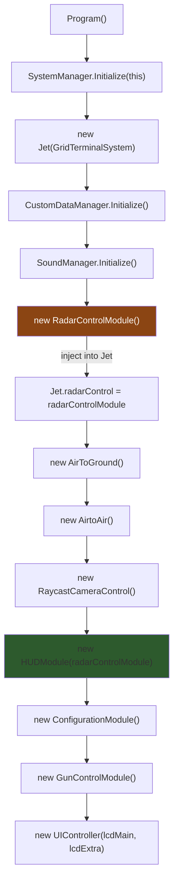
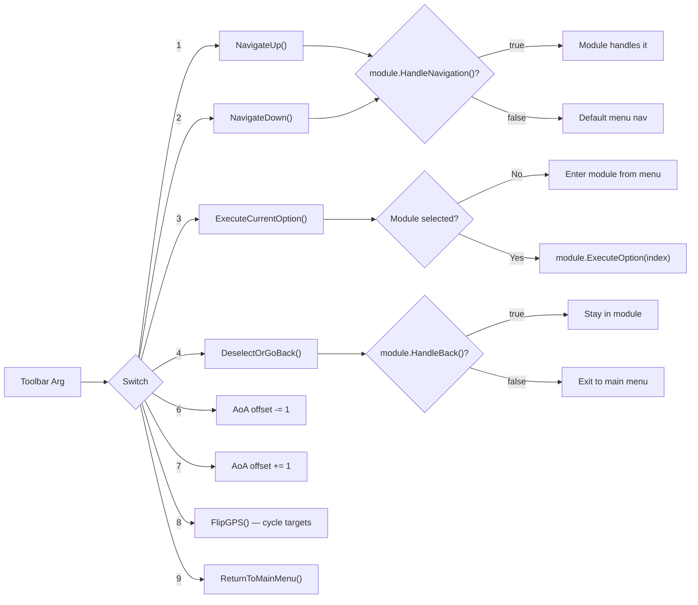
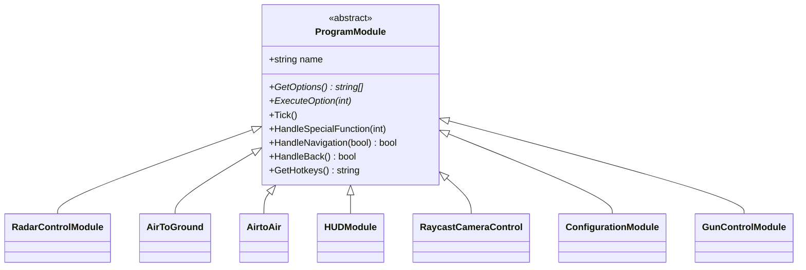
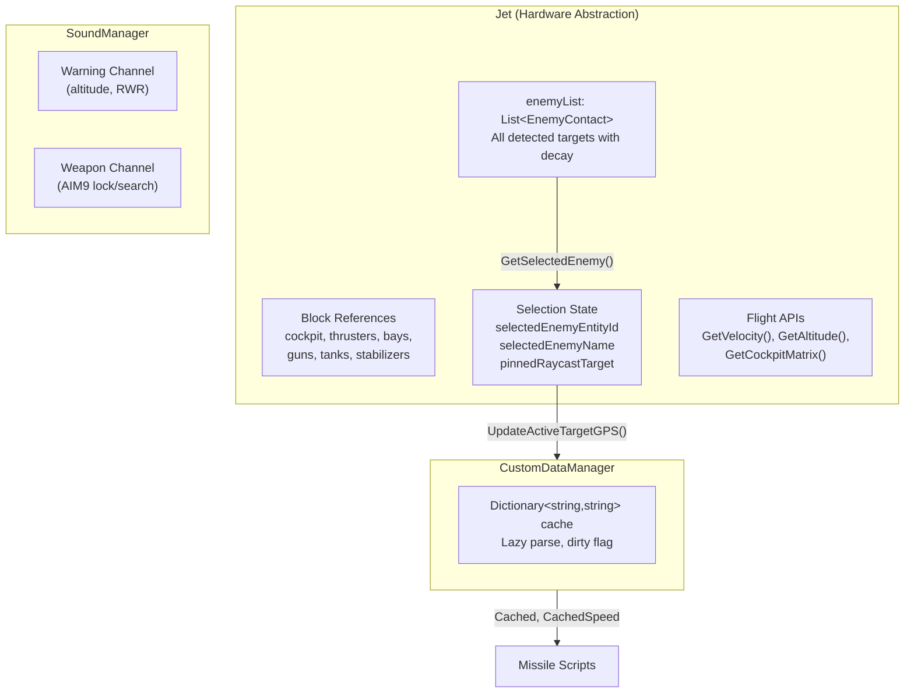
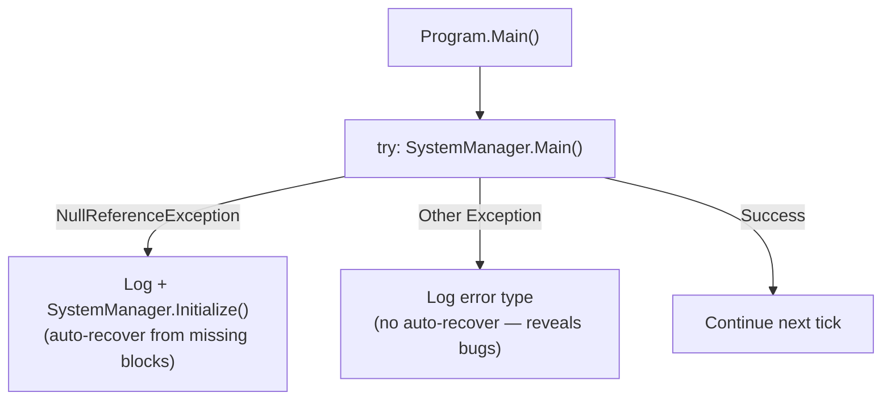

# System Architecture

## Tick Loop

Every game tick (~16ms at 60 Hz), `Program.Main()` delegates to `SystemManager.Main()` which orchestrates all modules:

```mermaid
flowchart TD
    A["Program.Main()"] --> B["SystemManager.Main()"]
    B --> C["Increment GameTicks"]
    C --> D["Altitude/Speed Warning Check"]
    D --> E["SoundManager.Tick()"]
    E --> F{Has toolbar argument?}
    F -- Yes --> G["HandleInput(arg)"]
    F -- No --> H["DisplayMenu()"]
    G --> I["Active Module .Tick()"]
    H --> I
    I --> J["Background Ticks"]

    J --> J1["RaycastCameraControl.Tick()"]
    J --> J2["HUDModule.Tick()"]
    J --> J3["RadarControlModule.Tick()"]
    J --> J4["AirtoAir.Tick()"]
    J --> J5["GunControlModule.Tick()"]

    style J1 fill:#2d5a2d
    style J2 fill:#2d5a2d
    style J3 fill:#2d4a5a
    style J4 fill:#2d4a5a
    style J5 fill:#2d4a5a
```

> Green = always ticks. Blue = ticks only when not the active module (avoids double-tick).

**Source:** `SystemManager.cs` — `Main()` method

---

## Initialization Order

Module initialization order matters because some modules depend on others:

> RadarControlModule initializes first because HUDModule and AirtoAir reference it.

**Source:** `SystemManager.cs` — `Initialize()` method

---

## Input Routing

Toolbar arguments (numpad 1-9) are dispatched through `HandleInput()`:

**Source:** `SystemManager.cs` — `HandleInput()`, `NavigateUp()`, `NavigateDown()`, `ExecuteCurrentOption()`, `DeselectOrGoBack()`

---

## Module System

All modules inherit from `ProgramModule`:

### Module Behavior Summary

| Module | Menu Name | Background Tick | Depends On |
|--------|-----------|----------------|------------|
| RadarControlModule | Radar Control | Yes (if not active) | Jet |
| AirToGround | Air To Ground | No | Jet |
| AirtoAir | Air To Air | Yes (if not active) | Jet, RadarTrackingModule |
| HUDModule | HUD Control | Yes (always) | Jet, RadarControlModule |
| RaycastCameraControl | TargetingPod Control | Yes (always) | Jet |
| ConfigurationModule | Configuration | No | — |
| GunControlModule | Gun Control | Yes (if not active) | Jet, BallisticsCalculator |

**Source:** `Modules/ProgramModule.cs` (base class), `SystemManager.cs` lines 78-100 (instantiation), lines 194-218 (tick routing)

---

## Core Data Holders

**Source:** `Jet.cs` (enemy list, selection, flight APIs), `Utilities/CustomDataManager.cs` (cache), `Utilities/SoundManager.cs` (channels)

---

## Exception Handling

**Source:** `Program.cs` — `Main()` method
