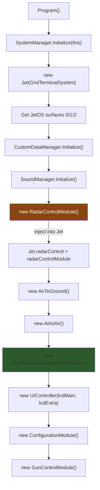
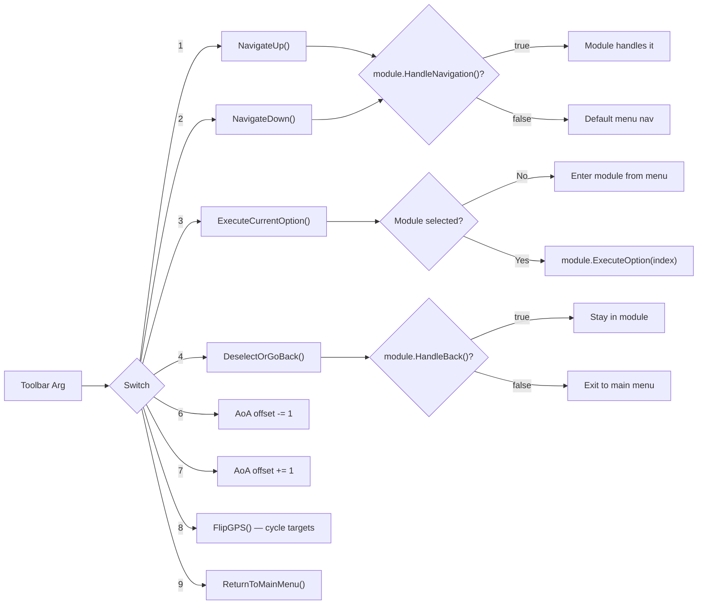
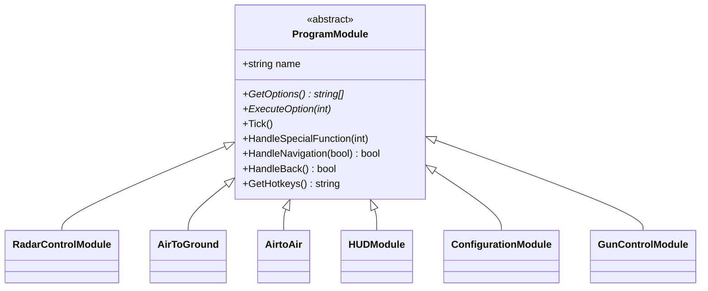
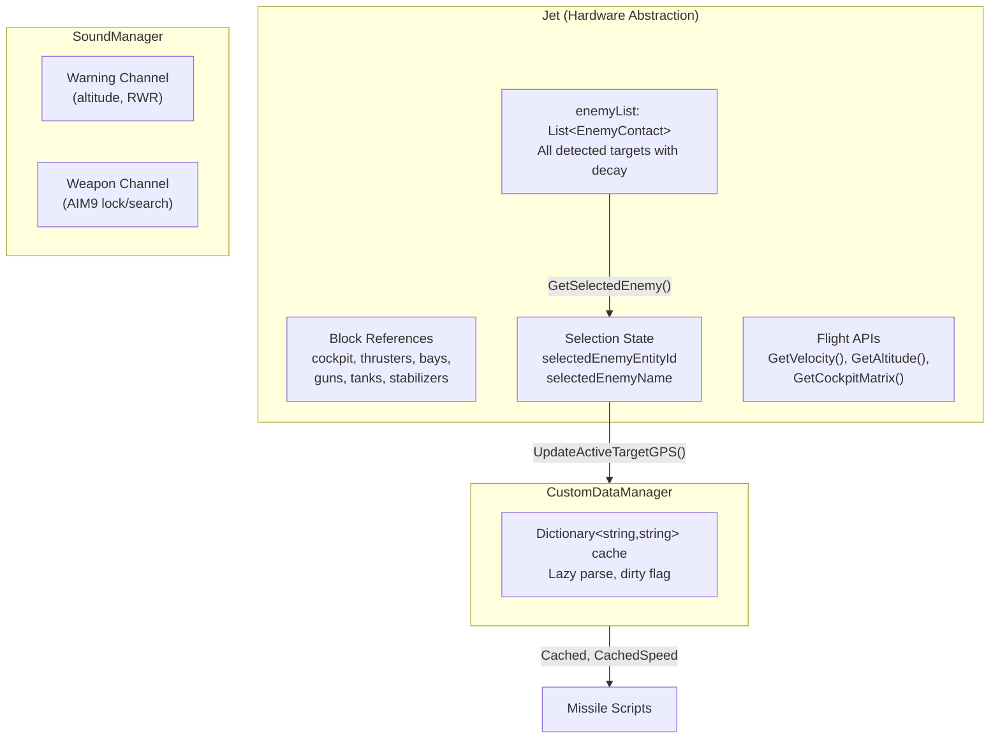
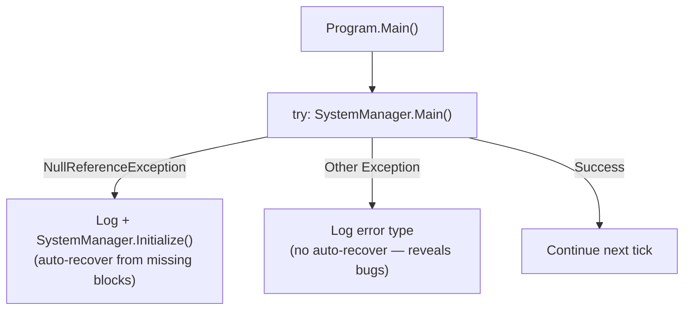

# System Architecture

## Tick Loop

Every game tick (~16ms at 60 Hz), `Program.Main()` delegates to `SystemManager.Main()` which orchestrates all modules:

```mermaid
flowchart TD
    A["Program.Main()"] --> B["SystemManager.Main()"]
    B --> T{"UpdateType.Trigger?"}
    T -- Yes --> DEFER["Defer argument, return early"]
    T -- No --> C["Increment GameTicks"]
    C --> G1["Cache gravity"]
    G1 --> D["Altitude/Speed Warning Check"]
    D --> F{Has toolbar argument?}
    F -- Yes --> G["HandleInput(arg)"]
    F -- No --> H["DisplayMenu()"]
    G --> I["Active Module .Tick()"]
    H --> I
    I --> J["Background Ticks"]
    J --> J2["HUDModule.Tick()"]
    J --> J3["RadarControlModule.Tick()"]
    J --> J4["AirtoAir.Tick()"]
    J --> J5["GunControlModule.Tick()"]
    J --> SP["HandleSpecialFunctionInputs()"]
    SP --> SND["SoundManager.Tick()"]

    style J2 fill:#2d4a5a
    style J3 fill:#2d4a5a
    style J4 fill:#2d4a5a
    style J5 fill:#2d4a5a
    style SND fill:#2d5a2d
```

> Blue = background-ticks when not the active module (avoids double-tick; the active module already ticked above). Green = runs unconditionally every tick.
>
> All four background-ticked modules effectively run every tick: when one IS the active module it ticks via the "Active Module .Tick()" step; when it is not, it ticks via the background section. `SoundManager.Tick()` runs last so that all module sound requests from the current tick are collected before processing.

**Source:** `SystemManager.cs` — `Main()` method (lines 136-230)

---

## Initialization Order

Module initialization order matters because some modules depend on others:

```mermaid
flowchart TD
    P["Program()"] --> SM["SystemManager.Initialize(this)"]
    SM --> JET["new Jet(GridTerminalSystem)"]
    JET --> LCD["Get JetOS surfaces 0/1/2"]
    LCD --> CDM["CustomDataManager.Initialize()"]
    CDM --> SND["SoundManager.Initialize()"]
    SND --> RAD["new RadarControlModule()"]
    RAD --> |"inject into Jet"| JETREF["Jet.radarControl = radarControlModule"]
    JETREF --> ATG["new AirToGround()"]
    ATG --> ATA["new AirtoAir()"]
    ATA --> HUD["new HUDModule(radarControlModule)"]
    HUD --> UI["new UIController(lcdMain, lcdExtra)"]
    UI --> CFG["new ConfigurationModule()"]
    CFG --> GUN["new GunControlModule()"]

    style RAD fill:#8b4513,color:#fff
    style HUD fill:#2d5a2d
```

> RadarControlModule (brown) initializes first because HUDModule and AirtoAir reference it. HUDModule (green) is stored in a dedicated field for background ticking and status panel access.

**Source:** `SystemManager.cs` — `Initialize()` method (lines 38-101)

---

## Input Routing

Toolbar arguments (numpad 1-9) are dispatched through `HandleInput()`:

```mermaid
flowchart LR
    INPUT["Toolbar Arg"] --> SW{Switch}
    SW -- "1" --> NAV_UP["NavigateUp()"]
    SW -- "2" --> NAV_DN["NavigateDown()"]
    SW -- "3" --> EXEC["ExecuteCurrentOption()"]
    SW -- "4" --> BACK["DeselectOrGoBack()"]
    SW -- "6" --> TRIM_DN["AoA offset -= 1"]
    SW -- "7" --> TRIM_UP["AoA offset += 1"]
    SW -- "8" --> FLIP["FlipGPS() — cycle targets"]
    SW -- "9" --> MENU["ReturnToMainMenu()"]

    NAV_UP --> MOD_NAV{"module.HandleNavigation()?"}
    NAV_DN --> MOD_NAV
    MOD_NAV -- "true" --> CUSTOM["Module handles it"]
    MOD_NAV -- "false" --> DEFAULT["Default menu nav"]

    EXEC --> MOD_SEL{Module selected?}
    MOD_SEL -- "No" --> ENTER["Enter module from menu"]
    MOD_SEL -- "Yes" --> OPT["module.ExecuteOption(index)"]

    BACK --> MOD_BACK{"module.HandleBack()?"}
    MOD_BACK -- "true" --> STAY["Stay in module"]
    MOD_BACK -- "false" --> EXIT["Exit to main menu"]
```

**Source:** `SystemManager.cs` — `HandleInput()` (line 270), `NavigateUp()` (line 358), `NavigateDown()` (line 370), `ExecuteCurrentOption()` (line 389), `DeselectOrGoBack()` (line 402)

---

## Module System

All modules inherit from `ProgramModule`:

```mermaid
classDiagram
    class ProgramModule {
        <<abstract>>
        +string name
        +GetOptions()* string[]
        +ExecuteOption(int)*
        +Tick()
        +HandleSpecialFunction(int)
        +HandleNavigation(bool) bool
        +HandleBack() bool
        +GetHotkeys() string
    }

    ProgramModule <|-- RadarControlModule
    ProgramModule <|-- AirToGround
    ProgramModule <|-- AirtoAir
    ProgramModule <|-- HUDModule
    ProgramModule <|-- ConfigurationModule
    ProgramModule <|-- GunControlModule
```

### Module Behavior Summary

| Module | Menu Name | Background Tick | Depends On |
|--------|-----------|----------------|------------|
| RadarControlModule | Radar Control | Yes (if not active) | Jet |
| AirToGround | Air To Ground | No | Jet |
| AirtoAir | Air To Air | Yes (if not active) | Jet |
| HUDModule | HUD Control | Yes (if not active) | Jet, RadarControlModule |
| ConfigurationModule | Configuration | No | — |
| GunControlModule | Gun Control | Yes (if not active) | Jet |

**Source:** `Modules/ProgramModule.cs` (base class), `SystemManager.cs` lines 77-93 (instantiation), lines 198-221 (tick routing)

---

## Core Data Holders

```mermaid
flowchart TD
    subgraph Jet ["Jet (Hardware Abstraction)"]
        BLOCKS["Block References\ncockpit, thrusters, bays,\nguns, tanks, stabilizers"]
        ENEMIES["enemyList: List&lt;EnemyContact&gt;\nAll detected targets with decay"]
        SELECT["Selection State\nselectedEnemyEntityId\nselectedEnemyName"]
        FLIGHT["Flight APIs\nGetVelocity(), GetAltitude(),\nGetCockpitMatrix()"]
    end

    subgraph CDM ["CustomDataManager"]
        CACHE["Dictionary&lt;string,string&gt; cache\nLazy parse, dirty flag"]
    end

    subgraph SM ["SoundManager"]
        WARN["Warning Channel\n(altitude, RWR)"]
        WEAP["Weapon Channel\n(AIM9 lock/search)"]
    end

    ENEMIES --> |"GetSelectedEnemy()"| SELECT
    SELECT --> |"UpdateActiveTargetGPS()"| CDM
    CDM --> |"Cached, CachedSpeed"| MISSILES["Missile Scripts"]
```

**Source:** `Jet.cs` (enemy list, selection, flight APIs), `Utilities/CustomDataManager.cs` (cache), `Utilities/SoundManager.cs` (channels)

---

## Exception Handling

```mermaid
flowchart TD
    MAIN["Program.Main()"] --> TRY["try: SystemManager.Main()"]
    TRY --> |NullReferenceException| REINIT["Log + SystemManager.Initialize()\n(auto-recover from missing blocks)"]
    TRY --> |Other Exception| LOG["Log error type\n(no auto-recover — reveals bugs)"]
    TRY --> |Success| DONE["Continue next tick"]
```

**Source:** `Program.cs` — `Main()` method (lines 27-50)
