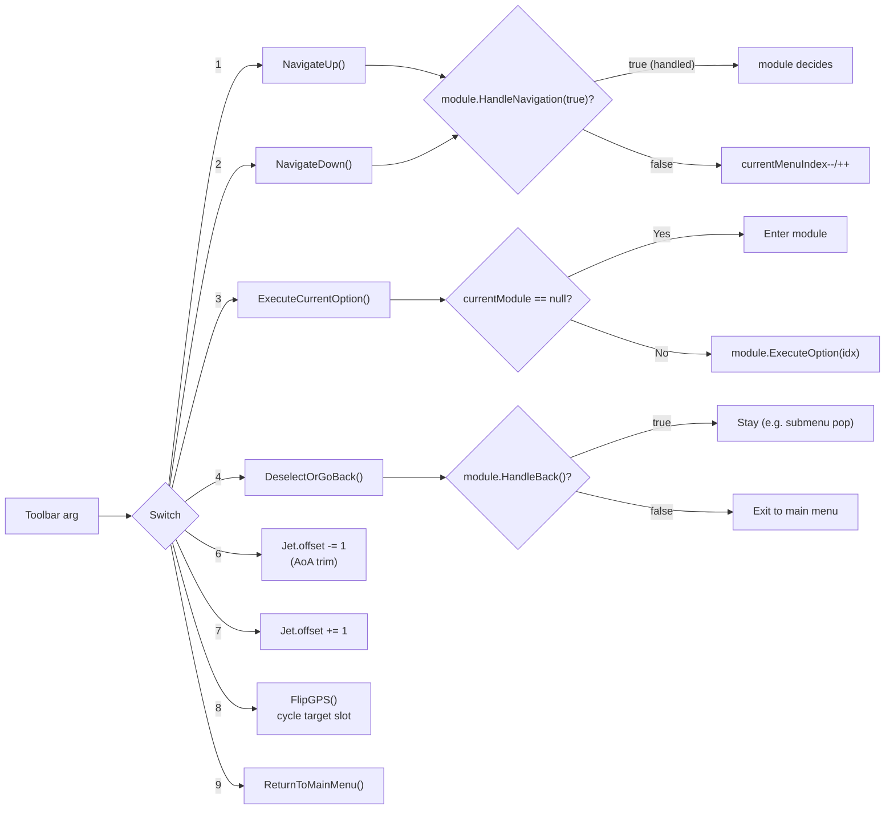
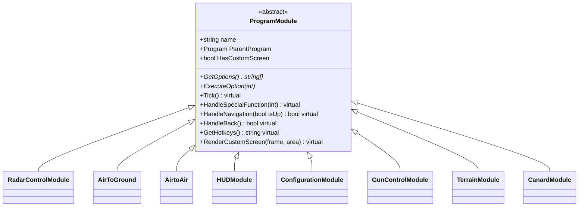
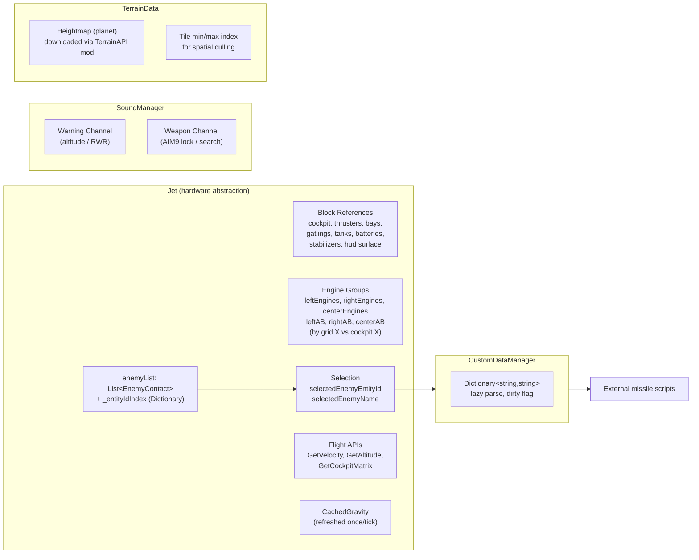
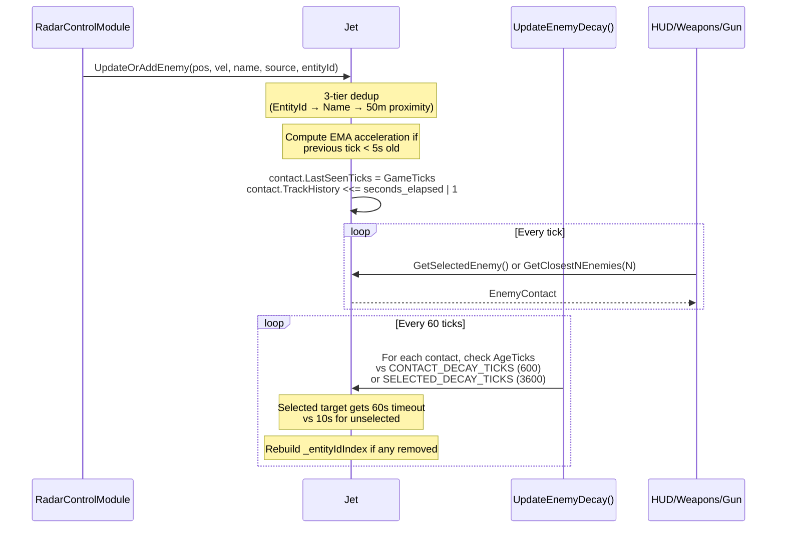
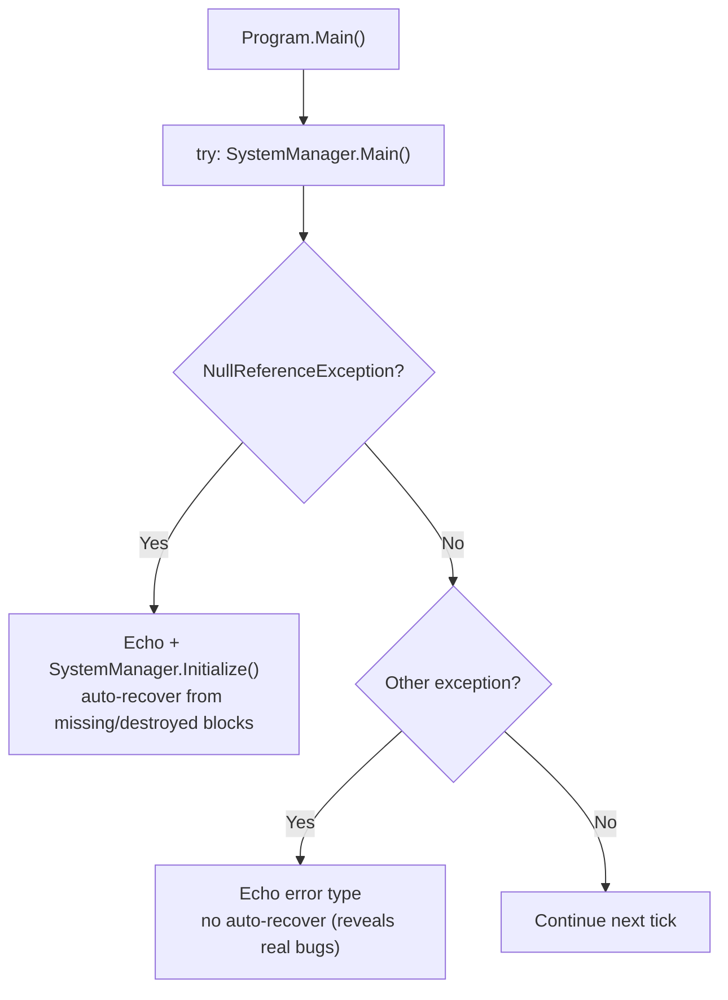

# System Architecture

> **Source files:** `Program.cs`, `SystemManager.cs`, `Jet.cs`, `Modules/ProgramModule.cs`
>
> **Interactive demo:** [interactive/throttle-demo.html](interactive/throttle-demo.html) shows the tick loop's effect on engine equalization.

## The Big Picture

JetOS is a single Space Engineers programmable block script organized as a `partial class Program`. All code lives in one compilation unit at runtime — MDK2 merges every `.cs` file before deployment.

```
                        ┌──────────────────────┐
                        │   Program.Main()     │
                        │  (entry every tick)  │
                        └──────────┬───────────┘
                                   │
                                   ▼
                        ┌──────────────────────┐
                        │  SystemManager.Main  │
                        │   (static class)     │
                        └──────────┬───────────┘
                                   │
            ┌──────────┬───────────┼──────────┬──────────┐
            ▼          ▼           ▼          ▼          ▼
         ┌──────┐  ┌──────┐   ┌────────┐  ┌──────┐  ┌──────────┐
         │ Jet  │  │ HUD  │   │ Radar  │  │ Gun  │  │ Canard   │
         │ data │  │      │   │  / RWR │  │ ctrl │  │  AoA→δ   │
         └──────┘  └──────┘   └────────┘  └──────┘  └──────────┘
                       │          │           │
                       ▼          ▼           ▼
                  ┌────────────────────────────────┐
                  │       SoundManager.Tick()      │
                  │  drains queued requests last   │
                  └────────────────────────────────┘
```

`SystemManager` is a **static class** — there's only ever one instance of JetOS per programmable block. Modules are instances inside `modules` list, but every cross-module call goes through static `SystemManager` methods.

---

## Tick Loop

`Program.Main()` is invoked by SE every game tick (≈16ms at 60 Hz, sometimes 6× slower for `Update10`/`Update100` runs — JetOS runs at `Update1`).


```mermaid
flowchart TD
    A["Program.Main(arg, source)"] --> B["SystemManager.Main(arg, source)"]
    B --> T{"source has Trigger flag?"}
    T -- Yes --> DEFER["Stash arg, return early<br/>(SE calls Main twice on toolbar press)"]
    T -- No --> CT["currentTick++<br/>Jet.GameTicks++"]
    CT --> G1["Cache gravity: jet.CachedGravity"]
    G1 --> TC["TerrainData.Tick(me, position)"]
    TC --> WARN["Altitude/speed warning hysteresis<br/>SoundManager.RequestWarning('Tief', P4)"]
    WARN --> ARG{Has toolbar arg?}
    ARG -- Yes --> IN["HandleInput(arg)"]
    ARG -- No --> MENU["DisplayMenu()<br/>(active module's screen or main menu)"]
    IN --> ACT
    MENU --> ACT["currentModule.Tick()<br/>(if any module is active)"]
    ACT --> BG["Background ticks"]
    BG --> H["HUDModule.Tick() (if not active)"]
    BG --> R["RadarControlModule.Tick() (if not active)"]
    BG --> AA["AirtoAir.Tick() (if not active)"]
    BG --> GC["GunControlModule.Tick() (if not active)"]
    BG --> CD["CanardModule.Tick() (if not active)"]
    BG --> SF["HandleSpecialFunctionInputs(arg)"]
    SF --> SND["SoundManager.Tick(currentTick)<br/>drains all requests"]
    SND --> MET["Update Jet.IC / IA / IP<br/>(instruction count metrics)"]

    style DEFER fill:#5a2d2d,color:#fff
    style H fill:#2d4a5a
    style R fill:#2d4a5a
    style AA fill:#2d4a5a
    style GC fill:#2d4a5a
    style CD fill:#2d4a5a
    style SND fill:#2d5a2d
    style WARN fill:#3a3a0a,color:#e0c060
```

> **Background-ticked modules** (blue) are HUDModule, RadarControlModule, AirtoAir, GunControlModule, and CanardModule. They tick every frame regardless of which module is currently displayed. The `if (currentModule != X)` guard prevents double-ticking when one *is* the active module.
>
> **Trigger guard** (red) is critical: SE calls `Main()` twice on the same sim tick when a toolbar button is pressed (once with `UpdateType.Trigger`, once with `Update1`). Without the guard, `Jet.GameTicks` would advance twice per tick and break aging logic.

**Source:** `SystemManager.cs:143-245`

---

## Initialization Order


```mermaid
flowchart TD
    P["Program()"] --> SM["SystemManager.Initialize(this)"]
    SM --> JET["new Jet(GridTerminalSystem)"]
    JET --> LCD["Get JetOS [HFPS] surfaces 0/1/2"]
    LCD --> CDM["CustomDataManager.Initialize"]
    CDM --> SND["SoundManager.Initialize"]
    SND --> TER["TerrainData.Probe + TerrainData.Init<br/>(start heightmap download)"]
    TER --> RAD["new RadarControlModule()<br/>auto-detect AI Flight/Combat 1..99"]
    RAD --> JR["Inject into Jet.radarControl"]
    JR --> ATG["new AirToGround()"]
    ATG --> ATA["new AirtoAir()"]
    ATA --> HUD["new HUDModule(weaponSurface, radar)"]
    HUD --> UI["new UIController(lcdMain, lcdExtra)"]
    UI --> CFG["new ConfigurationModule()<br/>load CustomData parameters"]
    CFG --> GUN["new GunControlModule()<br/>find rotor/hinge pairs"]
    GUN --> TRM["new TerrainModule()"]
    TRM --> CRD["new CanardModule()"]

    style RAD fill:#8b4513,color:#fff
    style HUD fill:#2d5a2d
    style CFG fill:#2d4a5a
```

**Why the order matters:**
- `CustomDataManager` must be ready before any module that reads/writes CustomData (radar count, config values, target slots).
- `SoundManager` initializes sound blocks and runs `PrepChannel()` to put them in a known clean state.
- `TerrainData` starts downloading the planet heightmap as soon as possible — it can take many ticks to complete via the `TerrainAPI` mod's chunked protocol.
- `RadarControlModule` must instantiate before `HUDModule` and `AirtoAir`, both of which receive a reference for lock detection.
- The instantiation order also defines the **main menu order** — `mainMenuOptions` is built from `modules.Select(m => m.name)`.

**Source:** `SystemManager.cs:38-108`

---

## Main Menu Layout

The main menu is auto-generated from the `modules` list:

```
┌──────────────────────────────┐
│  ▸ Radar & RWR Control       │
│    Air To Ground             │
│    Air To Air                │
│    HUD Control               │
│    Configuration             │
│    Gun Control               │
│    Terrain Map               │
│    Canards                   │
└──────────────────────────────┘
```

Adding a module is two lines: instantiate it in `SystemManager.Initialize()` and `modules.Add()` it. The main menu picks it up automatically; no separate `string[]` to maintain.

---

## Input Routing

Toolbar arguments (numpad 1–9) are dispatched through `HandleInput()`:


```mermaid
flowchart LR
    INPUT["Toolbar arg"] --> SW{Switch}
    SW -- "1" --> NU["NavigateUp()"]
    SW -- "2" --> ND["NavigateDown()"]
    SW -- "3" --> EX["ExecuteCurrentOption()"]
    SW -- "4" --> BK["DeselectOrGoBack()"]
    SW -- "6" --> T1["Jet.offset -= 1<br/>(AoA trim)"]
    SW -- "7" --> T2["Jet.offset += 1"]
    SW -- "8" --> FL["FlipGPS()<br/>cycle target slot"]
    SW -- "9" --> RT["ReturnToMainMenu()"]

    NU --> NAV{"module.HandleNavigation(true)?"}
    ND --> NAV
    NAV -- "true (handled)" --> CUS["module decides"]
    NAV -- "false" --> MNV["currentMenuIndex--/++"]

    EX --> SEL{"currentModule == null?"}
    SEL -- "Yes" --> ENT["Enter module"]
    SEL -- "No" --> OPT["module.ExecuteOption(idx)"]

    BK --> HBK{"module.HandleBack()?"}
    HBK -- "true" --> STAY["Stay (e.g. submenu pop)"]
    HBK -- "false" --> EXIT["Exit to main menu"]
```

**Special function inputs** (5–8 within a module): each module can override `HandleSpecialFunction(int key)` for hotkeys. AirtoAir and AirToGround use this for missile bay shortcuts via `MissileBayHelper.HandleWeaponHotkey()`.

**Source:** `SystemManager.cs:296-330` (HandleInput), `SystemManager.cs:247-257` (HandleSpecialFunctionInputs), `SystemManager.cs:331-366` (FlipGPS)

---

## Module Base Class

All modules inherit from `ProgramModule`:


```mermaid
classDiagram
    class ProgramModule {
        <<abstract>>
        +string name
        +Program ParentProgram
        +bool HasCustomScreen
        +GetOptions()* string[]
        +ExecuteOption(int)*
        +Tick() virtual
        +HandleSpecialFunction(int) virtual
        +HandleNavigation(bool isUp) bool virtual
        +HandleBack() bool virtual
        +GetHotkeys() string virtual
        +RenderCustomScreen(frame, area) virtual
    }

    ProgramModule <|-- RadarControlModule
    ProgramModule <|-- AirToGround
    ProgramModule <|-- AirtoAir
    ProgramModule <|-- HUDModule
    ProgramModule <|-- ConfigurationModule
    ProgramModule <|-- GunControlModule
    ProgramModule <|-- TerrainModule
    ProgramModule <|-- CanardModule
```

### Module Capability Matrix

| Module | Menu Name | Background Tick | Custom Screen | Special Function | Depends On |
|--------|-----------|----------------|---------------|------------------|------------|
| RadarControlModule | Radar & RWR Control | ✓ | — | — | Jet |
| AirToGround | Air To Ground | — | — | ✓ (missile hotkeys) | Jet, MissileBayHelper |
| AirtoAir | Air To Air | ✓ | — | ✓ | Jet, RadarControl |
| HUDModule | HUD Control | ✓ | — | — | Jet, RadarControl |
| ConfigurationModule | Configuration | — | — | — | CustomDataManager |
| GunControlModule | Gun Control | ✓ | — | — | Jet, BallisticsCalculator |
| TerrainModule | Terrain Map | — | ✓ | — | TerrainData |
| CanardModule | Canards | ✓ | — | — | Jet, HUDModule (smoothedAoA) |

> **HasCustomScreen** modules (TerrainModule) render their own MFD page instead of using the standard menu. `SystemManager.DisplayMenu()` checks `currentModule.HasCustomScreen` and routes accordingly.

**Source:** `Modules/ProgramModule.cs` (base), `SystemManager.cs:259-294` (DisplayMenu)

---

## Core Data Structures


```mermaid
flowchart LR
    subgraph Jet ["Jet (hardware abstraction)"]
        BL["Block References<br/>cockpit, thrusters, bays,<br/>gatlings, tanks, batteries,<br/>stabilizers, hud surface"]
        EG["Engine Groups<br/>leftEngines, rightEngines, centerEngines<br/>leftAB, rightAB, centerAB<br/>(by grid X vs cockpit X)"]
        EN["enemyList: List&lt;EnemyContact&gt;<br/>+ _entityIdIndex (Dictionary)"]
        SE["Selection<br/>selectedEnemyEntityId<br/>selectedEnemyName"]
        FA["Flight APIs<br/>GetVelocity, GetAltitude,<br/>GetCockpitMatrix"]
        CG["CachedGravity<br/>(refreshed once/tick)"]
    end

    subgraph CDM ["CustomDataManager"]
        CACHE["Dictionary&lt;string,string&gt;<br/>lazy parse, dirty flag"]
    end

    subgraph SM ["SoundManager"]
        WCH["Warning Channel<br/>(altitude / RWR)"]
        WPH["Weapon Channel<br/>(AIM9 lock / search)"]
    end

    subgraph TD ["TerrainData"]
        HMAP["Heightmap (planet)<br/>downloaded via TerrainAPI mod"]
        TIDX["Tile min/max index<br/>for spatial culling"]
    end

    EN --> SE
    SE --> CDM
    CDM --> EXTM["External missile scripts"]
```

**Source:** `Jet.cs` (all of it), `Utilities/CustomDataManager.cs`, `Utilities/SoundManager.cs`, `Utilities/TerrainData.cs`

---

## EnemyContact Lifecycle

The `enemyList` is the central target store. Every detection from RadarControlModule routes through `Jet.UpdateOrAddEnemy()`, which deduplicates and ages contacts.


```mermaid
sequenceDiagram
    participant Sensor as RadarControlModule
    participant Jet as Jet
    participant Decay as UpdateEnemyDecay()
    participant Consumer as HUD/Weapons/Gun

    Sensor->>Jet: UpdateOrAddEnemy(pos, vel, name, source, entityId)
    Note over Jet: 3-tier dedup<br/>(EntityId → Name → 50m proximity)
    Note over Jet: Compute EMA acceleration if<br/>previous tick < 5s old
    Jet->>Jet: contact.LastSeenTicks = GameTicks<br/>contact.TrackHistory <<= seconds_elapsed | 1

    loop Every tick
        Consumer->>Jet: GetSelectedEnemy() or GetClosestNEnemies(N)
        Jet-->>Consumer: EnemyContact
    end

    loop Every 60 ticks
        Decay->>Jet: For each contact, check AgeTicks<br/>vs CONTACT_DECAY_TICKS (600)<br/>or SELECTED_DECAY_TICKS (3600)
        Note over Jet: Selected target gets 60s timeout<br/>vs 10s for unselected
        Note over Jet: Rebuild _entityIdIndex if any removed
    end
```

See [target-tracking.md](target-tracking.md) for the full data flow.

**Source:** `Jet.cs:36-90` (struct), `Jet.cs:208-333` (Update/Decay)

---

## Exception Handling


```mermaid
flowchart TD
    MAIN["Program.Main()"] --> TRY["try: SystemManager.Main()"]
    TRY --> NRE{"NullReferenceException?"}
    NRE -- "Yes" --> REINIT["Echo + SystemManager.Initialize()<br/>auto-recover from missing/destroyed blocks"]
    NRE -- "No" --> OTH{Other exception?}
    OTH -- "Yes" --> LOG["Echo error type<br/>no auto-recover (reveals real bugs)"]
    OTH -- "No" --> OK["Continue next tick"]
```

The auto-reinit is forgiving — useful when the cockpit gets temporarily damaged or a key block is destroyed and rebuilt. Disable it during development if you're chasing a `NullReferenceException` bug, since it'll mask the original symptom.

**Source:** `Program.cs:27-50`

---

## Performance Budget

Space Engineers caps PB scripts at ~50,000 instructions per tick. Stay under, or SE throttles your script.

| Optimization | What it saves |
|--------------|--------------|
| Cached gravity (`Jet.CachedGravity`) | One `GetNaturalGravity()` call per tick instead of per renderer |
| `CustomDataManager` dictionary cache | Reparses CustomData only when raw string changes or dirty flag set |
| `_entityIdIndex` dictionary | O(1) enemy lookup vs O(N) linear scan |
| Reusable sort buffers (`_sortBuffer`, `_resultBuffer`) | Zero GC allocs per `GetClosestNEnemies()` call |
| `Math.Abs(over - new) > 0.001f` thrust override guard | Skip ~2 instructions per unchanged thruster per tick |
| Block list cache refresh every 60 ticks | Avoid `GetBlocksOfType` every frame |
| Visible-pitch loop bounds in `DrawArtificialHorizon` | ~5 iterations vs 36 over full -90/+90 range |
| `_tileMin/_tileMax` terrain culling | Skip entire 16×16 chunks where heightmap is uniform |

**Live metrics in MFD chrome:** the header shows `TACTICAL SYSTEM IC/IA/IP` where IC = current tick instructions, IA = 60-frame average, IP = peak ever observed. Watch IP — if it nears 50000, the script is on borrowed time.

**Source:** `MFDFrame.cs:54` (header readout), `Jet.cs:29` (IC/IA/IP fields), `SystemManager.cs:242-244` (update logic)

---

## File Layout

```
Mdk.PbScript2/
├── Program.cs                  # Constructor, Main, exception handling
├── SystemManager.cs            # Static orchestrator
├── Jet.cs                      # Hardware + enemy list + flight APIs
├── Modules/
│   ├── ProgramModule.cs        # Abstract base
│   ├── HUDModule.cs            # Flight instruments + throttle + render orchestrator
│   ├── AirToGround.cs          # Bombardment, topdown mode
│   ├── AirtoAir.cs             # AIM9 tones, GPS sync
│   ├── RaycastCameraControl.cs # (legacy) targeting pod
│   ├── RadarControlModule.cs   # AI block radar + RWR
│   ├── ConfigurationModule.cs  # 3-level config menu
│   ├── GunControlModule.cs     # Rotor+hinge gun turret aim
│   ├── TerrainModule.cs        # Custom-screen terrain map
│   └── CanardModule.cs         # Canard control + stab spillover
├── HUD/
│   ├── HorizonRenderer.cs      # Pitch ladder, horizon, FPM
│   ├── InstrumentRenderer.cs   # Speed/alt tapes, compass, AOA
│   ├── RadarRenderer.cs        # Radar minimap with auto-scale
│   ├── TargetingRenderer.cs    # Lead pip, target brackets, breakaway
│   └── WeaponScreenRenderer.cs # Weapons MFD page (surface 2)
├── UI/
│   ├── UIController.cs         # Surface 0 menu + module options + theme palette
│   ├── MFDFrame.cs             # Shared MFD chrome
│   ├── StatusPanelRenderer.cs  # Sidebar engine cards + minimap
│   ├── StatusPanelRenderer.idle-slides.cs  # Idle slideshow content
│   ├── StartupSequence.cs      # Boot animation
│   ├── TerrainRenderer.cs      # Terrain rendering helpers
│   └── GridVisualization.cs    # Surface 1: grid outline + flight data
├── Utilities/
│   ├── BallisticsCalculator.cs # Iterative intercept solver
│   ├── CircularBuffer.cs       # Fixed-size running buffer
│   ├── CustomDataManager.cs    # Dictionary cache
│   ├── MissileBayHelper.cs     # Bay selection + fire pipeline
│   ├── NavigationHelper.cs     # Vector math, GPS parsing
│   ├── RadarTrackingModule.cs  # AI block target extraction
│   ├── Shortcuts.cs            # Vector / math abbreviations
│   ├── SoundManager.cs         # Dual-channel priority audio
│   ├── SpriteHelpers.cs        # Sprite primitives
│   ├── TerrainAPI.cs           # TerrainAPI mod wrapper
│   └── TerrainData.cs          # Heightmap download + lookup
├── Extensions/
│   └── RandomExtensions.cs
└── Diagnostics/                # Excluded from build
    ├── TurretDiagnostic.cs
    └── TerrainMapDiagnostic.cs
```

The `partial class Program` pattern: every file (except `Diagnostics/`) declares `namespace IngameScript { partial class Program { … } }`. MDK2 merges them at build time into a single Program.cs that SE compiles.
