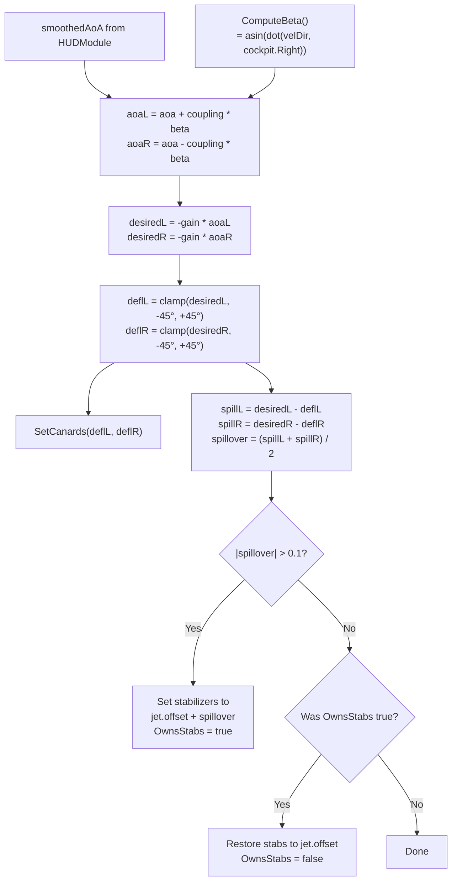
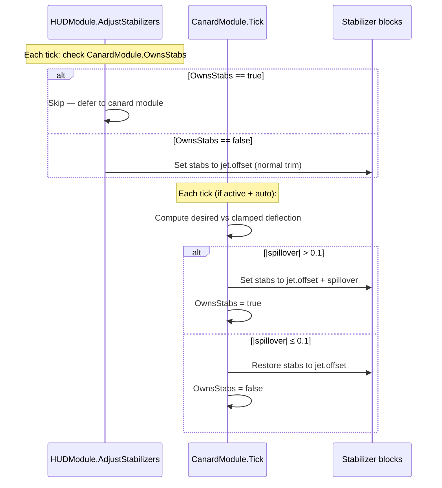

# Canard System

> **Source:** `Modules/CanardModule.cs`
>
> **Status:** Newly added subsystem. Optional — gracefully degrades if `Canard L [Ani]` / `Canard R [Ani]` blocks are missing.

## Overview

The CanardModule adds **active canard control surfaces** to the front of the jet, deflecting them based on the smoothed angle of attack (AoA) to provide pitch authority and reduce stabilizer load. When the commanded deflection saturates the canards' physical range, the excess "spills over" into the main stabilizers automatically.

```
       ╭───╮          ╭───╮
       │ L │ ←        → │ R │      ← Canards (Trim-bearing blocks)
       ╰─╥─╯          ╰─╥─╯
         ║              ║
        ███████████████████
        █                 █          ← Fuselage
        █   Cockpit       █
        ███████████████████
              │ │
              │ │
         ╲    │ │    ╱
          ╲   │ │   ╱
           ╲  │ │  ╱                ← Wings + main stabilizers
            ╲ │ │ ╱
```

The system runs in one of three modes:
- **OFF** — No deflection commanded; canards are released
- **AUTO** — Deflection = `-gain × (AoA + coupling × beta)`, where `beta` is the sideslip angle
- **MANUAL** — Pilot directly sets deflection in degrees with the navigate keys

---

## Auto Mode Math



### Sideslip Coupling

Sideslip (β) is the angle between the velocity vector and the jet's nose, measured laterally. When the jet is sliding sideways (e.g. during a high-G yawing turn), each canard sees a slightly different effective AoA:

```
aoaL = aoa + coupling × beta    (left canard sees more AoA when slipping right)
aoaR = aoa - coupling × beta    (right canard sees less)
```

The `coupling` parameter is adjustable from 0 to 1 (default 0.4). Higher coupling makes the canards differential during sideslip — turning them into roll-augmenting surfaces in addition to pitch.

**Source:** `Modules/CanardModule.cs:126-135` (ComputeBeta), `:148-189` (Tick)

---

## Stabilizer Spillover

When the commanded deflection exceeds the canards' physical range (±45°), the excess "spills" into the main stabilizers via the `OwnsStabs` flag:



> **Why a static flag?** `CanardModule.OwnsStabs` is a static internal property because `HUDModule.AdjustStabilizers` needs to check it without holding a reference to the canard module. Both modules touch the same stabilizer blocks; the flag is the contract between them.

> **Hysteresis:** the 0.1° threshold prevents the spillover from oscillating on/off as the commanded deflection brushes against the ±45° limit. Below 0.1°, the canard module releases the stabs.

**Source:** `HUDModule.cs:639-647` (AdjustStabilizers check), `Modules/CanardModule.cs:124, 175-189`

---

## Module Menu

```
Canards [AUTO]              ← toggle ON/OFF
Mode: Auto (AoA→0)          ← switch to auto mode
Mode: Manual                ← switch to manual mode
Manual Defl [10]            ← cycle preset deflections (-45..45 in 5° steps)
Gain+ [1.5]                 ← gain up (max 5.0)
Gain-                       ← gain down (min 0.5)
Coupling+ [0.40]            ← coupling up (max 1.0)
Coupling-                   ← coupling down (min 0.0)
Rescan Blocks               ← re-find canard blocks (after building)
L: Canard L [Ani] [12.3]    ← live status: trim value
R: Canard R [Ani] [-11.8]   ← live status: trim value
--- TRIM ---
Cmd L:12.3 R:-11.8  Cur L:12.3 R:-11.8
Stab Cmd: 0.0  Spill: no    ← Spillover indicator
Beta: 0.5  Pilot Trim: 0    ← Sideslip + pilot AoA trim
Back to Main Menu
```

### Navigation Override

In manual mode with the system active, the navigate-up/down keys (1/2) directly increment/decrement `manualDeflection` by 1° per press, clamped to ±45°:

```csharp
public override bool HandleNavigation(bool isUp)
{
    if (manualMode && active) {
        manualDeflection += isUp ? 1f : -1f;
        manualDeflection = Cl(manualDeflection, -45f, 45f);
        return true;  // consume — don't fall through to menu navigation
    }
    return false;     // let menu nav happen
}
```

This is a clean example of the `HandleNavigation` override pattern — modules can intercept navigation when they want fine-grained control over a value.

**Source:** `Modules/CanardModule.cs:112-121`

---

## Block Setup

| Block Name | Type | Purpose |
|------------|------|---------|
| `Canard L [Ani]` | trim-bearing block (typically a piston/rotor with mod-added Trim) | Left canard surface |
| `Canard R [Ani]` | trim-bearing block | Right canard surface |

The `[Ani]` suffix in the block name is a convention for animated/control surface blocks in this build. Both blocks must support the mod-added `Trim` terminal property (a float).

**Sign convention:** `SetCanards()` writes `-degreesL` to the left block and `+degreesR` to the right block. This compensates for the mirrored mounting orientation so positive command = nose up on both surfaces.

```csharp
void SetCanards(float degreesL, float degreesR)
{
    SetTrim(canardL, -degreesL);
    SetTrim(canardR, degreesR);
}
```

**Source:** `Modules/CanardModule.cs:25-26, 197-201`

---

## Configurable Parameters

| Parameter | Default | Range | Purpose |
|-----------|---------|-------|---------|
| `gain` | 1.5 | 0.5 – 5.0 | Multiplier from AoA to commanded deflection |
| `coupling` | 0.40 | 0.0 – 1.0 | Sideslip → differential canard ratio |
| `manualDeflection` | 0 | -45° – +45° | Manual mode override (cycled in 5° steps via menu, 1° via nav) |

**Tuning notes:**
- **Gain** sets responsiveness. 1.5 is gentle; 3.0+ feels aggressive but can over-correct on stable jets.
- **Coupling** is for jets with significant adverse yaw. 0 disables differential entirely; 0.4 is a good starting point.
- Higher gain + lower stabilizer authority makes spillover happen more often.

---

## Why Spillover Matters

Without spillover, when the canards saturate at ±45°, the jet would simply *not pitch as much as commanded* — losing AoA authority at the worst possible moment (high-G turns, recovery from departure).

The spillover mechanism redistributes the unmet command into the main stabilizers, so the jet still gets the requested pitch moment even if individual surfaces are pegged. The total available pitch authority becomes:

```
total_pitch_authority = canard_authority + stab_authority
```

This is roughly how F-15 STOL/MTD and X-31 use canards in concert with stabilators in real life.

---

## Performance Notes

- **Hot path is ~30 instructions/tick** when active + auto. ComputeBeta is one dot product, the rest is arithmetic.
- **Trim writes are tolerance-checked** — `SetTrim` skips the API call if the difference is < 0.1°. With 4 stabilizer blocks and 2 canards, that's 6 potential writes per tick reduced to ~0 when steady.
- **Block lookups happen once at construction** + on `Rescan Blocks` — no per-tick `GetBlockWithName`.
- **`OwnsStabs` flag bridges modules without dependencies** — neither HUDModule nor CanardModule needs to know the other exists at the type level.
