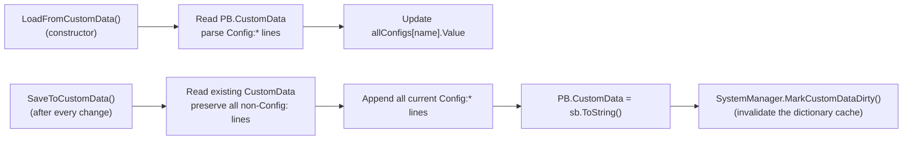

# Configuration System

> **Source:** `Modules/ConfigurationModule.cs`
>
> **Used by:** Every module that calls `SystemManager.GetConfigValue("...")` — HUDModule, GunControlModule, RadarControlModule, SystemManager (warnings).
>
> **Try the theme cycle:** [interactive/theme-demo.html](interactive/theme-demo.html)

## Overview

ConfigurationModule provides a **3-level menu** for editing runtime parameters that persist across PB restarts via CustomData. Every adjustable knob lives here — warnings, gun control, HUD toggles, color theme.

```mermaid
flowchart TD
    L1["Level 1: CATEGORY"] --> L2["Level 2: PARAMETER LIST"]
    L2 --> L3["Level 3: VALUE ADJUST"]
    L3 -- "Select to save" --> L2
    L3 -- "Back to cancel" --> L2
    L2 -- "Back" --> L1
    L1 -- "Reset All" --> L1

    style L1 fill:#2d4a5a
    style L2 fill:#2d5a2d
    style L3 fill:#5a4a2d
```



| Level | What you see |
|-------|--------------|
| **Category** | List of categories: Warnings, Gun Control, HUD Toggles, HUD Theme, Reset All |
| **Parameter List** | All parameters in the chosen category, with current values + `*` if modified from default |
| **Value Adjust** | Detail screen for one parameter — current/default/range, navigate up/down to adjust |

---

## Categories &amp; Parameters

### Warnings

| Parameter | Key | Default | Range | Unit |
|-----------|-----|---------|-------|------|
| Altitude Warning | `altitude_warning` | 150 | 100 – 1000 | m |
| Speed Warning | `speed_warning` | 360 | 100 – 600 | kts |
| Bingo Fuel | `bingo_fuel` | 0.20 | 0.05 – 0.50 | % |
| Low Fuel | `low_fuel` | 0.35 | 0.10 – 0.60 | % |

The altitude warning fires when `altitude < altitude_warning AND speed > speed_warning` — this prevents false alarms during normal landings (slow speed).

### Gun Control

| Parameter | Key | Default | Range | Unit |
|-----------|-----|---------|-------|------|
| KP Gain | `gun_kp` | 5.0 | 0.5 – 20.0 | — |
| Max RPM | `gun_max_rpm` | 30 | 5 – 60 | RPM |
| Lock Threshold | `gun_lock_threshold` | 2.0 | 0.5 – 10.0 | deg |
| Max Range | `gun_max_range` | 6000 | 1000 – 15000 | m |
| Muzzle Velocity | `gun_muzzle_velocity` | 1100 | 200 – 2000 | m/s |

See [weapons.md → Gun Turret Auto-Track](weapons.md#gun-turret-auto-track) for how each parameter is used.

### HUD Toggles

Each toggle is `1.0 = ON`, `0.0 = OFF`. Renderers gate themselves with `SystemManager.GetConfigValue("hud_*") > 0.5f`.

| Parameter | Key | Default |
|-----------|-----|---------|
| Radar Minimap | `hud_radar` | ON |
| Gun Funnel | `hud_gun_funnel` | ON |
| Target Brackets | `hud_target_brackets` | ON |
| G-Force | `hud_gforce` | ON |
| AOA Indexer | `hud_aoa` | ON |
| Flight Path Marker | `hud_fpm` | ON |
| Compass | `hud_compass` | ON |
| Breakaway Warning | `hud_breakaway` | ON |

Useful when the HUD gets cluttered or you want to disable expensive elements (the radar minimap is the largest sprite consumer).

### HUD Theme

| Parameter | Key | Default | Range |
|-----------|-----|---------|-------|
| Color Theme | `hud_theme` | 0 (Green) | 0 – 3 |

| Index | Theme | Primary | Use case |
|-------|-------|---------|---------|
| 0 | Green | `Color.Lime` | Default phosphor look |
| 1 | Blue | `Color.Cyan` | High-contrast cool palette |
| 2 | Amber | `Color.Orange` | Warm/sunset readability |
| 3 | White | `Color.White` | Maximum brightness |

[Try them live](interactive/theme-demo.html).

---

## Persistence

Values are stored in the PB's CustomData with one line per parameter:

```
Config:altitude_warning:150
Config:speed_warning:360
Config:gun_kp:5
Config:gun_max_rpm:30
Config:hud_theme:1
Config:hud_radar:1
...
```



> **`SaveToCustomData` preserves non-Config lines.** Other systems write to CustomData too (`Cached`, `CachedSpeed`, `RWRCount`, `Topdown`, `Cache0..N`, etc.). The save logic strips only `Config:*` lines, then re-appends all of them so the rest of CustomData survives untouched.

> **MarkCustomDataDirty.** After any direct CustomData write, the dictionary cache in `CustomDataManager` would be stale. Calling `MarkDirty()` forces it to re-parse on the next read. Without this, other modules would see old config values until their next CustomData write.

**Source:** `Modules/ConfigurationModule.cs:120-170`

---

## ConfigParam Internals

Each parameter is a `ConfigParam` with:

```csharp
private class ConfigParam
{
    public string Category;
    public string Name;
    public string DisplayName;
    public float Value;
    public float DefaultValue;
    public float MinValue;
    public float MaxValue;
    public float StepSize;
    public string Unit;
    public bool IsModified => Math.Abs(Value - DefaultValue) > 0.0001f;

    public void Adjust(int direction) {
        Value = Mx(MinValue, Mn(MaxValue, Value + direction * StepSize));
    }

    public void Reset() { Value = DefaultValue; }
}
```

The `IsModified` flag drives the `*` indicator next to modified parameters in the menu.

`AddConfig()` creates new entries in the constructor:

```csharp
AddConfig(C_W, "altitude_warning", "Altitude Warning", 150f, 100f, 1000f, 10f, "m");
//        cat   key                  display              def    min    max    step  unit
```

**Source:** `Modules/ConfigurationModule.cs:45-118`

---

## Adjustment UX

The Value Adjust screen renders different layouts depending on the parameter type:

### Continuous Numeric

```
Adjusting: KP Gain
^ Increase (Navigate Up)
  Current: 5.00
V Decrease (Navigate Down)

Default: 5.00
Range: 0.50 - 20.00

SELECT to save
BACK to cancel
```

Each navigate-up/down press calls `param.Adjust(±1)` which steps by `StepSize`. For KP Gain that's 0.5 per press.

### Toggle (0/1)

```
Adjusting: Radar Minimap
^ / V  Toggle
  Current: ON

SELECT to save
BACK to cancel
```

Detected by `MaxValue == 1f && MinValue == 0f && StepSize == 1f`.

### Theme Cycle

```
Adjusting: Color Theme
^ / V  Cycle Theme
  Current: Blue

0-Green 1-Blue 2-Amber 3-White

SELECT to save
BACK to cancel
```

Special-cased on `param.Name == "hud_theme"`.

**Source:** `Modules/ConfigurationModule.cs:222-272`

---

## Module Hooks

Other modules read config values via `SystemManager.GetConfigValue("...")`, which delegates to `ConfigurationModule.GetValue()` and returns 0 if the key doesn't exist:

```csharp
public float GetValue(string configName)
{
    if (allConfigs.ContainsKey(configName))
        return allConfigs[configName].Value;
    return 0f;
}
```

Common usages:

| Module | Reads |
|--------|-------|
| `HUDModule.RenderHUD` | `hud_radar`, `hud_compass`, `hud_gforce`, `hud_aoa`, `hud_fpm`, `hud_gun_funnel`, `hud_target_brackets`, `hud_breakaway` |
| `HUDModule.CacheTheme` | `hud_theme` |
| `GunControlModule` | `gun_kp`, `gun_max_rpm`, `gun_lock_threshold`, `gun_max_range`, `gun_muzzle_velocity` |
| `SystemManager.Main` | `altitude_warning`, `speed_warning` |

**Source:** `Modules/ConfigurationModule.cs:172-177`, `SystemManager.cs:136-141`

---

## Adding a New Parameter

1. Pick a category (or add a new one to `categories[]`)
2. Call `AddConfig(...)` in `InitializeConfigs()`
3. In the consuming module, read it via `SystemManager.GetConfigValue("your_key")`

That's it. The menu auto-populates from `allConfigs` filtered by category, so you don't need to touch any UI code.

```csharp
// In ConfigurationModule.InitializeConfigs():
AddConfig("My Category", "my_param", "My Parameter", 50f, 10f, 100f, 5f, "units");

// In your module:
float value = SystemManager.GetConfigValue("my_param");
```

If the new category isn't already in `categories[]`, add it there too.
