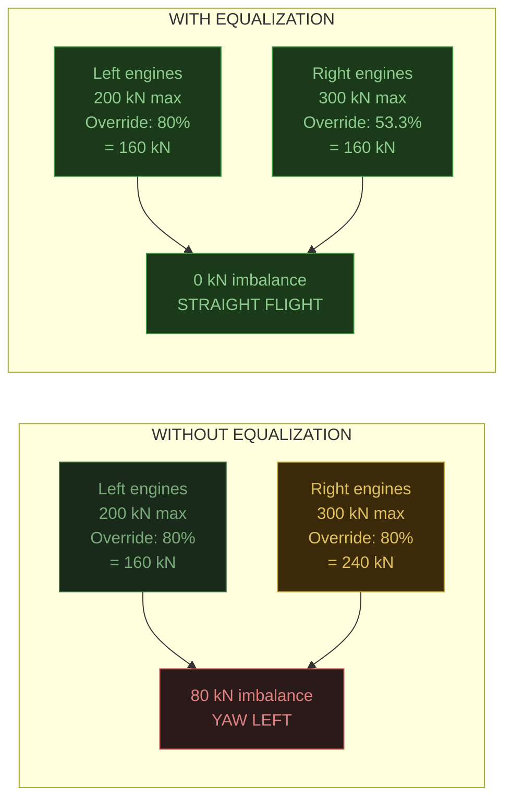
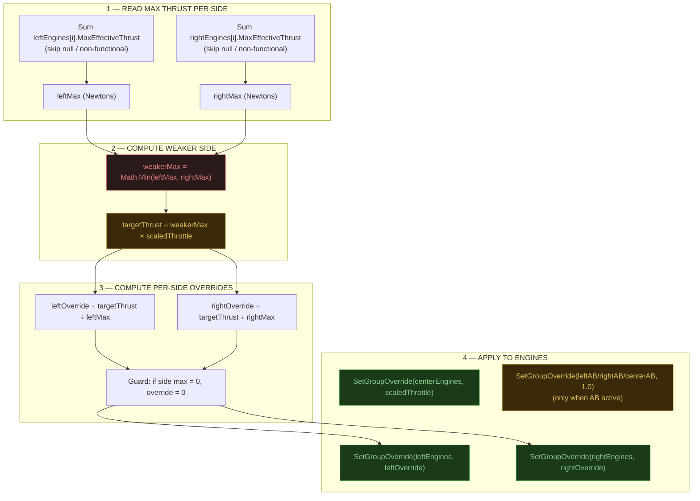
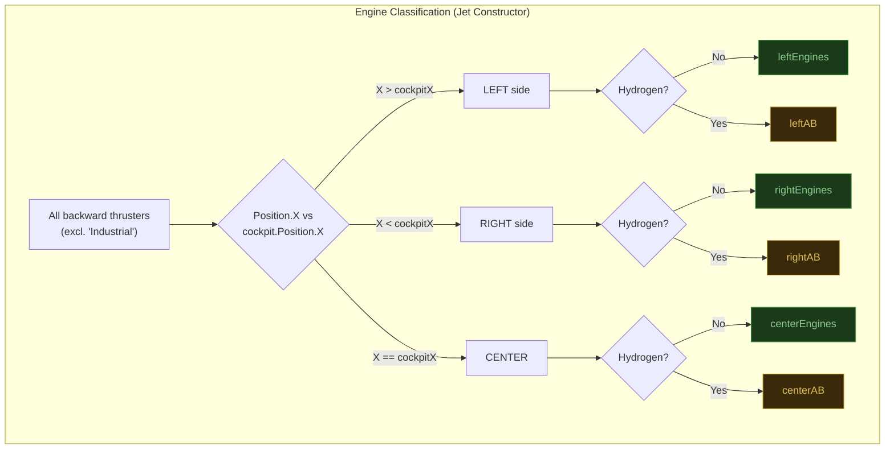
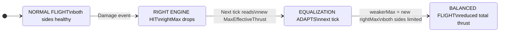
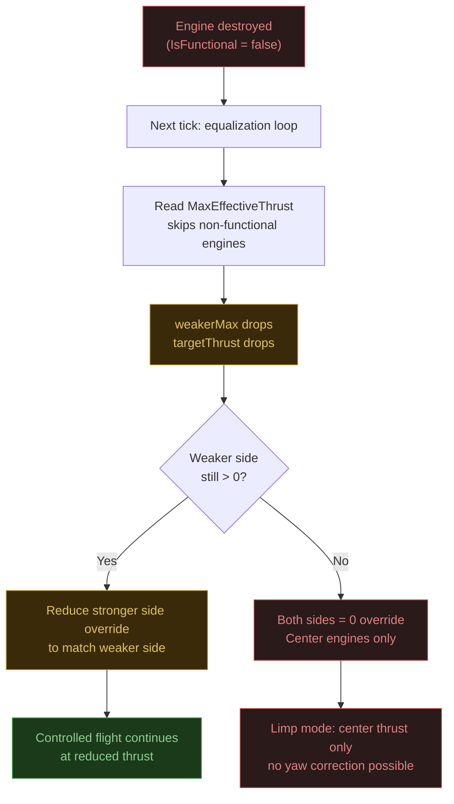

# Engine Equalization

> **Source**: `Jet.cs` (engine grouping, grid position classification), `Modules/HUDModule.cs` (equalization algorithm in `UpdateThrottleControl()`), `Modules/HUDModule.cs` (`SetGroupOverride()` helper)

## Overview

Engine equalization prevents yaw drift caused by asymmetric thrust. Every tick, the system reads `MaxEffectiveThrust` from each side's engines, caps total output to what the weaker side can produce, and computes per-side override percentages that deliver equal Newtons of force. This runs continuously, adapting instantly to engine damage, atmospheric density changes, and altitude transitions.

> **Try it live:** [interactive/throttle-demo.html](interactive/throttle-demo.html) — drag the throttle slider, click damage scenarios, watch the override percentages and yaw torque indicator rebalance in real time.

**[Open the equalization diagram](engine-equalization.svg)** to see the balancing mechanism visualized.

---

## The Problem

Without equalization, any thrust asymmetry causes uncommanded yaw:



Common causes of asymmetry:
- **Battle damage**: One or more engines destroyed on one side
- **Atmospheric density**: Altitude-dependent `MaxEffectiveThrust` changes (atmospheric thrusters)
- **Unequal engine count**: Asymmetric ship design (left side has 3 engines, right side has 2)

---

## Algorithm Pipeline

The equalization runs every tick inside `UpdateThrottleControl()` (`HUDModule.cs:542-585`):



> The `scaledThrottle` value maps the pilot's 0-80% throttle range to 0.0-1.0. When throttle is above the MIL threshold (80%), `scaledThrottle` is clamped to `1.0` (atmospheric engines at full power; additional thrust comes from AB hydrogen engines).

---

## Throttle Scaling

The equalization operates on `scaledThrottle`, not raw `throttlecontrol`:

```csharp
float scaledThrottle = throttlecontrol <= THROTTLE_HYDROGEN_THRESHOLD
    ? throttlecontrol / THROTTLE_HYDROGEN_THRESHOLD  // 0.0–0.8 → 0.0–1.0
    : 1.0f;                                          // 0.8–1.0 → 1.0 (AB adds extra)
```

| Pilot Throttle | `throttlecontrol` | `scaledThrottle` | Atmospheric Engines | AB Engines |
|:-:|:-:|:-:|:-:|:-:|
| Idle | 0.00 | 0.00 | Off | Off |
| 25% | 0.20 | 0.25 | 25% balanced | Off |
| 50% | 0.40 | 0.50 | 50% balanced | Off |
| 75% | 0.60 | 0.75 | 75% balanced | Off |
| MIL (100% atmo) | 0.80 | 1.00 | 100% balanced | Off |
| Afterburner | 0.80 – 1.00 | 1.00 | 100% balanced | 100% (all) |

---

## Engine Groups

The six engine groups are populated in the `Jet` constructor based on grid position relative to the cockpit:



**Center engines are excluded from balancing.** They sit on the centerline (same grid X as the cockpit) and produce no yaw moment regardless of thrust level. They run at straight `scaledThrottle`.

> SE grid coordinate convention: looking from cockpit forward, **X+ is LEFT**, X- is RIGHT.

---

## Damage Scenarios

### Single Engine Destroyed



**NORMAL**: leftMax=400kN, rightMax=400kN, weakerMax=400kN, both overrides at 80%. **BALANCED (after damage)**: rightMax drops to 200kN, weakerMax=200kN, leftOverride=40%, rightOverride=80%.

### Progressive Degradation

| Scenario | leftMax | rightMax | weakerMax | leftOverride | rightOverride | Total Thrust |
|:--|:-:|:-:|:-:|:-:|:-:|:-:|
| **Healthy** (2L + 2R, 200 kN each) | 400 kN | 400 kN | 400 kN | 80% | 80% | 640 kN |
| **1R destroyed** | 400 kN | 200 kN | 200 kN | 40% | 80% | 320 kN |
| **1R destroyed + altitude** (atmo thrust halved) | 200 kN | 100 kN | 100 kN | 40% | 80% | 160 kN |
| **All right destroyed** | 400 kN | 0 kN | 0 kN | 0% | 0% | 0 kN |

> When one side is fully destroyed (`rightMax = 0`), the weaker-side calculation produces `weakerMax = 0`, shutting down all lateral engines. The pilot retains only center engine thrust. This is intentional: running one side at full power with zero opposing thrust would cause an uncontrollable spin.

---

## Damage Cascade Flow



---

## SetGroupOverride Helper

The `SetGroupOverride()` method applies a percentage to a list of thrusters with a tolerance check:

```csharp
private static void SetGroupOverride(List<IMyThrust> group, float value)
{
    for (int i = 0; i < group.Count; i++)
    {
        if (group[i] != null && Math.Abs(group[i].ThrustOverridePercentage - value) > 0.001f)
            group[i].ThrustOverridePercentage = value;
    }
}
```

| Guard | Purpose |
|:--|:--|
| `group[i] != null` | Destroyed blocks become null between cache refreshes |
| `Math.Abs(... - value) > 0.001f` | Avoids redundant API calls (saves instruction cycles) |

> `ThrustOverridePercentage` is a 0.0-1.0 float. Setting it costs ~2 instruction cycles per thruster. The tolerance check avoids wasting cycles when the value hasn't meaningfully changed.

---

## Afterburner Engines

AB (hydrogen) engines are **not equalized**. When afterburner is engaged, all AB engines receive a flat `1.0` override:

```csharp
if (hydrogenswitch)
{
    SetGroupOverride(myjet.leftAB, 1f);
    SetGroupOverride(myjet.rightAB, 1f);
    SetGroupOverride(myjet.centerAB, 1f);
}
```

**Rationale**: AB engines are supplemental thrust for short-duration combat maneuvers. Balancing them against damaged atmospheric engines would defeat the purpose of afterburner (maximum thrust). The atmospheric equalization already handles yaw; AB engines add symmetric boost on top.

---

## Why MaxEffectiveThrust

The algorithm uses `MaxEffectiveThrust`, not `MaxThrust`:

| Property | Meaning | Varies With |
|:--|:--|:--|
| `MaxThrust` | Rated maximum thrust (block spec) | Never changes |
| `MaxEffectiveThrust` | Actual achievable thrust right now | Atmosphere density, altitude, damage, power |

Atmospheric thrusters produce less thrust at higher altitudes (thinner atmosphere). `MaxEffectiveThrust` reflects this in real-time, so the equalization automatically adjusts as the jet climbs or descends. A naive approach using `MaxThrust` would produce incorrect override ratios at altitude.

---

## Performance Notes

- **Per-tick execution**: The equalization runs every tick (~60/sec). This is necessary because `MaxEffectiveThrust` changes continuously with altitude.
- **Override tolerance**: `SetGroupOverride` only writes `ThrustOverridePercentage` when the delta exceeds `0.001`, saving ~2 instruction cycles per unchanged thruster per tick.
- **Null safety**: Destroyed engines are skipped via null checks. Block lists refresh every 60 ticks, so a destroyed engine may linger as null for up to 1 second before removal.
- **Zero-division guard**: `leftMax > 0` / `rightMax > 0` checks prevent division by zero when an entire side is destroyed.
- **No GC pressure**: The algorithm uses only stack-allocated floats. No heap allocations per tick.
- **Center engine bypass**: Center engines skip the min/divide math entirely, receiving `scaledThrottle` directly.
