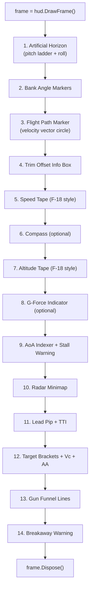
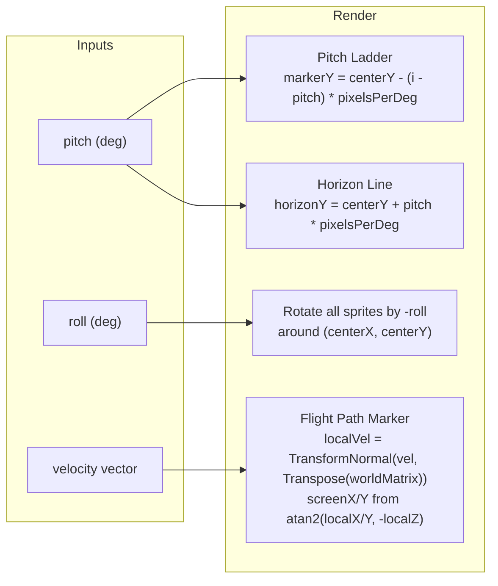
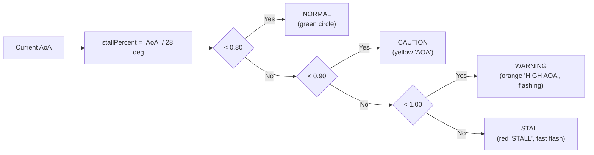
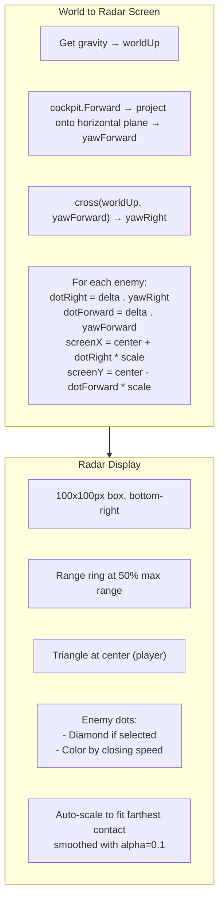
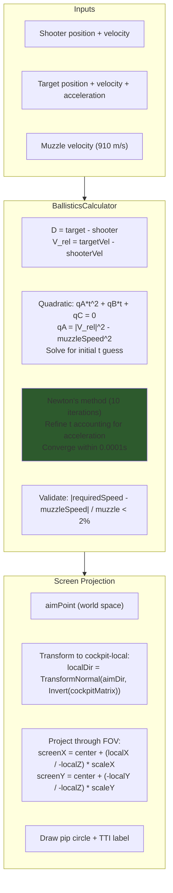
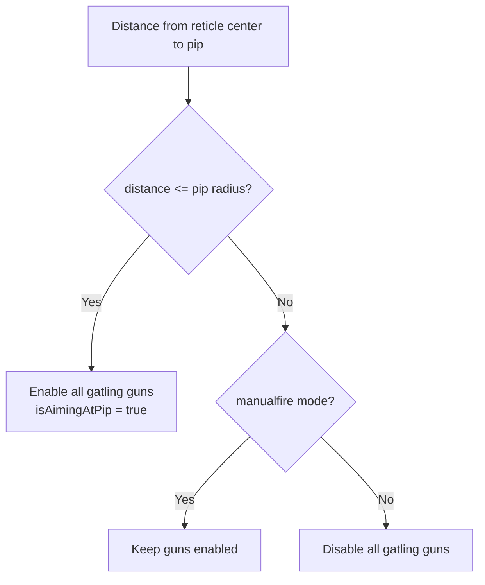
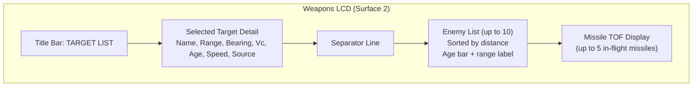
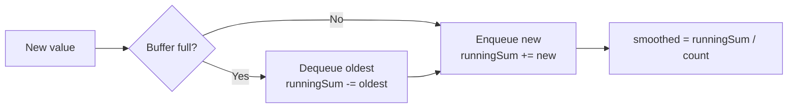

# HUD Rendering Pipeline

## Overview

The HUD renders on the `"Fighter HUD"` text surface at 60 Hz. `HUDModule.Tick()` computes flight data, then calls `RenderHUD()` which dispatches to specialized renderers in the `HUD/` folder.

```mermaid
flowchart TD
    TICK["HUDModule.Tick()"] --> VALID{"ValidateHUDState()"}
    VALID -- "fail" --> SKIP["Skip frame"]
    VALID -- "ok" --> FLIGHT["UpdateFlightData()\npitch, roll, velocity, AoA,\nG-force, Mach, altitude"]
    FLIGHT --> THROTTLE["UpdateThrottleControl()\nthrust override, H2 tanks, airbrakes"]
    THROTTLE --> SMOOTH["UpdateSmoothedValues()\ncircular buffer averaging"]
    SMOOTH --> STAB["AdjustStabilizers()\nPID trim to normalstab/invertedstab"]
    STAB --> RENDER["RenderHUD()"]

    RENDER --> R1["HorizonRenderer"]
    RENDER --> R2["InstrumentRenderer"]
    RENDER --> R3["RadarRenderer"]
    RENDER --> R4["TargetingRenderer"]
    RENDER --> R5["WeaponScreenRenderer"]

    style R1 fill:#2d5a2d
    style R2 fill:#2d4a5a
    style R3 fill:#5a2d2d
    style R4 fill:#5a4a2d
    style R5 fill:#4a2d5a
```

**Source:** `Modules/HUDModule.cs` — `Tick()`, `RenderHUD()`

---

## Render Order

`RenderHUD()` draws elements in this order (back to front):

---

## Renderer Breakdown

### HorizonRenderer (`HUD/HorizonRenderer.cs`)

Draws the artificial horizon that rotates with the aircraft.

| Element | Description |
|---------|-------------|
| Pitch Ladder | Lines every 5 deg from -90 to +90, split left/right with center gap |
| Horizon Line | Thick line at 0 deg pitch, moves vertically with pitch angle |
| Roll Rotation | All elements rotated around screen center by `-roll` angle |
| Flight Path Marker | Circle at actual velocity direction (where you're going, not where you're pointed) |
| Bank Angle Markers | Tick marks at 15/30/45/60 deg arranged radially |

**Source:** `HUD/HorizonRenderer.cs`

---

### InstrumentRenderer (`HUD/InstrumentRenderer.cs`)

Draws numeric readouts and tape gauges around the HUD edges.

| Element | Position | Data Source |
|---------|----------|-------------|
| Speed Tape | Left edge, 200px tall | `cockpit.GetShipSpeed()` converted to kph |
| Altitude Tape | Right edge, 200px tall | `cockpit.TryGetPlanetElevation()` |
| Compass | Top center, 90 deg FOV | Heading from gravity-plane projection |
| G-Force | Bottom-left | `acceleration.Length() / 9.81` |
| AoA Indexer | Left, centered | `atan2(dot(vel, up), dot(vel, fwd))` |
| Throttle Bar | Configurable | `cockpit.MoveIndicator.Z * -1` |

#### AoA Indexer Warning Levels

**Source:** `HUD/InstrumentRenderer.cs`

---

### RadarRenderer (`HUD/RadarRenderer.cs`)

Draws a top-down radar minimap in the bottom-right corner.

#### Contact Color Coding

| Condition | Color | Meaning |
|-----------|-------|---------|
| `timeToClosest < 5s` | Red | Imminent |
| `timeToClosest < 15s` | Orange | Threat |
| `closingSpeed > 0` | Yellow | Approaching |
| `closingSpeed <= 0` | Gray | Receding |

**Source:** `HUD/RadarRenderer.cs`

---

### TargetingRenderer (`HUD/TargetingRenderer.cs`)

Draws the lead pip (gun sight), target brackets, gun funnel, and breakaway warnings.

#### Lead Pip Calculation

> FOV scale constants (0.3434 horizontal, 0.31 vertical) are empirically determined from cockpit perspective.

**Source:** `HUD/TargetingRenderer.cs` — `DrawLeadingPip()`; `Utilities/BallisticsCalculator.cs` — `CalculateInterceptPoint()`

#### Gun Enable Logic

#### Target Brackets

Shows tactical data around the selected target:

| Display | Calculation |
|---------|-------------|
| Range | `distance(target, shooter)` in km or m |
| Closure Rate (Vc) | `dot(relativeVel, toTargetNorm)` — positive = closing |
| Aspect Angle (AA) | `acos(dot(targetFwd, toShooter))` — 0 = nose-on, 180 = tail |

#### Breakaway Warning

Triggers flashing "PULL UP" or "BREAK AWAY":
- **Low altitude:** `altitude < 100m AND vertical_velocity < -5 m/s`
- **Collision:** `range < 500m AND closureRate > 100 m/s`

**Source:** `HUD/TargetingRenderer.cs` — `DrawTargetBrackets()`, `DrawGunFunnel()`, `DrawBreakawayWarning()`

---

### WeaponScreenRenderer (`HUD/WeaponScreenRenderer.cs`)

Renders on LCD surface 2 (weapons status screen). Shows the enemy contact list and missile time-of-flight.

**Contact Age Color:** Green (fresh) → Yellow (aging) → Red (stale, approaching 180s timeout)

**Source tag meanings:**
- `RDR` = radar scan/track
- `RWR1` = RWR channel 1
- `PIN` = pinned raycast target
- `STT` = Single Target Track (radar locked)
- `TWS` = Track While Scan

**Source:** `HUD/WeaponScreenRenderer.cs`

---

## LCD Surface Allocation

| Surface | Block | Content |
|---------|-------|---------|
| 0 | `JetOS` | Main menu / module UI |
| 1 | `JetOS` | Grid visualization + fuel bar |
| 2 | `JetOS` | Weapons status screen |
| — | `Fighter HUD` | Full HUD (all renderers above) |
| — | `LCD Targeting Pod` | Targeting pod camera feed |

**Source:** `SystemManager.cs` — `Initialize()` (surface setup); `UI/UIController.cs` (menu rendering); `UI/GridVisualization.cs` (grid outline)

---

## Smoothing System

Flight data is smoothed using circular buffers with running sums (O(1) per update):

| Buffer | Size | Data |
|--------|------|------|
| velocityHistory | 10 | Ship speed (m/s) |
| altitudeHistory | 10 | Surface altitude (m) |
| gForcesHistory | 10 | G-force magnitude |
| aoaHistory | 10 | Angle of attack (deg) |

**Source:** `Modules/HUDModule.cs` — `UpdateSmoothedValues()`; `Utilities/CircularBuffer.cs`
