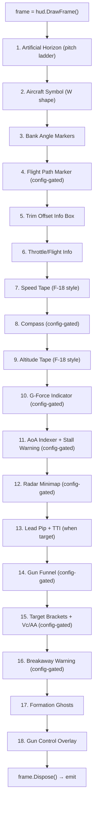
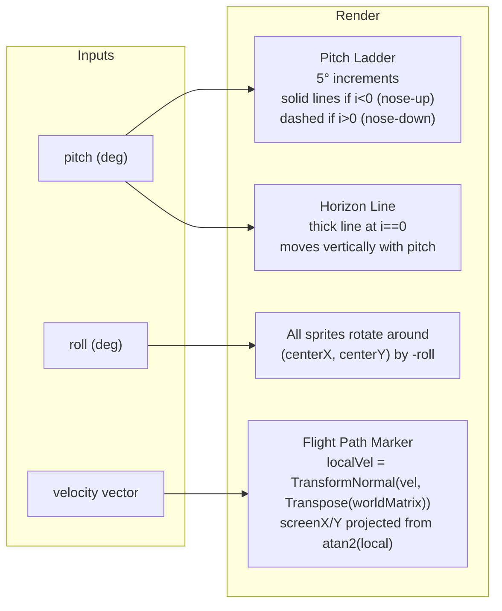
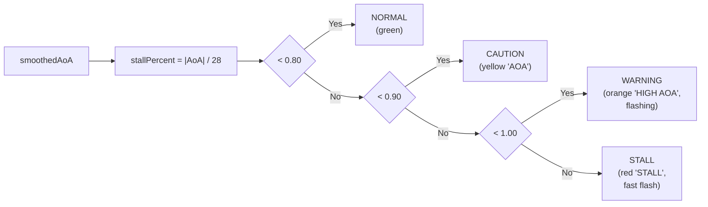
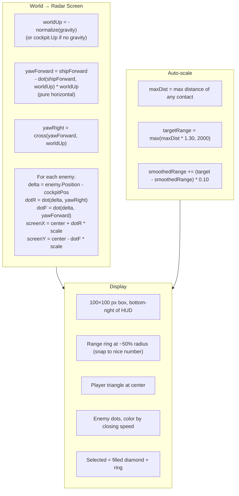
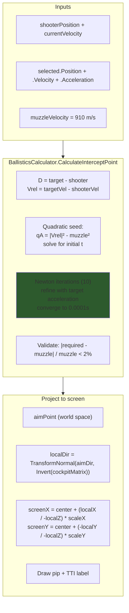
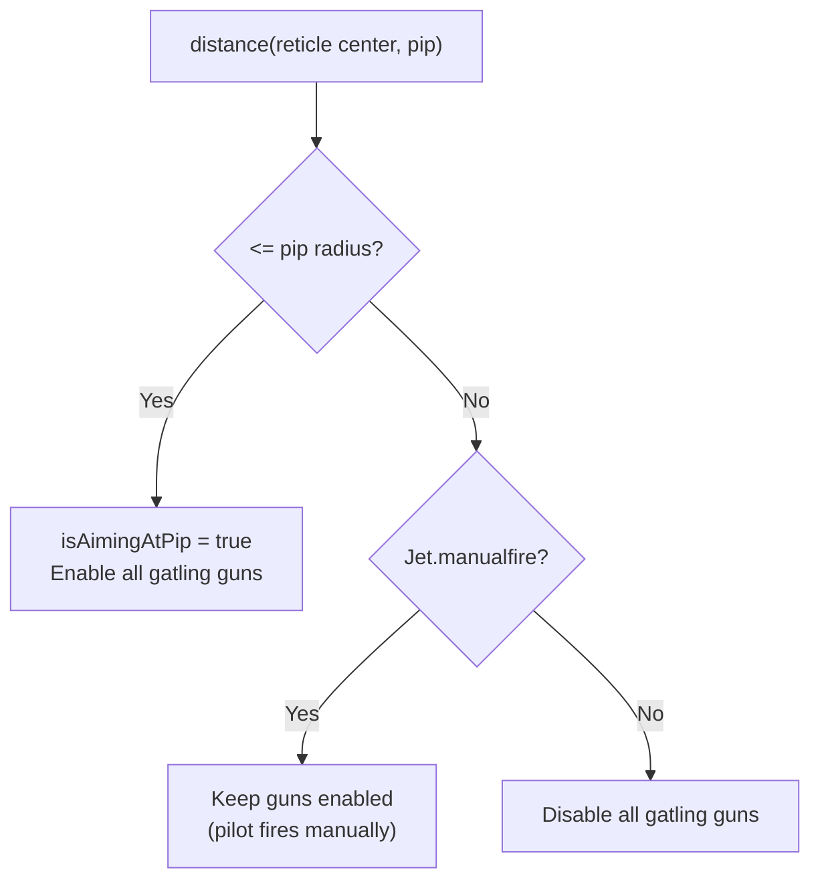
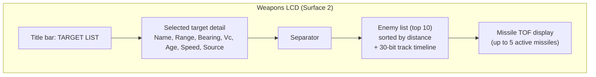
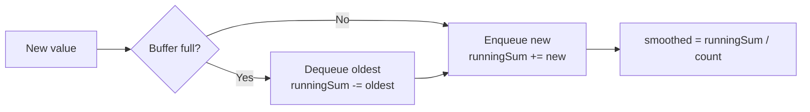

# HUD Rendering Pipeline

> **Source:** `Modules/HUDModule.cs` (orchestrator), `HUD/*.cs` (renderers), `Utilities/SpriteHelpers.cs`
>
> **Live demo:** [interactive/horizon-demo.html](interactive/horizon-demo.html) — pitch/roll sliders + Split-S/Immelmann presets.
>
> **Theme demo:** [interactive/theme-demo.html](interactive/theme-demo.html) — cycle through the four color themes.

## Overview

The HUD renders to the `Fighter HUD [HFPS]` text surface every tick (`Update1` ≈ 60 Hz). `HUDModule.Tick()` updates flight data, then dispatches to specialized renderers in the `HUD/` folder, all wrapped inside a single `hud.DrawFrame()` block for efficient batched sprite emission.


```mermaid
flowchart TD
    TICK["HUDModule.Tick()"] --> VAL{ValidateHUDState}
    VAL -- "fail" --> SKIP["Skip frame"]
    VAL -- "ok" --> CT["CacheTheme()<br/>(reads hud_theme config once)"]
    CT --> FD["UpdateFlightData()<br/>pitch, roll, velocity, AoA,<br/>G-force, Mach, altitude"]
    FD --> TH["UpdateThrottleControl()<br/>throttle, equalization, H2 tanks"]
    TH --> SM["UpdateSmoothedValues()<br/>circular buffer running averages"]
    SM --> ST["AdjustStabilizers()<br/>(skipped if Canard owns the stabs)"]
    ST --> RH["RenderHUD()"]

    RH --> R1["HorizonRenderer"]
    RH --> R2["InstrumentRenderer"]
    RH --> R3["RadarRenderer"]
    RH --> R4["TargetingRenderer"]
    RH --> R5["WeaponScreenRenderer<br/>(LCD surface 2)"]

    style R1 fill:#2d5a2d
    style R2 fill:#2d4a5a
    style R3 fill:#5a2d2d
    style R4 fill:#5a4a2d
    style R5 fill:#4a2d5a
```

**Source:** `HUDModule.cs:250-272` (Tick), `HUDModule.cs:274-371` (RenderHUD)

---

## Render Order (Back to Front)

`RenderHUD()` issues sprites in this order — later sprites paint over earlier ones.


```mermaid
flowchart TD
    F["frame = hud.DrawFrame()"] --> H1["1. Artificial Horizon (pitch ladder)"]
    H1 --> H2["2. Aircraft Symbol (W shape)"]
    H2 --> H3["3. Bank Angle Markers"]
    H3 --> H4["4. Flight Path Marker (config-gated)"]
    H4 --> H5["5. Trim Offset Info Box"]
    H5 --> H6["6. Throttle/Flight Info"]
    H6 --> H7["7. Speed Tape (F-18 style)"]
    H7 --> H8["8. Compass (config-gated)"]
    H8 --> H9["9. Altitude Tape (F-18 style)"]
    H9 --> H10["10. G-Force Indicator (config-gated)"]
    H10 --> H11["11. AoA Indexer + Stall Warning (config-gated)"]
    H11 --> H12["12. Radar Minimap (config-gated)"]
    H12 --> H13["13. Lead Pip + TTI (when target)"]
    H13 --> H14["14. Gun Funnel (config-gated)"]
    H14 --> H15["15. Target Brackets + Vc/AA (config-gated)"]
    H15 --> H16["16. Breakaway Warning (config-gated)"]
    H16 --> H17["17. Formation Ghosts"]
    H17 --> H18["18. Gun Control Overlay"]
    H18 --> DSP["frame.Dispose() → emit"]
```

> **Config-gated** elements check `SystemManager.GetConfigValue("hud_*") > 0.5f` before rendering. The pilot can disable individual elements via the Configuration menu — see [configuration.md](configuration.md).

---

## Color Themes

Four themes, selectable via Configuration → HUD Theme (`hud_theme = 0..3`):

| Index | Name | Primary | Secondary | Horizon | Radar Friendly |
|-------|------|---------|-----------|---------|----------------|
| 0 | **Green** (default) | `Color.Lime` | `Color.Green` | `LimeGreen` | `DarkGreen` |
| 1 | **Cyan** | `Color.Cyan` | `DodgerBlue` | `DeepSkyBlue` | `DarkBlue` |
| 2 | **Amber** | `Color.Orange` | `DarkGoldenrod` | `Goldenrod` | `DarkGoldenrod` |
| 3 | **White** | `Color.White` | `Color.Gray` | `LightGray` | `DarkGray` |

`CacheTheme()` reads the config value once at the start of each tick and caches the index in `_cachedTheme`. Renderers access via `HUD_PRIMARY`, `HUD_SECONDARY`, `HUD_HORIZON`, `HUD_RADAR_FRIENDLY` properties — no per-call config lookup overhead.

> **See it live:** [interactive/theme-demo.html](interactive/theme-demo.html) cycles through all four themes with the artificial horizon, radar, and instruments updating together.

**Source:** `HUDModule.cs:14-37`

---

## HorizonRenderer

Draws the artificial horizon, pitch ladder, and flight path marker.


```mermaid
flowchart LR
    subgraph In ["Inputs"]
        P["pitch (deg)"]
        R["roll (deg)"]
        V["velocity vector"]
    end

    subgraph Pipe ["Render"]
        PL["Pitch Ladder<br/>5° increments<br/>solid lines if i&lt;0 (nose-up)<br/>dashed if i&gt;0 (nose-down)"]
        HL["Horizon Line<br/>thick line at i==0<br/>moves vertically with pitch"]
        ROT["All sprites rotate around<br/>(centerX, centerY) by -roll"]
        FPM["Flight Path Marker<br/>localVel = TransformNormal(vel, Transpose(worldMatrix))<br/>screenX/Y projected from atan2(local)"]
    end

    P --> PL
    P --> HL
    R --> ROT
    V --> FPM
```

**Performance trick:** the pitch ladder loop bounds are computed from the current pitch and visible viewport height instead of iterating from -90 to +90. This brings the typical iteration count down from 36 to ~5.

```csharp
float halfVisibleDeg = (hud.SurfaceSize.Y / 2f + 100f) / pixelsPerDegree;
int loopMin = Mx(-90, (int)Math.Floor((pitch - halfVisibleDeg) / 5f) * 5);
int loopMax = Mn(90, (int)Math.Ceiling((pitch + halfVisibleDeg) / 5f) * 5);
```

**Pitch sign convention:** `pitch = asin(dot(forward, gravityDown))`. So **nose-up = negative pitch** (you're pointing away from gravity). The ladder code uses `i < 0` for nose-up dashed lines, which looks counterintuitive but matches the math.

**Source:** `HUD/HorizonRenderer.cs:13-100`

---

## InstrumentRenderer

Numeric readouts and tape gauges around the HUD edges.

| Element | Position | Data Source |
|---------|----------|-------------|
| Speed Tape | Left edge, 200px tall | `cockpit.GetShipSpeed()` × 3.6 (m/s → kph) |
| Speed Box | Inside tape, centered | Smoothed velocity |
| Altitude Tape | Right edge, 200px tall | `cockpit.TryGetPlanetElevation(Surface)` |
| Altitude Box | Inside tape, centered | Smoothed altitude |
| Compass | Top center, 90° FOV | `NavigationHelper.CalculateHeading(cockpit)` |
| G-Force | Bottom-left | `acceleration.Length() / 9.81` |
| AoA Indexer | Left edge, vertical | `atan2(dot(vel, up), dot(vel, fwd))` (deg) |

### Stall Warning Levels


```mermaid
flowchart LR
    AOA["smoothedAoA"] --> PCT["stallPercent = |AoA| / 28"]
    PCT --> C1{&lt; 0.80}
    C1 -- "Yes" --> NORM["NORMAL<br/>(green)"]
    C1 -- "No" --> C2{&lt; 0.90}
    C2 -- "Yes" --> CAU["CAUTION<br/>(yellow 'AOA')"]
    C2 -- "No" --> C3{&lt; 1.00}
    C3 -- "Yes" --> WARN["WARNING<br/>(orange 'HIGH AOA',<br/>flashing)"]
    C3 -- "No" --> STALL["STALL<br/>(red 'STALL',<br/>fast flash)"]
```

| Constant | Value |
|----------|-------|
| `STALL_AOA` | 28.0° |
| `STALL_CAUTION_PERCENT` | 0.80 |
| `STALL_WARNING_PERCENT` | 0.90 |

**Source:** `HUD/InstrumentRenderer.cs`, constants in `HUDModule.cs:144-150`

---

## RadarRenderer (Minimap)

Draws a top-down radar minimap in the bottom-right corner with smoothed auto-scaling.


```mermaid
flowchart TD
    subgraph Proj ["World → Radar Screen"]
        GRAV["worldUp = -normalize(gravity)<br/>(or cockpit.Up if no gravity)"]
        FWD["yawForward = shipForward<br/>- dot(shipForward, worldUp) * worldUp<br/>(pure horizontal)"]
        RT["yawRight = cross(yawForward, worldUp)"]
        LOOP["For each enemy:<br/>delta = enemy.Position - cockpitPos<br/>dotR = dot(delta, yawRight)<br/>dotF = dot(delta, yawForward)<br/>screenX = center + dotR * scale<br/>screenY = center - dotF * scale"]
    end

    subgraph Scale ["Auto-scale"]
        MD["maxDist = max distance of any contact"]
        TR["targetRange = max(maxDist * 1.30, 2000)"]
        SR["smoothedRange += (target - smoothedRange) * 0.10"]
    end

    subgraph Disp ["Display"]
        FRAME["100×100 px box, bottom-right of HUD"]
        RING["Range ring at ~50% radius (snap to nice number)"]
        PT["Player triangle at center"]
        EN["Enemy dots, color by closing speed"]
        SEL["Selected = filled diamond + ring"]
    end

    Proj --> Disp
    Scale --> Disp
```

> **Cross product order matters.** SE uses a **-Z forward** convention. `Cross(yawForward, worldUp)` gives the correct radar-right; `Cross(worldUp, yawForward)` flips the radar horizontally — this was an actual past bug.

### Contact Color Logic

| Condition | Color | Meaning |
|-----------|-------|---------|
| `tti < 5s` | Red | Imminent |
| `tti < 15s` | Orange | Threat |
| `closingSpeed > 0` | Yellow | Approaching |
| `closingSpeed <= 0` | Gray | Receding |

**Try it:** [interactive/radar-demo.html](interactive/radar-demo.html) has 4 preset contacts (closing/receding/lateral) that move in real time with the auto-scale and target cycling working.

**Source:** `HUD/RadarRenderer.cs`

---

## TargetingRenderer

Lead pip (gun sight), gun funnel, target brackets, and breakaway warnings.

### Lead Pip Calculation


```mermaid
flowchart TD
    subgraph In ["Inputs"]
        SP["shooterPosition + currentVelocity"]
        TP["selected.Position + .Velocity + .Acceleration"]
        MV["muzzleVelocity = 910 m/s"]
    end

    subgraph BC ["BallisticsCalculator.CalculateInterceptPoint"]
        REL["D = target - shooter<br/>Vrel = targetVel - shooterVel"]
        Q["Quadratic seed:<br/>qA = |Vrel|² - muzzle²<br/>solve for initial t"]
        N["Newton iterations (10)<br/>refine with target acceleration<br/>converge to 0.0001s"]
        VAL["Validate: |required - muzzle| / muzzle &lt; 2%"]
    end

    subgraph Proj ["Project to screen"]
        AIM["aimPoint (world space)"]
        L["localDir = TransformNormal(aimDir, Invert(cockpitMatrix))"]
        FOV["screenX = center + (localX / -localZ) * scaleX<br/>screenY = center + (-localY / -localZ) * scaleY"]
        PIP["Draw pip + TTI label"]
    end

    In --> BC --> Proj
    style N fill:#2d5a2d
```

> **1-tick spawn delay compensation:** the renderer adjusts the target position by `(targetVel - shooterVel) * (1/60)` before calling the ballistics solver. This corrects for the fact that bullets spawn one tick after the calculation completes — both objects move during that tick, so the actual range at spawn is shorter than the calculated range.

**Source:** `HUDModule.cs:329-337` (compensation), `HUD/TargetingRenderer.cs:12-100` (DrawLeadingPip), `Utilities/BallisticsCalculator.cs`

### Gun Auto-Enable Logic


```mermaid
flowchart TD
    DIST["distance(reticle center, pip)"] --> CHK{&lt;= pip radius?}
    CHK -- "Yes" --> ENABLE["isAimingAtPip = true<br/>Enable all gatling guns"]
    CHK -- "No" --> MAN{Jet.manualfire?}
    MAN -- "Yes" --> KEEP["Keep guns enabled<br/>(pilot fires manually)"]
    MAN -- "No" --> DIS["Disable all gatling guns"]
```

The pilot toggles `manualfire` by pressing crouch — see [propulsion.md](propulsion.md#manual-fire-toggle).

### Target Brackets

When a target is selected and on-screen, the brackets show:

| Display | Calculation |
|---------|-------------|
| Range | `distance(target, shooter)` in km or m |
| Closure (Vc) | `dot(relativeVel, toTargetNorm)` — positive = closing |
| Aspect (AA) | `acos(dot(targetFwd, toShooter))` — 0=nose-on, 180=tail |

### Breakaway Warning

Flashes "PULL UP" or "BREAK AWAY" when:

- **Low altitude:** `altitude < 100m` AND `vertical_velocity < -5 m/s`
- **Imminent collision:** `range < 500m` AND `closureRate > 100 m/s`

**Source:** `HUD/TargetingRenderer.cs`

---

## WeaponScreenRenderer (LCD Surface 2)

Renders to the dedicated weapons screen on `JetOS [HFPS]` surface 2.


```mermaid
flowchart TD
    subgraph LCD ["Weapons LCD (Surface 2)"]
        T["Title bar: TARGET LIST"]
        D["Selected target detail<br/>Name, Range, Bearing, Vc, Age, Speed, Source"]
        SEP["Separator"]
        L["Enemy list (top 10)<br/>sorted by distance<br/>+ 30-bit track timeline"]
        TOF["Missile TOF display<br/>(up to 5 active missiles)"]
    end

    T --> D --> SEP --> L --> TOF
```

### Track Timeline

Each contact has a `TrackHistory` field — a 30-bit value where each bit represents one second over the last 30s. `1` = radar update received, `0` = no update. The weapons screen renders this as a horizontal bar of green/dark cells, giving the pilot an at-a-glance "is this contact still being tracked?" indicator.

```
[##########.....##############]   <- TrackHistory bits
 30s ago                       now
```

### Source Tag Meanings

- `RDR` — Active radar (search/track pool)
- `RWR1` — Picked up via RWR channel 1
- `STT` — Single Target Track (radar locked)
- `TWS` — Track While Scan
- `PIN` — Pinned raycast target (legacy)

**Source:** `HUD/WeaponScreenRenderer.cs`

---

## Smoothing System

Flight data is smoothed via circular buffers using running sums (O(1) per update — no need to re-sum the buffer):


```mermaid
flowchart LR
    NEW["New value"] --> FULL{Buffer full?}
    FULL -- "Yes" --> DEQ["Dequeue oldest<br/>runningSum -= oldest"]
    FULL -- "No" --> ENQ
    DEQ --> ENQ["Enqueue new<br/>runningSum += new"]
    ENQ --> AVG["smoothed = runningSum / count"]
```

| Buffer | Size | Data |
|--------|------|------|
| `velocityHistory` | 10 | Ship speed (kph) |
| `altitudeHistory` | 10 | Surface altitude (m) + timestamp |
| `gForcesHistory` | 10 | G-force magnitude |
| `aoaHistory` | 10 | Angle of attack (deg) |

The 10-sample window at 60 Hz means a ~167ms low-pass filter — enough to remove single-frame jitter without making the readouts feel laggy.

**Source:** `HUDModule.cs:600-635`, `Utilities/CircularBuffer.cs`

---

## Stabilizer Trim

The pilot can shift the AoA trim with numpad 6/7. The trim is stored on `Jet.offset`. Every tick, `AdjustStabilizers()` writes the trim to `normalstab` (left) and `invertedstab` (right) blocks via the mod-added `Trim` terminal property.

```csharp
private void AdjustStabilizers(double aoa, Jet myjet)
{
    if (cockpit == null || CanardModule.OwnsStabs || myjet.offset == _lastTrimOffset)
        return;
    _lastTrimOffset = myjet.offset;

    AdjustTrim(rightstab, myjet.offset);
    AdjustTrim(leftstab, -myjet.offset);
}
```

> **Skipped if Canard owns the stabs.** The Canard module can spill excess deflection into the stabilizers when its own deflection saturates — see [canard-system.md](canard-system.md). When `CanardModule.OwnsStabs` is true, HUDModule defers to the canard module to avoid fighting over the trim value.

**Source:** `HUDModule.cs:639-657`

---

## LCD Surface Allocation

| Surface | Block | Renderer | Content |
|---------|-------|----------|---------|
| 0 | `JetOS [HFPS]` | `UIController` | Main menu / module options / breadcrumbs |
| 1 | `JetOS [HFPS]` | `GridVisualization` | Grid outline + flight data + G-meter |
| 2 | `JetOS [HFPS]` | `WeaponScreenRenderer` | Target list + missile TOF |
| — | `Fighter HUD [HFPS]` | All `HUD/*.cs` renderers | The main HUD |
| — | (other) | `TerrainRenderer` (when active) | Terrain map MFD page |

**Source:** `SystemManager.cs:40-66` (surface setup)
