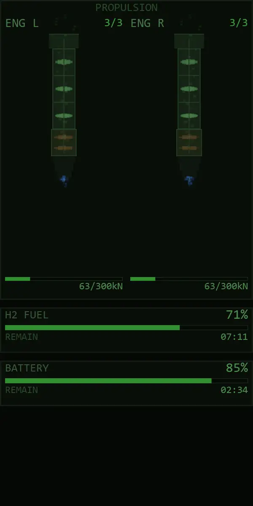
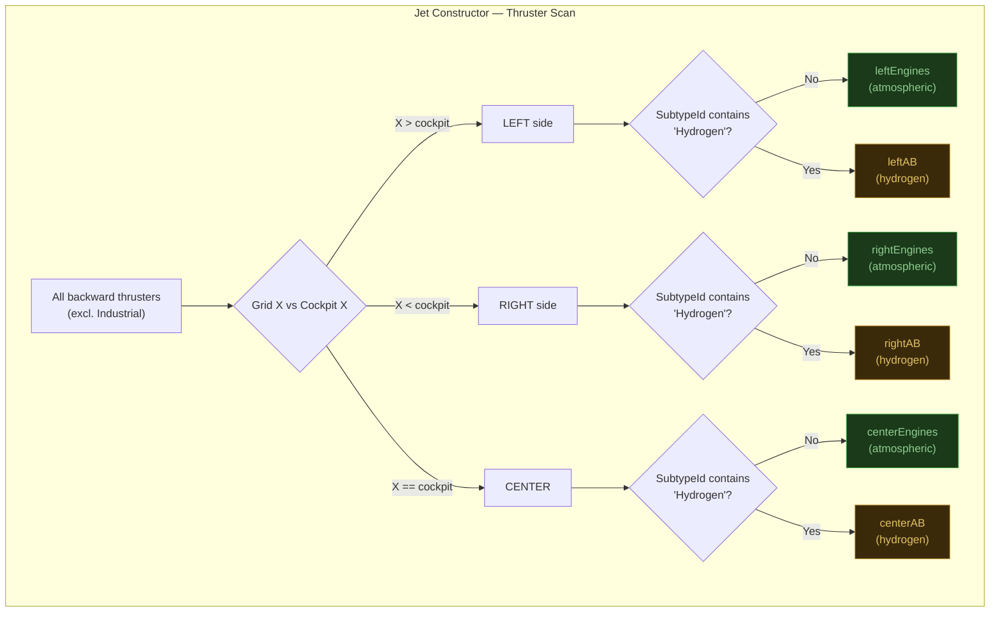
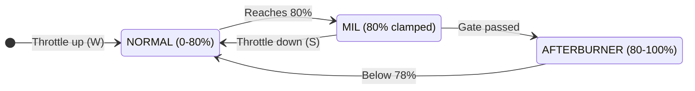
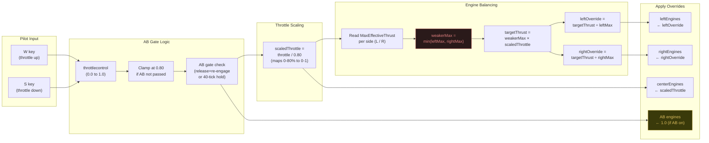

# Propulsion System

> **Source**: `Jet.cs` (engine grouping), `Modules/HUDModule.cs` (throttle control), `UI/StatusPanelRenderer.cs` (engine visualization)

## Overview

JetOS manages a twin-engine configuration with atmospheric thrusters for normal flight and hydrogen thrusters for afterburner boost. Engines are dynamically grouped by grid position relative to the cockpit, enabling per-side thrust balancing and asymmetric damage handling.

The animation below is a 1:1 recreation of the in-game `StatusPanelRenderer`, with the throttle cycling through IDLE, MIL, and AB stages.



> Interactive versions: [SVG](propulsion-animation.svg) and [HTML](propulsion-animation.html) — open locally in any browser for the live JavaScript-driven animation.

---

## Engine Classification

At initialization, `Jet` scans all backward-facing thrusters on the grid (excluding `"Industrial"` named blocks) and classifies them into six groups based on two axes: **lateral position** and **fuel type**.



> SE grid coordinate convention: looking from the cockpit forward, **X+ is LEFT**, X- is RIGHT. Center engines (same X as cockpit) participate in both sides' thrust calculations but are not balanced — they run at straight throttle.

---

## Throttle Stages

The throttle system provides three distinct power stages with a safety gate preventing accidental afterburner engagement.



**MIL**: Throttle clamps at 80% until AB gate is passed. Green HUD bar. **AB**: H2 tanks enabled, full thrust. Yellow HUD bar.

| Stage | Throttle Range | Thrust Sources | H2 Tanks | HUD Bar Color |
|-------|---------------|----------------|----------|---------------|
| **NORMAL** | 0% – 80% | Atmospheric only, proportional | Disabled | Green |
| **MIL** (Military) | 80% (clamped) | Atmospheric at 100% | Disabled | Green |
| **AFTERBURNER** | 80% – 100% | Atmospheric 100% + Hydrogen | Enabled | Yellow |

---

## MIL/AB Gate Mechanism

The gate prevents accidentally engaging afterburner (which consumes hydrogen fuel) during normal maneuvering. There are two ways to break through the gate:

```mermaid
flowchart TD
    START["Throttle reaches 80%\n(MIL clamp active)"] --> CHOICE{Pilot action}

    CHOICE --> PATH_A["Path A: Release and Re-engage\nRelease W at MIL"]
    CHOICE --> PATH_B["Path B: Hold Through\nKeep W held at MIL"]

    PATH_A --> ARMED["Gate ARMED\n(abGatePassed = true)"]
    ARMED --> REPRESS["Press W again"]
    REPRESS --> AB_ON["AB engages immediately\nH2 tanks ON"]

    PATH_B --> COUNTER["abHoldCounter increments\neach tick"]
    COUNTER --> CHECK{Counter > 40?\n(~0.67 seconds)}
    CHECK -- No --> COUNTER
    CHECK -- Yes --> AB_ON

    AB_ON --> FLYING["Afterburner active\nFull atmospheric + hydrogen"]
    FLYING --> THROTTLE_DN["Throttle drops\nbelow 78%"]
    THROTTLE_DN --> RESET["H2 tanks OFF\nGate reset\nBack to NORMAL"]

    style AB_ON fill:#3a3a0a,stroke:#c0a030,color:#e0c060
    style ARMED fill:#1a2a3a,stroke:#4080c0,color:#80c0e0
    style RESET fill:#1a3a1a,stroke:#40a040,color:#90cc90
```

The 2% hysteresis (`HYDROGEN_HYSTERESIS = 0.02`) between the MIL engagement point (80%) and the AB disengage point (78%) prevents oscillation when the throttle hovers near the boundary.

---

## Thrust Control Pipeline

Every tick, `UpdateThrottleControl()` converts the pilot's W/S input into per-engine thrust overrides:



> **Why balance?** If one side has damaged or fewer engines, its `MaxEffectiveThrust` is lower. Without equalization, the stronger side would produce more thrust, causing unwanted yaw. See [Engine Equalization](engine-equalization.md) for the full algorithm.

---

## Airbrakes

Airbrakes are `IMyDoor` blocks that open/close based on the cockpit's vertical (jump/crouch) input:

- **Jump (Space)**: Opens all doors → aerodynamic braking
- **Release**: Closes all doors

The system tracks `airbrakesOpen` state to avoid redundant API calls.

---

## Hydrogen Tank Management

H2 tanks are toggled via `SetTanksEnabled()`:

- **AB engaged**: All tanks with `"Jet"` in name → `Enabled = true`
- **AB disengaged**: → `Enabled = false`
- **On startup**: Tanks disabled (prevents accidental fuel drain)

Only tanks whose `Enabled` state actually differs from the target value are touched (avoids redundant API calls that cost instruction cycles).

---

## Live Engine Visualization

The engine animation below is a 1:1 JavaScript port of `StatusPanelRenderer.cs` — every drawing call, color, and formula is identical to the in-game MFD. The throttle cycles automatically through IDLE, NORMAL, MIL, and AB stages.


> The animation shows: 3D-projected compressor blade discs with depth-sorted rendering, 48 golden-ratio-spaced air particles per engine with hermite smoothstep phasing, multi-tongue exhaust plume with per-stage coloring (blue/MIL white-blue/AB orange-yellow), combustion chamber glow proportional to thrust, and resource cards.

---

## Engine Health Monitoring

`Jet.GetEngineHealth()` returns `(functional, total)` counts for any engine group. `StatusPanelRenderer` visualizes this per-side with:

- **Segment coloring**: Damaged compressor segments blink red
- **Thrust bars**: Live `currentThrust / maxThrust` readout in kN
- **Animated turbine discs**: Spin speed proportional to thrust percentage
- **Exhaust plume**: Color and length respond to thrust stage (blue → white → orange)

The mini engine schematics on the MFD status panel show a real-time cross-section of each engine with 3D-projected compressor blade rotation, air particle flow, and maneuver-responsive exhaust drift.

---

## Performance Notes

- **Thrust override tolerance**: Only sets `ThrustOverridePercentage` when the delta exceeds `0.001` (avoids wasting instruction cycles on no-ops)
- **Block cache refresh**: Engine lists are populated once at init, refreshed every 60 ticks in `GridVisualization`
- **Tank toggle efficiency**: Only toggles `Enabled` when the current state differs from target
