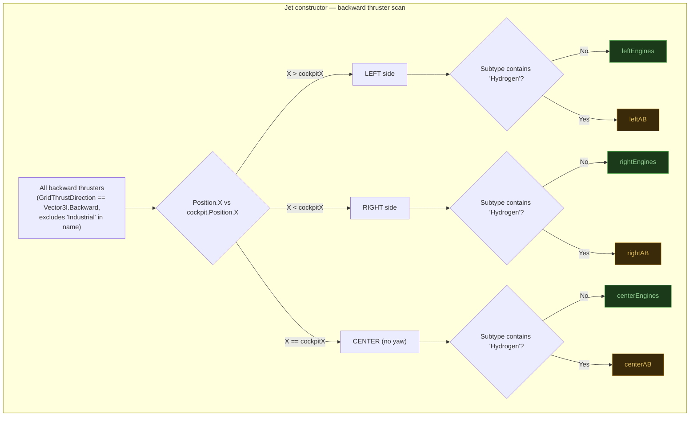
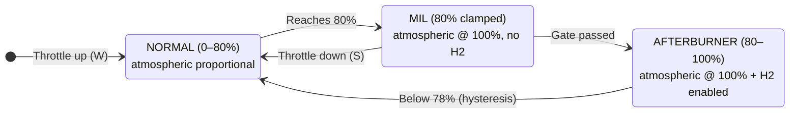
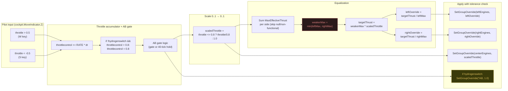

# Propulsion System

> **Source:** `Jet.cs` (engine grouping), `Modules/HUDModule.cs` (`UpdateThrottleControl()`), `UI/StatusPanelRenderer.cs` (engine card visualization)
>
> **Try it live:** [interactive/throttle-demo.html](interactive/throttle-demo.html) — drag the W slider, hit damage scenarios, watch equalization rebalance overrides in real time.

## Overview

JetOS manages a multi-engine configuration with **atmospheric thrusters** for normal flight and **hydrogen thrusters** for afterburner boost. Engines are dynamically grouped by grid position relative to the cockpit, enabling per-side balancing and asymmetric damage handling.

The MFD sidebar continuously renders a 1:1 cross-section of each engine — turbine spin, particle airflow, exhaust plume, and damage state. See [propulsion-animation.html](propulsion-animation.html) for the live JavaScript port.


---

## Engine Classification

At construction time, `Jet` scans every backward-facing thruster (excluding any with `Industrial` in the name) and sorts them into six lists by **lateral position** and **fuel type**.



> **SE coordinate quirk:** looking from the cockpit forward, **X+ is LEFT**, X− is RIGHT. Cockpit X is the lateral midline. Center engines (`Position.X == cockpitX`) participate in throttle but are bypassed in equalization since they produce no yaw moment.

**Source:** `Jet.cs:149-180`

---

## Throttle Stages

The throttle system has three distinct stages with a safety gate preventing accidental afterburner engagement.



| Stage | Throttle Range | Atmospheric | H2 Tanks | HUD Bar |
|-------|----------------|-------------|----------|---------|
| **NORMAL** | 0% – 80% | Proportional, balanced | Disabled | Green |
| **MIL** | 80% (clamped) | 100%, balanced | Disabled | Green |
| **AFTERBURNER** | 80% – 100% | 100%, balanced | Enabled | Yellow |

---

## MIL/AB Gate Mechanism

The gate prevents accidental afterburner engagement (which costs hydrogen). Two ways to break through:

```mermaid
flowchart TD
    START["Throttle reaches 80%<br/>(MIL clamp active)"] --> CHOICE{Pilot action}

    CHOICE --> PA["Path A: Release &amp; Re-press"]
    CHOICE --> PB["Path B: Hold W"]

    PA --> ARMED["Release W at MIL<br/>abGatePassed = true"]
    ARMED --> REPRESS["Press W again"]
    REPRESS --> AB["AB engages immediately<br/>SetTanksEnabled(true)<br/>hydrogenswitch = true"]

    PB --> COUNTER["abHoldCounter++<br/>each tick W is held"]
    COUNTER --> CHK{Counter &gt; 40?<br/>(~0.67s @ 60fps)}
    CHK -- "No" --> COUNTER
    CHK -- "Yes" --> AB

    AB --> FLY["Afterburner active<br/>full atmospheric + hydrogen"]
    FLY --> DOWN["Throttle &lt; 78% (HYSTERESIS=0.02)"]
    DOWN --> RESET["SetTanksEnabled(false)<br/>hydrogenswitch = false<br/>gate reset"]

    style AB fill:#3a3a0a,stroke:#c0a030,color:#e0c060
    style ARMED fill:#1a2a3a,stroke:#4080c0,color:#80c0e0
    style RESET fill:#1a3a1a,stroke:#40a040,color:#90cc90
```

The 2% hysteresis between MIL engagement (80%) and AB disengagement (78%) prevents oscillation when throttle hovers near the boundary.

**Source:** `HUDModule.cs:447-505`

> **See it in action:** the [throttle demo](interactive/throttle-demo.html) shows the gate state, hold counter, and tank toggle in real time as you drag the W slider.

---

## Thrust Control Pipeline

Every tick, `UpdateThrottleControl()` converts pilot W/S input into per-engine thrust overrides:



> **Why the weaker side?** If one side has damaged or fewer engines, its `MaxEffectiveThrust` is lower. Without equalization, the stronger side would generate more thrust, causing yaw drift. See [engine-equalization.md](engine-equalization.md) for the math.

**Source:** `HUDModule.cs:542-585`

---

## Airbrakes

Airbrakes are `IMyDoor` blocks that open/close based on the cockpit's vertical input:

| Pilot input | Airbrake state |
|-------------|----------------|
| Jump (Space) — `MoveIndicator.Y > 0.5` | All doors open → drag |
| Released — Y near 0 | All doors close |

State is tracked in `airbrakesOpen` so we don't spam the API every tick when nothing changed.

**Source:** `HUDModule.cs:507-518`

---

## Hydrogen Tank Management

`SetTanksEnabled(bool)` toggles every tank with `Jet` in its name:

| Throttle State | Action |
|----------------|--------|
| AB engages | Enable all `Jet` tanks |
| AB disengages | Disable all `Jet` tanks |
| Script startup | Tanks disabled (`HUDModule` constructor) |

The function only writes `Enabled` if the current state differs from the target. This avoids ~2 instructions per unchanged tank per tick.

**Source:** `HUDModule.cs:587-594`

---

## Manual Fire Toggle

Pressing crouch (`MoveIndicator.Y < -0.5`) toggles `Jet.manualfire`:

| Mode | Behavior |
|------|----------|
| `manualfire = true` | Gatling guns stay enabled. Pilot fires manually. |
| `manualfire = false` | Guns are enabled by `TargetingRenderer.DrawLeadingPip()` only when the lead pip is on-target. Auto-disable when off-target. |

A `manualFireToggleCooldown` flag prevents the press from firing every tick the key is held.

**Source:** `HUDModule.cs:520-540`

---

## Live Engine Visualization

The MFD sidebar's engine cards are rendered by `StatusPanelRenderer.DrawEngCol()`. Each side shows:

- **Functional/Total count** (red if any are damaged)
- **Vertical thrust bar** with damage gradient
- **Live thrust readout in kN** (`current / max`)
- **Bar fills yellow when AB is active** (any AB thrust > 0.1 kN)

The animation port at [propulsion-animation.html](propulsion-animation.html) is a pure-JS recreation showing the in-game schematic — compressor blade discs, particle airflow, exhaust plume coloring per stage.

**Source:** `UI/StatusPanelRenderer.cs:62-93`

---

## Tunable Constants

| Constant | Value | Where | Purpose |
|----------|-------|-------|---------|
| `THROTTLE_RATE` | 0.6 | HUDModule | Throttle change per second (W or S) |
| `THROTTLE_HYDROGEN_THRESHOLD` | 0.8 | HUDModule | MIL gate position |
| `HYDROGEN_HYSTERESIS` | 0.02 | HUDModule | Gap between MIL engage / AB disengage |
| `AB_AUTO_ENGAGE_TICKS` | 40 | HUDModule | Hold-W ticks to bypass gate |
| `0.001f` | tolerance | SetGroupOverride | Skip API call if delta is below this |

Tweak `AB_AUTO_ENGAGE_TICKS` to make the gate stricter (longer hold) or more permissive (shorter hold).

---

## Performance Notes

- **Per-tick equalization** runs unconditionally — `MaxEffectiveThrust` changes with altitude (atmospheric density), so we re-read every frame.
- **Tolerance-checked overrides** skip the API write when the delta is < 0.001. With ~12 thrusters this saves ~24 instructions per tick when the throttle is steady.
- **No GC pressure** — equalization uses only stack-allocated floats. The same `for` loops mutate existing list entries.
- **Center engines bypass the min/divide** entirely. They get raw `scaledThrottle`.
