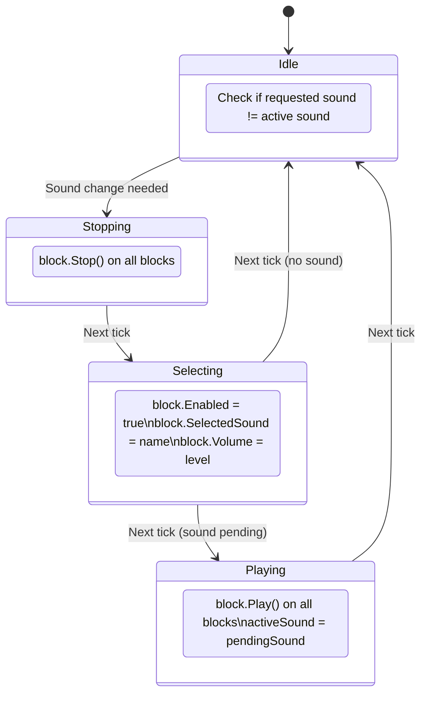
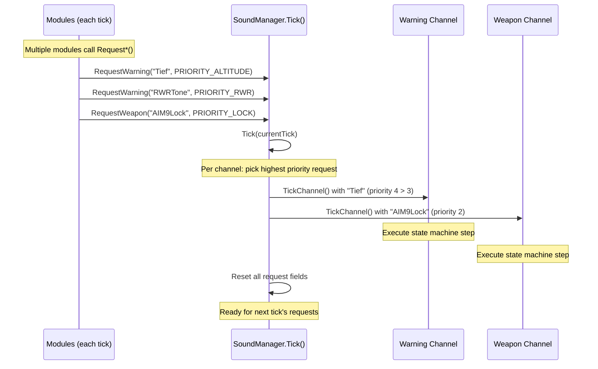

# Sound System

## Dual-Channel Architecture

SoundManager runs two independent audio channels, each with its own sound blocks and priority system. The highest-priority request each tick wins.

```mermaid
flowchart LR
    subgraph Requesters ["Sound Requesters (every tick)"]
        ALT["SystemManager\nAltitude warning"]
        RWR["RadarControlModule\nRWR threat tone"]
        LOCK["AirtoAir\nAIM9 lock tone"]
        SEARCH["AirtoAir\nAIM9 search tone"]
    end

    subgraph Channels ["SoundManager"]
        subgraph WCH ["Warning Channel"]
            WB["Sound Block Warning\n(volume 1.0)"]
        end
        subgraph ACH ["Weapon Channel"]
            AB["Canopy Side Plate Sound Block\n(volume 0.3)"]
        end
    end

    ALT --> |"PRIORITY_ALTITUDE (4)"| WCH
    RWR --> |"PRIORITY_RWR (3)"| WCH
    LOCK --> |"PRIORITY_LOCK (2)"| ACH
    SEARCH --> |"PRIORITY_SEARCH (1)"| ACH

    style ALT fill:#8b0000,color:#fff
    style RWR fill:#8b4513,color:#fff
    style LOCK fill:#2d5a2d
    style SEARCH fill:#2d4a5a
```

---

## Priority System

Each tick, modules call `RequestWarning()` or `RequestWeapon()`. Only the highest priority wins per channel.

| Priority | Value | Sound | Channel | Requester |
|----------|-------|-------|---------|-----------|
| ALTITUDE | 4 | `"Tief"` | Warning | SystemManager (low + fast) |
| RWR | 3 | RWR tone | Warning | RadarControlModule |
| LOCK | 2 | `"AIM9Lock"` | Weapon | AirtoAir (target locked) |
| SEARCH | 1 | `"AIM9Search"` | Weapon | AirtoAir (searching) |
| NONE | 0 | — | — | (no request = silence) |

**Rule:** If altitude warning (4) and RWR (3) both fire on the same tick, only altitude plays on the warning channel.

**Source:** `Utilities/SoundManager.cs` — `RequestWarning()`, `RequestWeapon()`

---

## 3-Tick State Machine

Space Engineers allows only 1 sound API action per tick. Changing a sound requires 3 sequential ticks:

### Optimization

When in Idle and a change is detected, `Stop()` executes immediately on the same tick (not deferred to next tick). This saves 1 tick compared to a pure 4-state machine — total change time is 3 ticks (~50ms).

---

## Tick Processing

---

## Sound Block Naming

| Block Name | Channel | Volume | Purpose |
|------------|---------|--------|---------|
| `Sound Block Warning` | Warning | 1.0 (full) | Altitude/speed alerts, RWR |
| `Canopy Side Plate Sound Block` | Weapon | 0.3 (quiet) | AIM9 lock/search tones |

Multiple blocks with the same name are supported — all play simultaneously for spatial audio effect.

**Source:** `Utilities/SoundManager.cs` — `Initialize()` (block detection), `TickChannel()` (state machine)
