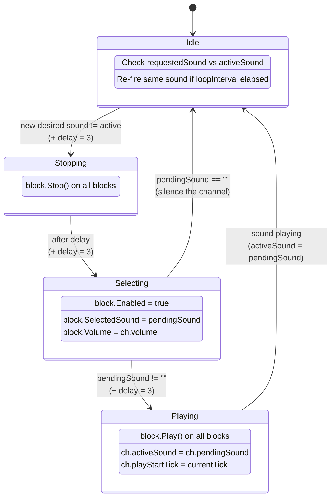
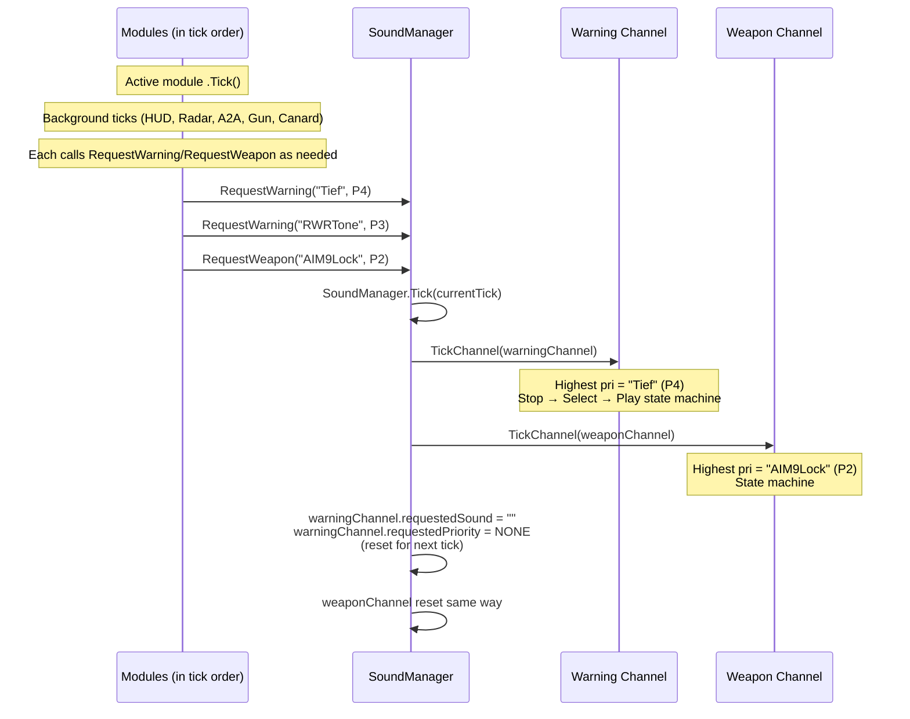

# Sound System

> **Source:** `Utilities/SoundManager.cs`
>
> **Live demo:** [interactive/sound-priority-demo.html](interactive/sound-priority-demo.html) — click priority buttons, watch the dual-channel state machine + 3-frame delay live.
>
> **Tick-by-tick trace:** [sound-pipeline-debug.md](sound-pipeline-debug.md) (stays as a deep-dive reference).

## Dual-Channel Architecture

`SoundManager` runs two independent audio channels, each with its own sound blocks and priority resolution.


```mermaid
flowchart LR
    subgraph REQ ["Per-tick requesters"]
        ALT["SystemManager<br/>Altitude warning"]
        RWR["RadarControlModule<br/>RWR threat tone"]
        LCK["AirtoAir<br/>AIM9 lock tone"]
        SCH["AirtoAir<br/>AIM9 search tone"]
    end

    subgraph SM ["SoundManager"]
        WCH["Warning Channel<br/>blocks: Sound Block Warning<br/>volume: 1.0"]
        ECH["Weapon Channel<br/>blocks: Canopy Side Plate Sound Block<br/>volume: 0.3"]
    end

    ALT --> |"P4 RequestWarning"| WCH
    RWR --> |"P3 RequestWarning"| WCH
    LCK --> |"P2 RequestWeapon"| ECH
    SCH --> |"P1 RequestWeapon"| ECH

    style ALT fill:#8b0000,color:#fff
    style RWR fill:#8b4513,color:#fff
    style LCK fill:#2d5a2d
    style SCH fill:#2d4a5a
```

> **`SoundManager.Tick()` runs LAST** in `SystemManager.Main()`, after every module has had a chance to call `RequestWarning()` / `RequestWeapon()`. This ensures all module requests from the current tick are batched before the priority arbiter picks a winner. Previously the tick ran first and module requests were delayed by one frame.

**Source:** `Utilities/SoundManager.cs`, `SystemManager.cs:241` (Tick last)

---

## Priority Resolution

Each tick, multiple modules can call `Request*()`. Only the **highest priority per channel** wins; lower-priority requests are silently dropped that tick.

| Priority | Value | Sound | Channel | Caller |
|----------|-------|-------|---------|--------|
| `PRIORITY_ALTITUDE` | 4 | `Tief` | Warning | `SystemManager` (low altitude + fast) |
| `PRIORITY_RWR` | 3 | `RWRTone` | Warning | `RadarControlModule` (active threat) |
| `PRIORITY_LOCK` | 2 | `AIM9Lock` | Weapon | `AirtoAir` (target locked) |
| `PRIORITY_SEARCH` | 1 | `AIM9Search` | Weapon | `AirtoAir` (no lock yet) |
| `PRIORITY_NONE` | 0 | — | — | (no request = silence) |

**Rule:** if altitude (P4) and RWR (P3) both fire on the same tick, only the altitude tone plays on the warning channel. RWR is dropped that tick. They run on different channels — the weapon channel can play AIM9Lock simultaneously.

```csharp
public static void RequestWarning(string sound, int priority, int loopInterval = 300)
{
    if (priority >= warningChannel.requestedPriority) {
        warningChannel.requestedSound = sound;
        warningChannel.requestedPriority = priority;
        warningChannel.requestedLoopInterval = loopInterval;
    }
}
```

The `>=` (not `>`) means later same-priority calls win — convenient for replacing requests within a tick if a more accurate sound becomes known.

**Source:** `Utilities/SoundManager.cs:80-104`

---

## State Machine with 3-Frame Delay

Space Engineers allows only **1 sound API action per tick** per block. Worse, **SE calls `Main()` twice per simulation tick** when a toolbar button is pressed — once with `UpdateType.Trigger` and once with `Update1`. Both calls would each try to issue block operations, and SE applies them all at end-of-sim-tick, sometimes discarding one.

The fix: a 4-state machine with a **3-frame delay** between every transition.


```mermaid
stateDiagram-v2
    [*] --> Idle

    Idle --> Stopping : new desired sound != active<br/>(+ delay = 3)
    Stopping --> Selecting : after delay<br/>(+ delay = 3)
    Selecting --> Playing : pendingSound != ""<br/>(+ delay = 3)
    Selecting --> Idle : pendingSound == ""<br/>(silence the channel)
    Playing --> Idle : sound playing<br/>(activeSound = pendingSound)

    state Idle {
        [*]: Check requestedSound vs activeSound
        [*]: Re-fire same sound if loopInterval elapsed
    }
    state Stopping {
        [*]: block.Stop() on all blocks
    }
    state Selecting {
        [*]: block.Enabled = true
        [*]: block.SelectedSound = pendingSound
        [*]: block.Volume = ch.volume
    }
    state Playing {
        [*]: block.Play() on all blocks
        [*]: ch.activeSound = ch.pendingSound
        [*]: ch.playStartTick = currentTick
    }
```

### Why 3 frames?

- Each sim tick may call `Main()` twice (Trigger + Update1).
- Each `Main()` decrements the delay counter.
- 3 `Main()` calls = guaranteed 2 sim ticks of separation.
- Each block operation lands in a different sim tick → SE has time to fully apply each change before the next arrives.

Total time from "request a new sound" to "audio playing" worst case:
- Stopping: 3 frames
- Selecting: 3 frames
- Playing: 3 frames
- = 9 frames ≈ 4-5 sim ticks ≈ ~83ms at 60fps

Acceptable for a warning tone; imperceptible for a continuous loop.

### PrepChannel at Init

`SoundManager.Initialize()` runs `PrepChannel()` on both channels, which forcibly stops every block, enables it, clears `SelectedSound`, and sets the volume. This puts blocks in a known clean state so the first `Play()` after script compile works reliably — avoids the case where a block was left mid-sound from a previous PB run.

**Source:** `Utilities/SoundManager.cs:64-74`

---

## Loop Interval

Sounds can be re-played at a configurable interval (default 300 ticks ≈ 5 seconds). This lets a request stay "active" by re-firing the same sound periodically, even though the actual block `Play()` is rate-limited:

```csharp
else if (!string.IsNullOrEmpty(desired) && !string.IsNullOrEmpty(ch.activeSound))
{
    if (currentTick - ch.playStartTick >= ch.activeLoopInterval)
    {
        ch.pendingSound = desired;
        needsChange = true;  // re-fire
    }
}
```

Used by AIM9 lock/search tones, which loop every 5s while the seeker is engaged.

**Source:** `Utilities/SoundManager.cs:202-215`

---

## Tick Sequence


```mermaid
sequenceDiagram
    participant Mods as Modules (in tick order)
    participant SM as SoundManager
    participant W as Warning Channel
    participant E as Weapon Channel

    Note over Mods: Active module .Tick()
    Note over Mods: Background ticks (HUD, Radar, A2A, Gun, Canard)
    Note over Mods: Each calls RequestWarning/RequestWeapon as needed

    Mods->>SM: RequestWarning("Tief", P4)
    Mods->>SM: RequestWarning("RWRTone", P3)
    Mods->>SM: RequestWeapon("AIM9Lock", P2)

    SM->>SM: SoundManager.Tick(currentTick)
    SM->>W: TickChannel(warningChannel)
    Note over W: Highest pri = "Tief" (P4)<br/>Stop → Select → Play state machine
    SM->>E: TickChannel(weaponChannel)
    Note over E: Highest pri = "AIM9Lock" (P2)<br/>State machine

    SM->>SM: warningChannel.requestedSound = ""<br/>warningChannel.requestedPriority = NONE<br/>(reset for next tick)
    SM->>SM: weaponChannel reset same way
```

**Source:** `Utilities/SoundManager.cs:106-120`

---

## Sound Block Naming

| Block Name | Channel | Volume | Purpose |
|------------|---------|--------|---------|
| `Sound Block Warning` | Warning | 1.0 (full) | Altitude/speed alerts, RWR threat tone |
| `Canopy Side Plate Sound Block` | Weapon | 0.3 (quiet) | AIM9 lock/search tones |

Multiple blocks with the same name are supported — `GetBlocksOfType` finds all of them, and they all play simultaneously for spatial audio effect.

> **Choose appropriate sound clips in-game.** The `SelectedSound` string must match a sound name SE knows. JetOS uses:
> - `Tief` — generic alert tone
> - `RWRTone` — RWR threat tone (configure in your sound block options)
> - `AIM9Lock` — AIM9 lock-on tone
> - `AIM9Search` — AIM9 search tone

**Source:** `Utilities/SoundManager.cs:41-62` (Initialize)

---

## Try It Yourself

The [interactive/sound-priority-demo.html](interactive/sound-priority-demo.html) demo runs the **exact same state machine** in JavaScript. Click the priority buttons to fire requests and watch:

- The 4-state state machine transitions in real time
- The 3-frame delay countdown
- A timeline showing the last 30 ticks
- Priority arbitration when multiple buttons are held simultaneously

Adjustable tick rate to make the state changes easier to see at slow speeds.
