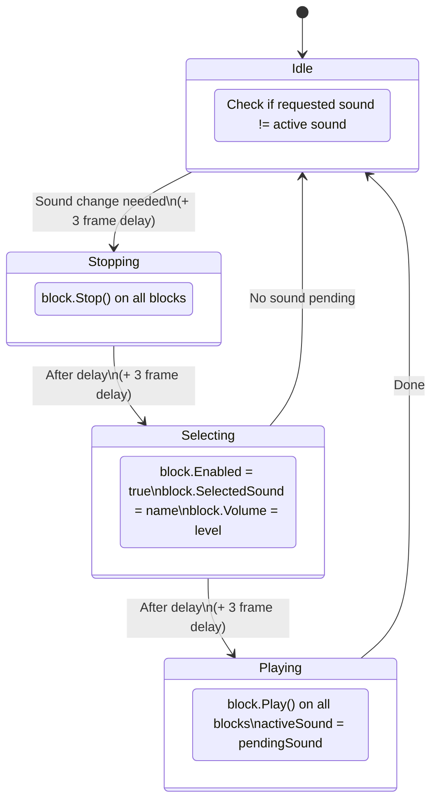
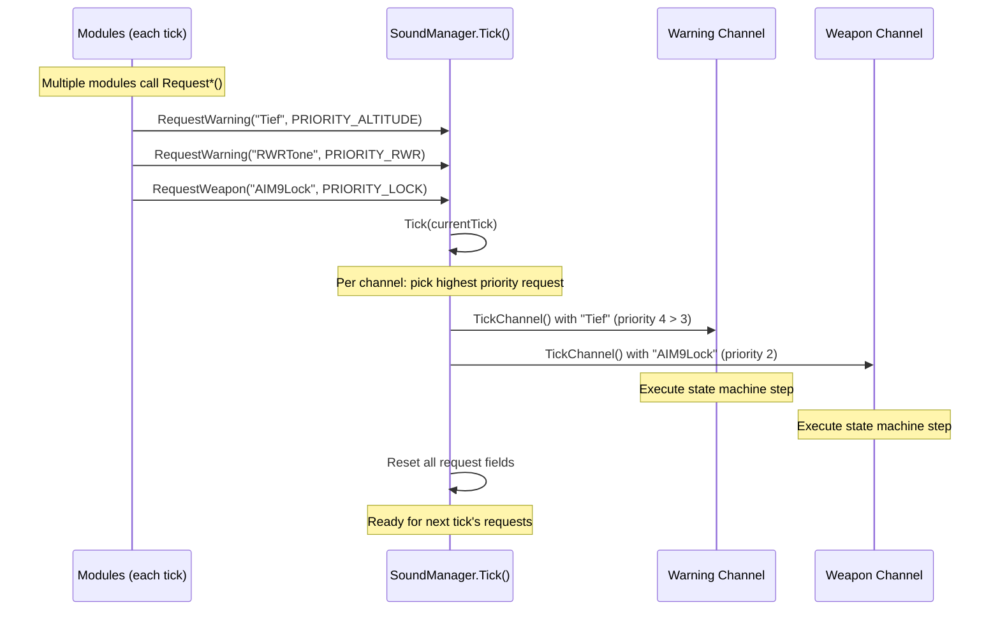

# Sound System

## Dual-Channel Architecture

SoundManager runs two independent audio channels, each with its own sound blocks and priority system. The highest-priority request each tick wins.

```mermaid
flowchart LR
    subgraph Requesters ["Sound Requesters (every tick)"]
        ALT["SystemManager\nAltitude warning"]
        RWR["RadarControlModule\nRWR threat tone"]
        LOCK["AirtoAir\nAIM9 lock tone"]
        SEARCH["AirtoAir\nAIM9 search tone"]
    end

    subgraph Channels ["SoundManager"]
        subgraph WCH ["Warning Channel"]
            WB["Sound Block Warning\n(volume 1.0)"]
        end
        subgraph ACH ["Weapon Channel"]
            AB["Canopy Side Plate Sound Block\n(volume 0.3)"]
        end
    end

    ALT --> |"PRIORITY_ALTITUDE (4)"| WCH
    RWR --> |"PRIORITY_RWR (3)"| WCH
    LOCK --> |"PRIORITY_LOCK (2)"| ACH
    SEARCH --> |"PRIORITY_SEARCH (1)"| ACH

    style ALT fill:#8b0000,color:#fff
    style RWR fill:#8b4513,color:#fff
    style LOCK fill:#2d5a2d
    style SEARCH fill:#2d4a5a
```

---

## Priority System

Each tick, modules call `RequestWarning()` or `RequestWeapon()`. Only the highest priority wins per channel.

| Priority | Value | Sound | Channel | Requester |
|----------|-------|-------|---------|-----------|
| ALTITUDE | 4 | `"Tief"` | Warning | SystemManager (low + fast) |
| RWR | 3 | RWR tone | Warning | RadarControlModule |
| LOCK | 2 | `"AIM9Lock"` | Weapon | AirtoAir (target locked) |
| SEARCH | 1 | `"AIM9Search"` | Weapon | AirtoAir (searching) |
| NONE | 0 | — | — | (no request = silence) |

**Rule:** If altitude warning (4) and RWR (3) both fire on the same tick, only altitude plays on the warning channel.

**Source:** `Utilities/SoundManager.cs` — `RequestWarning()`, `RequestWeapon()`

---

## State Machine with Frame Delay

Space Engineers allows only 1 sound API action per tick. Additionally, SE calls `Main()` twice per simulation tick on toolbar button presses (Trigger + Update1). Both calls increment `currentTick` and process fully, which can put two block operations in the same sim tick — causing SE to discard one.

The state machine uses a **3-frame delay** between each state transition. This guarantees every block operation lands in a different simulation tick regardless of double-call behavior.

```mermaid
stateDiagram-v2
    [*] --> Idle

    Idle --> Stopping: Sound change needed\n(+ 3 frame delay)
    Stopping --> Selecting: After delay\n(+ 3 frame delay)
    Selecting --> Playing: After delay\n(+ 3 frame delay)
    Selecting --> Idle: No sound pending
    Playing --> Idle: Done

    state Idle {
        [*]: Check if requested sound != active sound
    }
    state Stopping {
        [*]: block.Stop() on all blocks
    }
    state Selecting {
        [*]: block.Enabled = true\nblock.SelectedSound = name\nblock.Volume = level
    }
    state Playing {
        [*]: block.Play() on all blocks\nactiveSound = pendingSound
    }
```

### Why 3 frames?

With double `Main()` calls per sim tick, 3 frames = minimum 2 sim ticks between operations. This ensures SE has fully applied each block change before the next one arrives. Total time from detection to playback is ~12 `Main()` calls (~6 sim ticks worst case), which is under 0.1 seconds at 60fps.

### PrepChannel at init

`SoundManager.Initialize()` calls `PrepChannel()` on both channels, which stops all blocks, enables them, clears `SelectedSound`, and sets volume. This puts blocks in a known clean state so the first `Play()` works reliably after script compilation.

---

## Tick Processing

```mermaid
sequenceDiagram
    participant Modules as Modules (each tick)
    participant SM as SoundManager.Tick()
    participant WCH as Warning Channel
    participant ACH as Weapon Channel

    Note over Modules: Multiple modules call Request*()
    Modules->>SM: RequestWarning("Tief", PRIORITY_ALTITUDE)
    Modules->>SM: RequestWarning("RWRTone", PRIORITY_RWR)
    Modules->>SM: RequestWeapon("AIM9Lock", PRIORITY_LOCK)

    SM->>SM: Tick(currentTick)
    Note over SM: Per channel: pick highest priority request

    SM->>WCH: TickChannel() with "Tief" (priority 4 > 3)
    SM->>ACH: TickChannel() with "AIM9Lock" (priority 2)

    Note over WCH: Execute state machine step
    Note over ACH: Execute state machine step

    SM->>SM: Reset all request fields
    Note over SM: Ready for next tick's requests
```

---

## Sound Block Naming

| Block Name | Channel | Volume | Purpose |
|------------|---------|--------|---------|
| `Sound Block Warning` | Warning | 1.0 (full) | Altitude/speed alerts, RWR |
| `Canopy Side Plate Sound Block` | Weapon | 0.3 (quiet) | AIM9 lock/search tones |

Multiple blocks with the same name are supported — all play simultaneously for spatial audio effect.

**Source:** `Utilities/SoundManager.cs` — `Initialize()` (block detection), `TickChannel()` (state machine)
