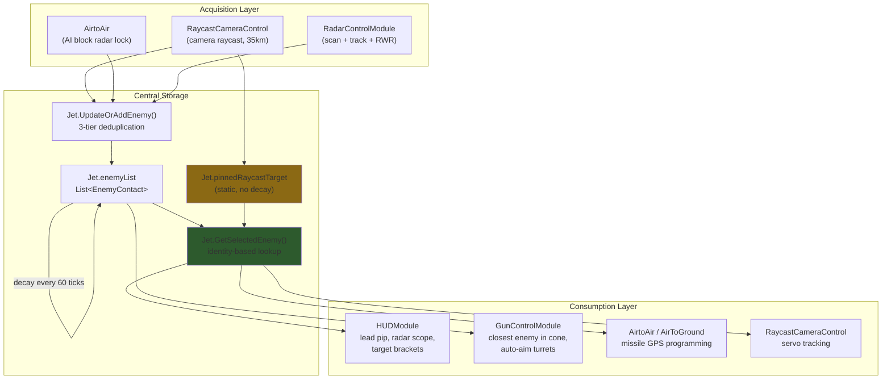
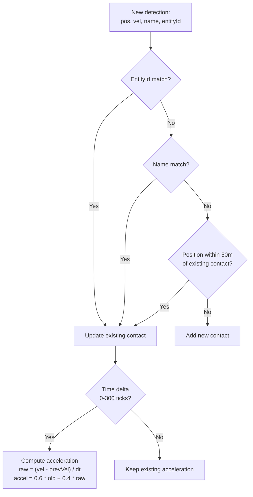
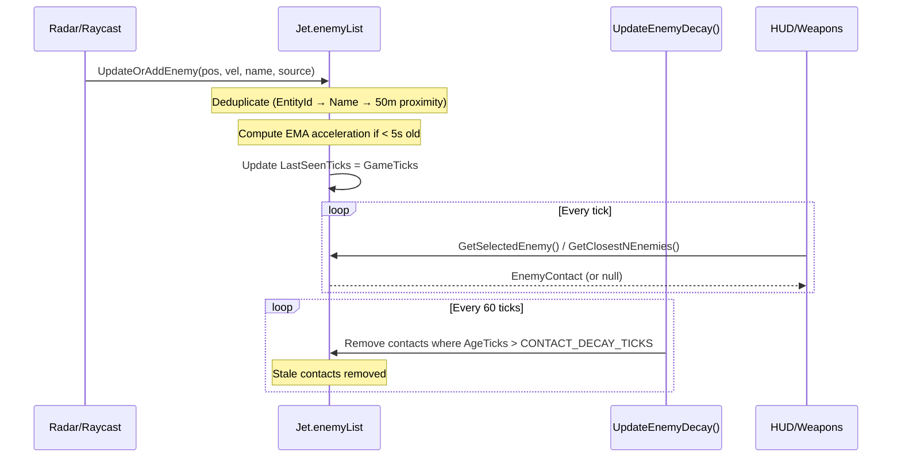
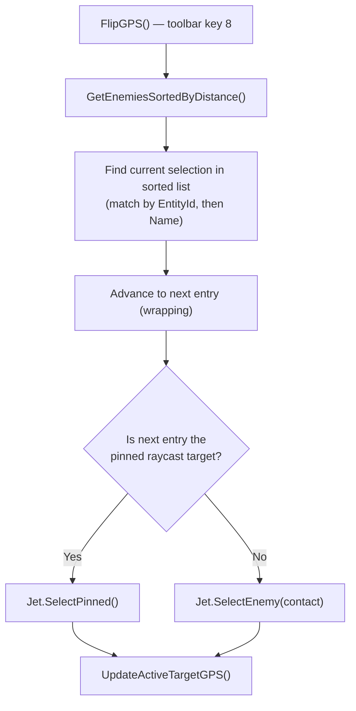
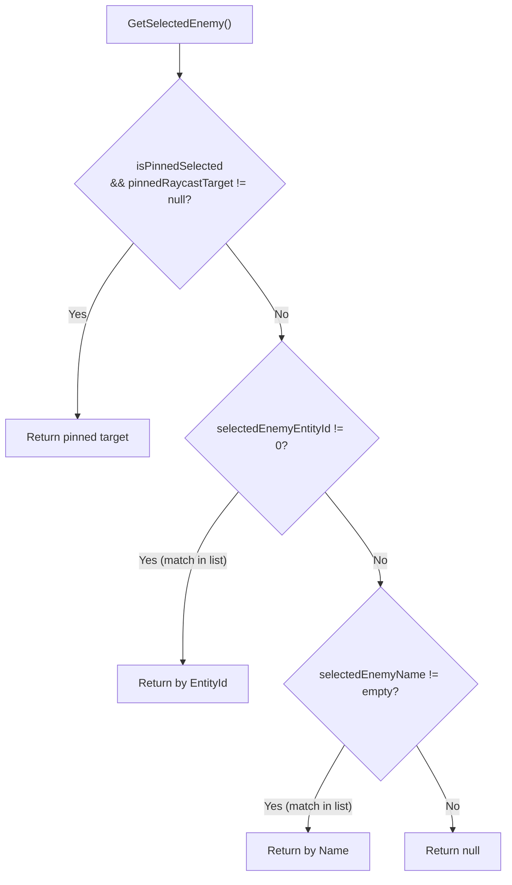
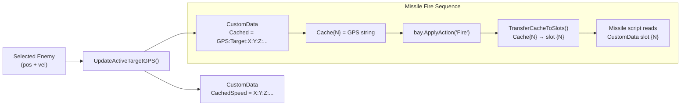
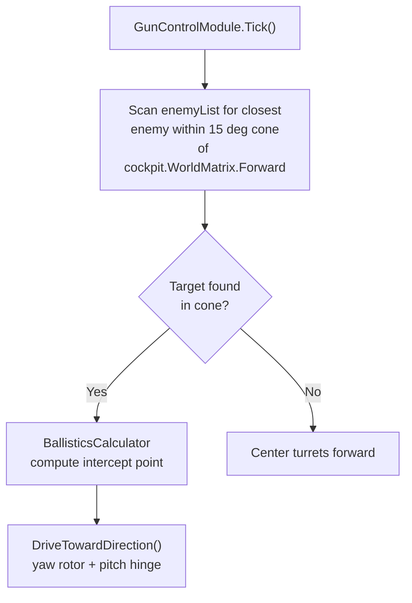

# Target Tracking & Data Flow

## Overview

Targets flow from sensors through a central enemy list to consumers (HUD, weapons, gun turrets). Three independent sensor types feed into one shared `enemyList` on the `Jet` class.

---

## EnemyContact Structure

Each contact in `enemyList` holds:

| Field | Type | Description |
|-------|------|-------------|
| Position | Vector3D | World position |
| Velocity | Vector3D | Velocity vector |
| Acceleration | Vector3D | EMA-filtered (60% old + 40% new) |
| Name | string | Grid name or "Raycast" |
| EntityId | long | SE entity ID (0 if unknown) |
| LastSeenTicks | long | GameTicks when last updated |
| SourceIndex | int | 0=scan, 1=track, 2+=RWR, -1=raycast |

**Source:** `Jet.cs` — `EnemyContact` struct

---

## Contact Deduplication

When a sensor reports a target, `UpdateOrAddEnemy()` tries to match it against existing contacts using a 3-tier priority system:

**Source:** `Jet.cs` — `UpdateOrAddEnemy()` method

---

## Contact Lifecycle

**Source:** `Jet.cs` — `UpdateOrAddEnemy()`, `UpdateEnemyDecay()`, `GetSelectedEnemy()`

---

## Target Selection

The pilot selects targets via `FlipGPS()` (toolbar key 8), which cycles through enemies sorted by distance:

### Selection Priority in GetSelectedEnemy()

**Source:** `Jet.cs` — `GetSelectedEnemy()`, `SelectEnemy()`, `SelectPinned()`; `SystemManager.cs` — `FlipGPS()`

---

## GPS Sync to CustomData

When a target is selected, its GPS coordinates are written to the programmable block's CustomData so missile scripts can read them:

### CustomData Key Map

| Key | Format | Writers | Readers |
|-----|--------|---------|---------|
| `Cached` | `GPS:Target:X:Y:Z:#FF75C9F1:` | SystemManager, RaycastCamera, AirtoAir | Weapon modules (missile GPS) |
| `CachedSpeed` | `X:Y:Z:#FF75C9F1:` | SystemManager, RaycastCamera, AirtoAir | External missile scripts |
| `Cache0`-`CacheN` | GPS format | AirToGround, AirtoAir | Same modules (pre-fire staging) |
| `0`-`4` | GPS format | AirToGround, AirtoAir | Detached missile scripts |
| `Topdown` | `true`/`false` | AirToGround | AirToGround (persisted toggle) |

**Source:** `SystemManager.cs` — `UpdateActiveTargetGPS()`, `FlipGPS()`; `Utilities/CustomDataManager.cs` — cache layer

---

## Sensor Details

### Raycast (RaycastCameraControl)

- Camera raycast up to 35 km
- Hit creates an `EnemyContact` with `SourceIndex = -1`
- Also stored as `Jet.pinnedRaycastTarget` (never decays, survives enemy list cleanup)
- Auto-selects via `SelectPinned()` on successful hit

**Source:** `Modules/RaycastCameraControl.cs` — `ExecuteRaycast()`

### Radar (RadarControlModule)

- Uses AI Flight + AI Combat block pairs
- Index 0 = scan radar, Index 1 = track radar, Index 2+ = RWR
- Auto-detects pairs named `"AI Flight"` / `"AI Combat"` through `"AI Flight 99"` / `"AI Combat 99"`
- Each pair feeds `UpdateOrAddEnemy()` with its source index

**Source:** `Modules/RadarControlModule.cs` — `Tick()` method

### AirtoAir Seeker

- Wraps the primary AI block pair for active radar lock
- Provides lock/search sound cues via SoundManager
- Auto-selects closest enemy if no selection exists

**Source:** `Modules/AirtoAir.cs` — `Tick()` method

---

## GunControlModule: Independent Targeting

The gun turrets do **not** use the pilot's selected target. They independently find the closest enemy within a forward cone:

> The cone check uses the ship's forward vector (not the gun's) to prevent feedback loops.

**Source:** `Modules/GunControlModule.cs` — `TrackTarget()`, `DriveTowardDirection()`
