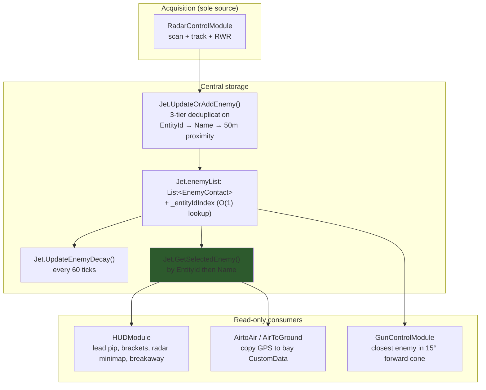
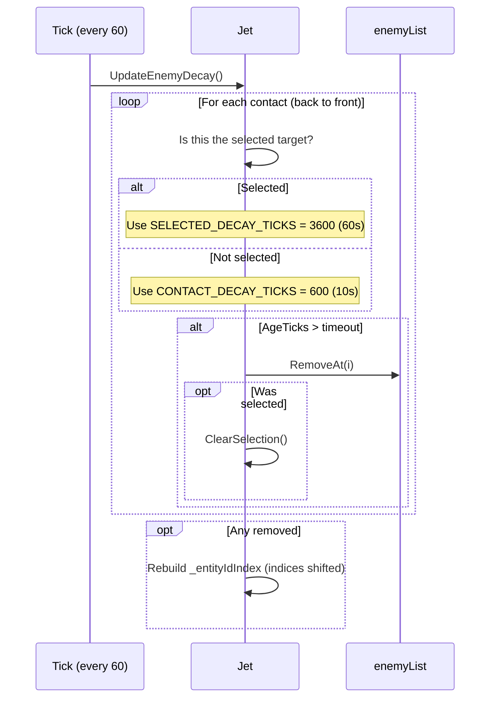
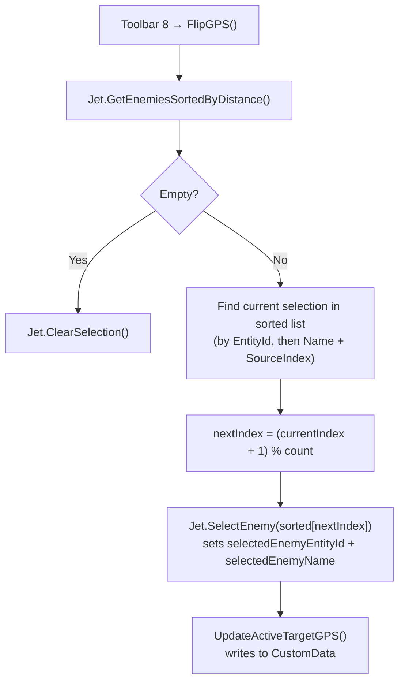
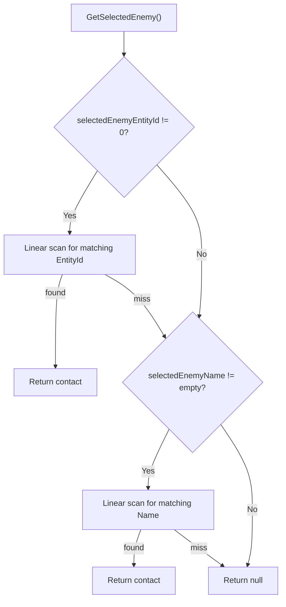
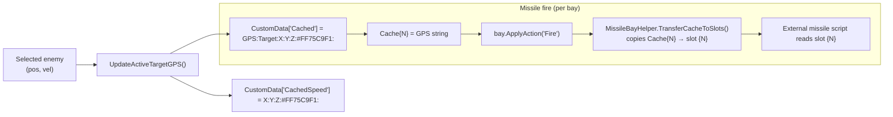
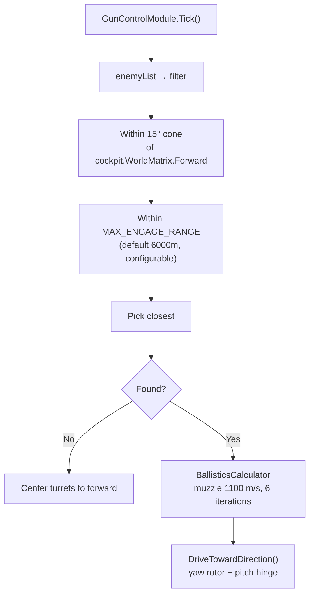

# Target Tracking &amp; Data Flow

> **Source:** `Jet.cs` (enemy list, selection, struct), `Modules/RadarControlModule.cs` (sole sensor), `SystemManager.cs` (FlipGPS, GPS sync), `Modules/AirtoAir.cs` (consumer)
>
> **Try it:** [interactive/radar-demo.html](interactive/radar-demo.html) — moving contacts, target cycling, color-coded threat assessment.

## Overview

Targets flow from RadarControlModule through `Jet.UpdateOrAddEnemy()` into a single shared `enemyList`, then out to consumers (HUD lead pip, gun turrets, missile fire pipeline).


```mermaid
flowchart TD
    subgraph Sensors ["Acquisition (sole source)"]
        RCM["RadarControlModule<br/>scan + track + RWR"]
    end

    subgraph Storage ["Central storage"]
        UOA["Jet.UpdateOrAddEnemy()<br/>3-tier deduplication<br/>EntityId → Name → 50m proximity"]
        EL["Jet.enemyList: List&lt;EnemyContact&gt;<br/>+ _entityIdIndex (O(1) lookup)"]
        SEL["Jet.GetSelectedEnemy()<br/>by EntityId then Name"]
        DEC["Jet.UpdateEnemyDecay()<br/>every 60 ticks"]
    end

    subgraph Consumers ["Read-only consumers"]
        HUD["HUDModule<br/>lead pip, brackets, radar minimap, breakaway"]
        GUN["GunControlModule<br/>closest enemy in 15° forward cone"]
        FIRE["AirtoAir / AirToGround<br/>copy GPS to bay CustomData"]
    end

    RCM --> UOA --> EL
    EL --> DEC
    EL --> SEL
    SEL --> HUD
    EL --> GUN
    SEL --> FIRE

    style SEL fill:#2d5a2d
```

> **AirtoAir is NOT a sensor** — it only reads from `enemyList`. RadarControlModule is the sole writer. AirtoAir auto-selects the closest enemy if no selection exists, then syncs that selection's GPS to CustomData.

---

## EnemyContact Struct

```csharp
public struct EnemyContact
{
    public Vector3D Position;
    public Vector3D Velocity;
    public Vector3D Acceleration;     // EMA filtered (60% old + 40% new)
    public string   Name;             // From AI block DetailedInfo
    public long     EntityId;         // 0 if unknown
    public long     LastSeenTicks;    // Jet.GameTicks when last fed
    public int      SourceIndex;      // 0=primary, 1+=other radars
    public uint     TrackHistory;     // 30-bit timeline, bit 0 = most recent second
    public long     LastHistoryShiftTick;
}
```

| Field | Type | Notes |
|-------|------|-------|
| `Position` | `Vector3D` | World-space, fed every radar update |
| `Velocity` | `Vector3D` | World-space, derived from waypoint deltas |
| `Acceleration` | `Vector3D` | EMA-smoothed (α=0.4) — used for ballistics intercept |
| `Name` | `string` | Grid name from `IMyOffensiveCombatBlock.DetailedInfo` |
| `EntityId` | `long` | SE entity ID. **0 means unknown** — name+proximity dedup must take over |
| `LastSeenTicks` | `long` | `Jet.GameTicks` snapshot — used for `AgeTicks`, `AgeSeconds`, `IsStale` |
| `SourceIndex` | `int` | Which radar fed it (0..N) — drives source tag (RDR/RWR1/...) |
| `TrackHistory` | `uint` | 30-bit log: bit 0 = current second has updates, bit 29 = 30s ago |
| `LastHistoryShiftTick` | `long` | When the timeline was last shifted left |

### Track History Bit Trick

Each second, when a radar feeds the same contact, `TrackHistory` shifts left by the elapsed seconds and ORs `1` into the new bit. If no updates arrive for 30+ seconds, the entire history clears and the contact resets:

```
sec ago: 30  29  28  ...  3   2   1   0
         ─────────────────────────────────
fresh:    0   0   0  ...  1   1   1   1   (just acquired)
gap:      0   0   0  ...  1   0   0   1   (lost briefly, reacquired)
stale:    1   0   0  ...  0   0   0   0   (lost long ago, almost gone)
```

The weapons screen renders this as a horizontal bar — pilot sees at a glance how stable the track is.

**Source:** `Jet.cs:36-90`

---

## Deduplication Pipeline

When a sensor reports a target, `UpdateOrAddEnemy()` matches it against existing contacts using a 3-tier priority system:

```mermaid
flowchart TD
    NEW["UpdateOrAddEnemy(pos, vel, name, source, entityId)"] --> P1{entityId != 0?}
    P1 -- Yes --> EID["Lookup _entityIdIndex<br/>(Dictionary, O(1))"]
    EID -- "found" --> UPDATE
    EID -- "miss" --> P2
    P1 -- No --> P2{Name != empty?}
    P2 -- Yes --> NAME["Linear scan enemyList[i].Name"]
    NAME -- "match" --> UPDATE
    NAME -- "no match" --> P3
    P2 -- No --> P3
    P3 --> PROX["Linear scan: |existing.Position - pos| &lt; 50m"]
    PROX -- "match" --> UPDATE
    PROX -- "no match" --> ADD["Append new contact<br/>_entityIdIndex[id] = newIdx"]

    UPDATE --> ACCEL{tickDelta &lt; 300<br/>(5 sec)?}
    ACCEL -- "Yes" --> EMA["raw = (vel - prevVel) / dt<br/>accel = 0.6*old + 0.4*raw"]
    ACCEL -- "No" --> ZERO["accel = Vector3D.Zero"]
    EMA --> HIST["Carry track history forward<br/>shift left by elapsedSeconds<br/>OR in 1 for current second"]
    ZERO --> HIST
    HIST --> WRITE["enemyList[idx] = new contact"]
```

**Why 3 tiers?** EntityId is the most reliable but isn't always available (RWR detections often have name only). Name matches catch the same target across radars. Proximity is the fallback for unnamed/unknown contacts and prevents 5 radars from creating 5 duplicate entries for the same enemy.

**Source:** `Jet.cs:212-295`

---

## Decay & Cleanup

`UpdateEnemyDecay()` runs every 60 ticks (1 second). It removes stale contacts and rebuilds the EntityId index.


```mermaid
sequenceDiagram
    participant T as Tick (every 60)
    participant J as Jet
    participant L as enemyList

    T->>J: UpdateEnemyDecay()
    loop For each contact (back to front)
        J->>J: Is this the selected target?
        alt Selected
            Note over J: Use SELECTED_DECAY_TICKS = 3600 (60s)
        else Not selected
            Note over J: Use CONTACT_DECAY_TICKS = 600 (10s)
        end
        alt AgeTicks > timeout
            J->>L: RemoveAt(i)
            opt Was selected
                J->>J: ClearSelection()
            end
        end
    end
    opt Any removed
        J->>J: Rebuild _entityIdIndex (indices shifted)
    end
```

> **Selected targets get 6× longer lifetime.** This prevents the radar momentarily losing the lead target from clearing your selection — you can re-acquire after a brief gap without having to FlipGPS through the list again.

**Source:** `Jet.cs:301-333`

---

## Target Selection (FlipGPS)

The pilot cycles through targets with **numpad 8** (`FlipGPS` in `SystemManager`):


```mermaid
flowchart TD
    F["Toolbar 8 → FlipGPS()"] --> SORT["Jet.GetEnemiesSortedByDistance()"]
    SORT --> EMP{Empty?}
    EMP -- "Yes" --> CL["Jet.ClearSelection()"]
    EMP -- "No" --> FIND["Find current selection in sorted list<br/>(by EntityId, then Name + SourceIndex)"]
    FIND --> ADV["nextIndex = (currentIndex + 1) % count"]
    ADV --> SE["Jet.SelectEnemy(sorted[nextIndex])<br/>sets selectedEnemyEntityId + selectedEnemyName"]
    SE --> GPS["UpdateActiveTargetGPS()<br/>writes to CustomData"]
```

**Identity tracking, not index tracking** — `Jet.selectedEnemyEntityId` and `selectedEnemyName` together uniquely identify the selected target. If a radar refresh shuffles the list, the selection still resolves to the same physical target on the next `GetSelectedEnemy()` call.

### GetSelectedEnemy Resolution Order


```mermaid
flowchart TD
    G["GetSelectedEnemy()"] --> EID{selectedEnemyEntityId != 0?}
    EID -- "Yes" --> LOOP1["Linear scan for matching EntityId"]
    LOOP1 -- "found" --> R1["Return contact"]
    LOOP1 -- "miss" --> NQ
    EID -- "No" --> NQ{selectedEnemyName != empty?}
    NQ -- "Yes" --> LOOP2["Linear scan for matching Name"]
    LOOP2 -- "found" --> R2["Return contact"]
    LOOP2 -- "miss" --> NULL
    NQ -- "No" --> NULL["Return null"]
```

**Source:** `Jet.cs:375-396` (GetSelectedEnemy), `Jet.cs:406-410` (SelectEnemy), `SystemManager.cs:331-366` (FlipGPS)

---

## GPS Sync to CustomData

When a target is selected, its GPS is written to the PB's CustomData so external missile scripts can read it.


```mermaid
flowchart LR
    SEL["Selected enemy<br/>(pos, vel)"] --> UGPS["UpdateActiveTargetGPS()"]
    UGPS --> CD1["CustomData['Cached'] = GPS:Target:X:Y:Z:#FF75C9F1:"]
    UGPS --> CD2["CustomData['CachedSpeed'] = X:Y:Z:#FF75C9F1:"]

    subgraph FIRE ["Missile fire (per bay)"]
        CD1 --> BAY["Cache{N} = GPS string"]
        BAY --> ACT["bay.ApplyAction('Fire')"]
        ACT --> XF["MissileBayHelper.TransferCacheToSlots()<br/>copies Cache{N} → slot {N}"]
        XF --> MS["External missile script reads slot {N}"]
    end
```

### CustomData Key Map

| Key | Format | Writers | Readers |
|-----|--------|---------|---------|
| `Cached` | `GPS:Target:X:Y:Z:#FF75C9F1:` | `SystemManager.UpdateActiveTargetGPS`, `AirtoAir`, `AirToGround` | Missile scripts, gun ballistics fallback |
| `CachedSpeed` | `X:Y:Z:#FF75C9F1:` | same | Missile scripts (lead computation) |
| `Cache0`–`CacheN` | GPS format | `MissileBayHelper.FireSelectedBays` | `MissileBayHelper.TransferCacheToSlots` (post-fire) |
| `0`–`N` | GPS format | `TransferCacheToSlots` | External missile scripts |
| `Topdown` | `true`/`false` | `AirToGround.ToggleTopdownMode` | Missile scripts (steepen approach angle) |
| `AntiAir` | `true`/`false` | `AirtoAir.UpdateTopdownCustomData` | Missile scripts (A/A guidance mode) |
| `RWRCount` | integer | `RadarControlModule` | Self (persisted RWR allocation) |

**Source:** `SystemManager.cs:368-382` (UpdateActiveTargetGPS), `Utilities/MissileBayHelper.cs` (cache → slot transfer)

---

## GunControlModule: Independent Targeting

Gun turrets do **not** use the pilot's selected target. They scan `enemyList` independently for the closest enemy within a 15° forward cone:


```mermaid
flowchart TD
    GT["GunControlModule.Tick()"] --> EN["enemyList → filter"]
    EN --> CONE["Within 15° cone<br/>of cockpit.WorldMatrix.Forward"]
    CONE --> RNG["Within MAX_ENGAGE_RANGE<br/>(default 6000m, configurable)"]
    RNG --> CL["Pick closest"]
    CL --> FOUND{Found?}
    FOUND -- "No" --> CTR["Center turrets to forward"]
    FOUND -- "Yes" --> BC["BallisticsCalculator<br/>muzzle 1100 m/s, 6 iterations"]
    BC --> AIM["DriveTowardDirection()<br/>yaw rotor + pitch hinge"]
```

> **Cone uses ship's forward, not the gun's.** Using the gun's forward would create a feedback loop — once the turret rotated off-center, the cone would follow it and chase any target. Using the cockpit forward keeps the cone fixed in jet-space.

**Source:** `Modules/GunControlModule.cs`, `Utilities/BallisticsCalculator.cs`

---

## AirtoAir: Read-Only Consumer

```csharp
public override void Tick()
{
    // Auto-select closest enemy if no selection exists
    if (!myJet.HasSelectedEnemy() && myJet.enemyList.Count > 0)
    {
        var closest = myJet.GetClosestNEnemies(1);
        if (closest.Count > 0)
            myJet.SelectEnemy(closest[0]);
    }

    if (myJet.HasSelectedEnemy())
        SystemManager.UpdateActiveTargetGPS();

    // Seeker tones are independent of radar block control
    if (!isAirtoAirenabled) return;

    bool hasLock = myJet.radarControl != null && myJet.radarControl.IsTrackLocked;
    SoundManager.RequestWeapon(
        hasLock ? "AIM9Lock" : "AIM9Search",
        hasLock ? SoundManager.PRIORITY_LOCK : SoundManager.PRIORITY_SEARCH,
        300);
}
```

| Behavior | Notes |
|----------|-------|
| Auto-select closest | Runs every tick — keeps a selection even if pilot didn't FlipGPS |
| GPS sync | Writes `Cached` and `CachedSpeed` so missiles can fire any time |
| Seeker tones | Only audio side-effects. Toggling the seeker does not control the radar — that's `RadarControlModule`'s job. |
| `IsTrackLocked` | Reads from `radarControl`, true when any LOCKED pool radar matches the selected target by EntityId or Name |

**Source:** `Modules/AirtoAir.cs:75-109`
