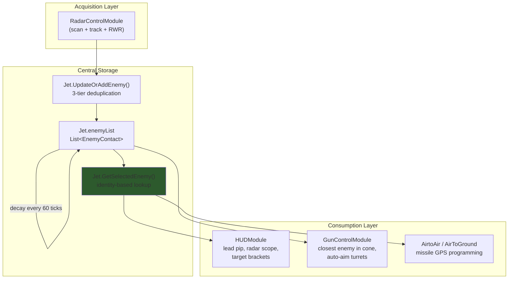
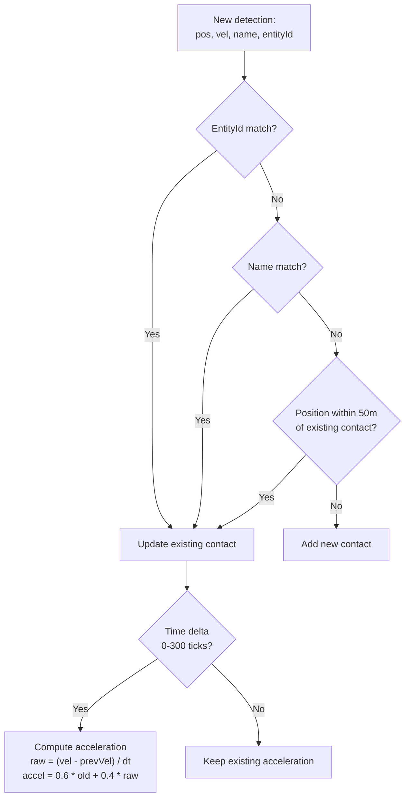
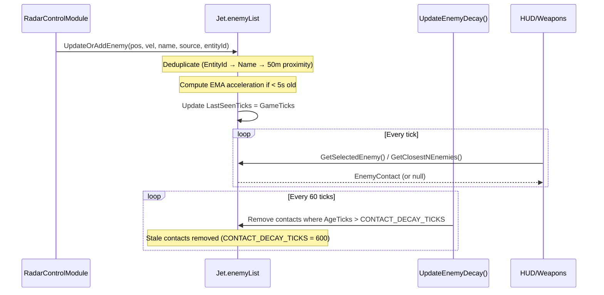
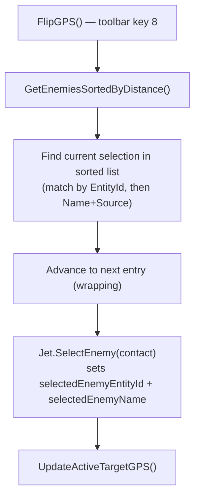
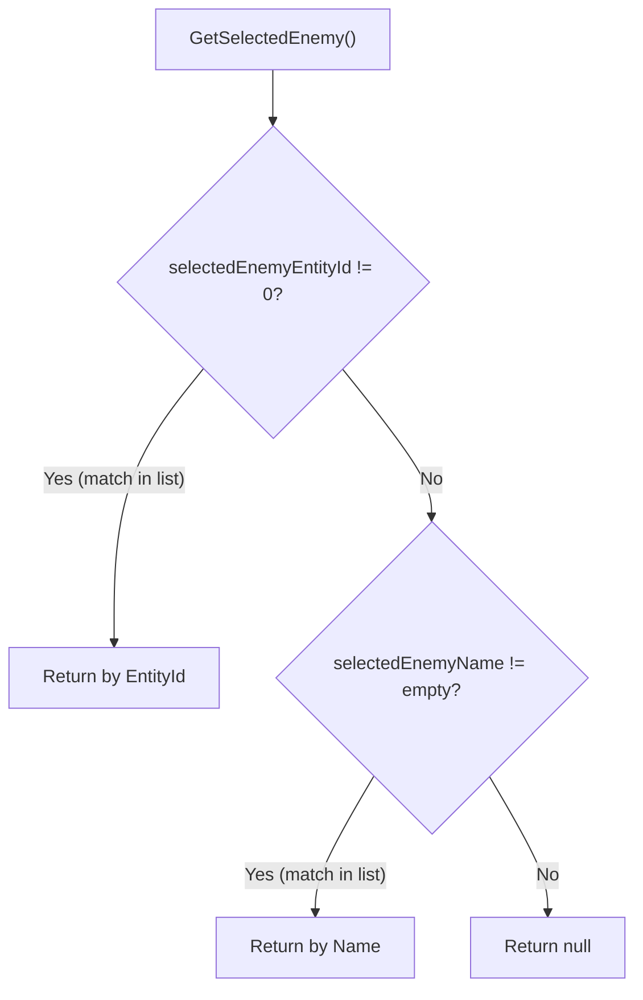
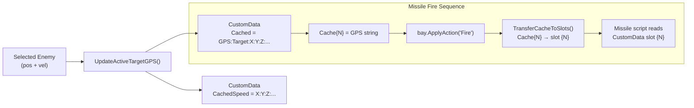
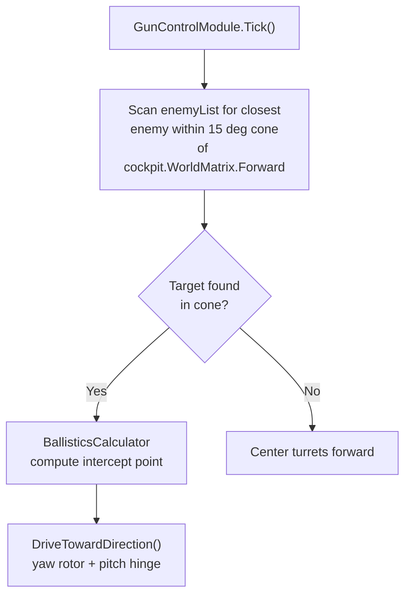

# Target Tracking & Data Flow

## Overview

Targets flow from the radar system through a central enemy list to consumers (HUD, weapons, gun turrets). `RadarControlModule` is the sole target acquisition source, feeding into one shared `enemyList` on the `Jet` class.

```mermaid
flowchart TD
    subgraph Sensors ["Acquisition Layer"]
        RCM["RadarControlModule\n(scan + track + RWR)"]
    end

    subgraph Storage ["Central Storage"]
        UOA["Jet.UpdateOrAddEnemy()\n3-tier deduplication"]
        EL["Jet.enemyList\nList&lt;EnemyContact&gt;"]
        SEL["Jet.GetSelectedEnemy()\nidentity-based lookup"]
    end

    subgraph Consumers ["Consumption Layer"]
        HUD["HUDModule\nlead pip, radar scope,\ntarget brackets"]
        GUN["GunControlModule\nclosest enemy in cone,\nauto-aim turrets"]
        FIRE["AirtoAir / AirToGround\nmissile GPS programming"]
    end

    RCM --> UOA

    UOA --> EL
    EL --> |"decay every 60 ticks"| EL
    EL --> SEL

    SEL --> HUD
    EL --> GUN
    SEL --> FIRE

    style SEL fill:#2d5a2d
```

---

## EnemyContact Structure

Each contact in `enemyList` holds:

| Field | Type | Description |
|-------|------|-------------|
| Position | Vector3D | World position |
| Velocity | Vector3D | Velocity vector |
| Acceleration | Vector3D | EMA-filtered (60% old + 40% new) |
| Name | string | Grid name (from AI block DetailedInfo) |
| EntityId | long | SE entity ID (0 if unknown) |
| LastSeenTicks | long | GameTicks when last updated |
| SourceIndex | int | 0=scan, 1=track, 2+=RWR |
| TrackHistory | uint | 30-bit timeline: 1 bit per second, bit 0 = most recent |

**Source:** `Jet.cs` — `EnemyContact` struct

---

## Contact Deduplication

When a sensor reports a target, `UpdateOrAddEnemy()` tries to match it against existing contacts using a 3-tier priority system:

```mermaid
flowchart TD
    NEW["New detection:\npos, vel, name, entityId"] --> P1{EntityId match?}
    P1 -- "Yes" --> UPDATE["Update existing contact"]
    P1 -- "No" --> P2{Name match?}
    P2 -- "Yes" --> UPDATE
    P2 -- "No" --> P3{"Position within 50m\nof existing contact?"}
    P3 -- "Yes" --> UPDATE
    P3 -- "No" --> ADD["Add new contact"]

    UPDATE --> ACCEL{"Time delta\n0-300 ticks?"}
    ACCEL -- "Yes" --> EMA["Compute acceleration\nraw = (vel - prevVel) / dt\naccel = 0.6 * old + 0.4 * raw"]
    ACCEL -- "No" --> SKIP["Keep existing acceleration"]
```

**Source:** `Jet.cs` — `UpdateOrAddEnemy()` method

---

## Contact Lifecycle

```mermaid
sequenceDiagram
    participant Sensor as RadarControlModule
    participant Jet as Jet.enemyList
    participant Decay as UpdateEnemyDecay()
    participant Consumer as HUD/Weapons

    Sensor->>Jet: UpdateOrAddEnemy(pos, vel, name, source, entityId)
    Note over Jet: Deduplicate (EntityId → Name → 50m proximity)
    Note over Jet: Compute EMA acceleration if < 5s old
    Jet->>Jet: Update LastSeenTicks = GameTicks

    loop Every tick
        Consumer->>Jet: GetSelectedEnemy() / GetClosestNEnemies()
        Jet-->>Consumer: EnemyContact (or null)
    end

    loop Every 60 ticks
        Decay->>Jet: Remove contacts where AgeTicks > CONTACT_DECAY_TICKS
        Note over Jet: Stale contacts removed (CONTACT_DECAY_TICKS = 600)
    end
```

**Source:** `Jet.cs` — `UpdateOrAddEnemy()`, `UpdateEnemyDecay()`, `GetSelectedEnemy()`

---

## Target Selection

The pilot selects targets via `FlipGPS()` (toolbar key 8), which cycles through enemies sorted by distance:

```mermaid
flowchart TD
    FLIP["FlipGPS() — toolbar key 8"] --> SORT["GetEnemiesSortedByDistance()"]
    SORT --> FIND["Find current selection in sorted list\n(match by EntityId, then Name+Source)"]
    FIND --> NEXT["Advance to next entry (wrapping)"]
    NEXT --> SELEN["Jet.SelectEnemy(contact)\nsets selectedEnemyEntityId + selectedEnemyName"]
    SELEN --> GPS["UpdateActiveTargetGPS()"]
```

### Selection Priority in GetSelectedEnemy()

```mermaid
flowchart TD
    GET["GetSelectedEnemy()"] --> EIDQ{"selectedEnemyEntityId != 0?"}
    EIDQ -- "Yes (match in list)" --> RETEID["Return by EntityId"]
    EIDQ -- "No" --> NAMEQ{"selectedEnemyName != empty?"}
    NAMEQ -- "Yes (match in list)" --> RETNAME["Return by Name"]
    NAMEQ -- "No" --> RETNULL["Return null"]
```

**Source:** `Jet.cs` — `GetSelectedEnemy()`, `SelectEnemy()`, `ClearSelection()`; `SystemManager.cs` — `FlipGPS()`

---

## GPS Sync to CustomData

When a target is selected, its GPS coordinates are written to the programmable block's CustomData so missile scripts can read them:

```mermaid
flowchart LR
    SEL["Selected Enemy\n(pos + vel)"] --> UGPS["UpdateActiveTargetGPS()"]
    UGPS --> CD_C["CustomData\nCached = GPS:Target:X:Y:Z:..."]
    UGPS --> CD_S["CustomData\nCachedSpeed = X:Y:Z:..."]

    subgraph Fire ["Missile Fire Sequence"]
        CD_C --> BAY["Cache{N} = GPS string"]
        BAY --> MERGE["bay.ApplyAction('Fire')"]
        MERGE --> XFER["TransferCacheToSlots()\nCache{N} → slot {N}"]
        XFER --> MSL["Missile script reads\nCustomData slot {N}"]
    end
```

### CustomData Key Map

| Key | Format | Writers | Readers |
|-----|--------|---------|---------|
| `Cached` | `GPS:Target:X:Y:Z:#FF75C9F1:` | SystemManager, AirtoAir | Weapon modules (missile GPS) |
| `CachedSpeed` | `X:Y:Z:#FF75C9F1:` | SystemManager, AirtoAir | External missile scripts |
| `Cache0`-`CacheN` | GPS format | AirToGround, AirtoAir | Same modules (pre-fire staging) |
| `0`-`4` | GPS format | AirToGround, AirtoAir | Detached missile scripts |
| `Topdown` | `true`/`false` | AirToGround | AirToGround (persisted toggle) |

**Source:** `SystemManager.cs` — `UpdateActiveTargetGPS()`, `FlipGPS()`; `Utilities/CustomDataManager.cs` — cache layer

---

## Sensor Details

### Radar (RadarControlModule) — Sole Acquisition Source

- Uses AI Flight + AI Combat block pairs
- Sequential activation state machine: `IDLE → SEARCHING → LOCKED`
- Only 1 pool radar SEARCHING at a time; when it finds a new target (not already locked), it transitions to LOCKED and activates the next IDLE as SEARCHING
- Remaining pairs assigned as RWR (passive threat detection)
- Auto-detects pairs named `"AI Flight"` / `"AI Combat"` through `"AI Flight 99"` / `"AI Combat 99"`
- Each pair feeds `UpdateOrAddEnemy()` with its source index
- `IsTrackLocked` is true when any LOCKED pool radar matches the currently selected enemy (by EntityId or Name)

**Source:** `Modules/RadarControlModule.cs` — constructor (pair detection), `Tick()` (scan/track/RWR loop)

### AirtoAir — Radar Consumer (Not a Sensor)

- Does NOT directly feed `UpdateOrAddEnemy()` — reads from `Jet.enemyList` only
- Auto-selects closest enemy via `GetClosestNEnemies(1)` if no selection exists
- Syncs selected enemy GPS to CustomData via `UpdateActiveTargetGPS()`
- Uses `RadarControlModule.IsTrackLocked` for lock detection (no separate tracker)
- Seeker toggle only affects weapon tone sounds (lock/search), not radar blocks

**Source:** `Modules/AirtoAir.cs` — `Tick()` method

---

## GunControlModule: Independent Targeting

The gun turrets do **not** use the pilot's selected target. They independently find the closest enemy within a forward cone:

```mermaid
flowchart TD
    GUN["GunControlModule.Tick()"] --> CONE["Scan enemyList for closest\nenemy within 15 deg cone\nof cockpit.WorldMatrix.Forward"]
    CONE --> FOUND{"Target found\nin cone?"}
    FOUND -- "Yes" --> BALLI["BallisticsCalculator\ncompute intercept point"]
    FOUND -- "No" --> CENTER["Center turrets forward"]
    BALLI --> AIM["DriveTowardDirection()\nyaw rotor + pitch hinge"]
```

> The cone check uses the ship's forward vector (not the gun's) to prevent feedback loops.

**Source:** `Modules/GunControlModule.cs` — `TrackTarget()`, `DriveTowardDirection()`
