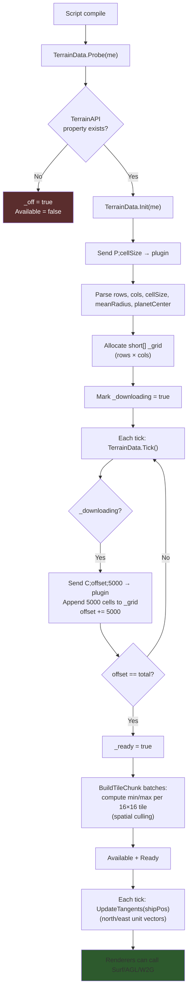
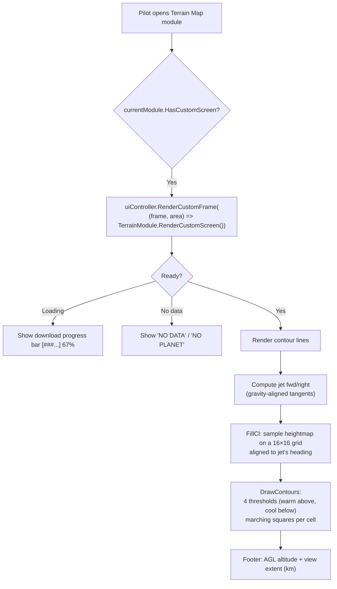

# Terrain System

> **Source:** `Utilities/TerrainData.cs` (heightmap download + lookup), `Utilities/TerrainAPI.cs` (mod wrapper), `Modules/TerrainModule.cs` (custom-screen renderer + minimap), `UI/TerrainRenderer.cs`
>
> **Status:** Newly added subsystem. Requires the **TerrainAPI mod** to be subscribed/installed on the world.

## Overview

JetOS can download a planet's complete heightmap once on script compile, then provide instant offline lookups for the rest of the session. This powers a **terrain awareness map** (full-screen MFD page) and a **mini-map** in the status sidebar that shows nearby contour lines tinted by altitude relative to the jet.



**Source:** `Utilities/TerrainData.cs:65-128`

---

## TerrainAPI Mod Protocol

`TerrainData` communicates with the `TerrainAPI` mod via a `StringBuilder` terminal property on the programmable block. The protocol is text-based:

| Command | Direction | Format | Response |
|---------|-----------|--------|----------|
| `P;cellSize` | PB → mod | Probe + initialize | `P;rows;cols;cellSize;meanRadius;pcX;pcY;pcZ` |
| `C;offset;count` | PB → mod | Request heightmap chunk | `<header>\n<count chars>` where each char encodes one short (offset by 32768) |

Each cell is encoded as a single 16-bit unicode codepoint with `(height + 32768)` so the payload survives string round-tripping. Decoding:

```csharp
_grid[_offset + i] = (short)((int)resp[nl + 1 + i] - HOFF);
```

The `5000` chunk size keeps each `SetValue/GetValue` round-trip well under the 100KB string property limit while still completing the download in a few seconds for a typical planet.

**Source:** `Utilities/TerrainData.cs:130-155`

---

## Tile Index (Spatial Culling)

After the download completes, `BuildTileChunk` precomputes `min`/`max` heights for every **16×16 tile** of the heightmap, in batches of 2500 cells per tick. This index lets the contour renderer skip entire chunks where:

- The minimum tile height is above the current threshold (whole tile is "above the line"), OR
- The maximum tile height is below the threshold (whole tile is "below the line")

```
┌─────────────────────────────────────────────┐
│  Tile (16×16)                               │
│  ┌────┐ ┌────┐ ┌────┐ ┌────┐ ┌────┐ ┌────┐ │
│  │ █  │ │    │ │ █  │ │    │ │    │ │ ▓  │ │
│  │  █ │ │ ░  │ │  █ │ │ ░  │ │    │ │ ▓  │ │   ← Each cell = one short
│  └────┘ └────┘ └────┘ └────┘ └────┘ └────┘ │
│  Per tile: min = -200m, max = +850m         │
└─────────────────────────────────────────────┘
```

For a 1024×1024 heightmap, this is 64×64 = 4096 tiles vs ~1M cells. The contour renderer can reject 99% of irrelevant tiles in microseconds.

**Source:** `Utilities/TerrainData.cs:157-181`

---

## World ↔ Grid Coordinate Conversion

The heightmap is an **equirectangular projection** of the planet's surface. Conversion uses lat/lon:

```csharp
public static void W2GF(Vector3D wp, out int row, out int col, out double fracR, out double fracC)
{
    Vector3D dir = VN(wp - _pc);   // direction from planet center
    double lat = Math.Asin(dir.Y);
    double lon = At2(dir.Z, dir.X);
    double er = (lat / PI + 0.5) * _rows;
    double ec = (lon / (2.0 * PI) + 0.5) * _cols;
    row = (int)er; if (er < row) row--;
    col = (int)ec; if (ec < col) col--;
    fracR = er - row;
    fracC = ec - col;
    // clamp row, wrap col
}
```

The `fracR` / `fracC` outputs let the contour renderer interpolate between cells for smooth scrolling instead of "jumping" by full cells as the jet flies.

### Tangent Vectors (Lat-Aware)

`UpdateTangents()` recomputes north/east unit vectors at the ship's position each tick. The east vector is **scaled by `1/cosLat`** to compensate for equirectangular longitude distortion — at the poles, columns cover progressively less physical distance, so the renderer needs to step more columns to cover the same world distance.

```csharp
double colScale = cosLat > 0.01
    ? (double)_cols / (2.0 * _rows * cosLat) : 1.0;
_gridRight = new Vector3D(-sinLon * colScale, 0, cosLon * colScale);
```

Without this correction, the terrain map would visually compress at high latitudes — a 5km square would look like a thin rectangle.

**Source:** `Utilities/TerrainData.cs:183-206`

---

## Public API

| Method | Returns | Purpose |
|--------|---------|---------|
| `Available` | bool | True if TerrainAPI mod is loaded |
| `Ready` | bool | True if heightmap finished downloading |
| `Loading` | bool | True while download is in progress |
| `DownloadProgress` | float 0..1 | For loading bar |
| `Surf(row, col)` | double | World-space surface radius at grid cell |
| `Alt(wp)` | double | Distance from planet center |
| `AGL(wp)` | double | Above ground level — `Alt - Surf` |
| `W2G(wp, out r, out c)` | void | World position → grid cell (clamped/wrapped) |
| `W2GF(wp, ...)` | void | World position → grid cell + fractional offset |
| `TileRange(r, c, out mn, out mx)` | bool | Min/max for the 16×16 tile containing (r,c) |

**Source:** `Utilities/TerrainData.cs:208-286`

---

## Terrain Map Module (Custom Screen)

`TerrainModule` is a `HasCustomScreen = true` module — when active, it renders directly to MFD surface 0 instead of going through the standard menu.



### Threshold Coloring

The contour renderer uses **4 fixed thresholds** representing relative altitude (terrain - jet altitude):

| Threshold | Color | Meaning |
|-----------|-------|---------|
| `-500m` | Bright red | Terrain far ABOVE you (hard danger) |
| `0m` | Yellow | Terrain at your altitude |
| `+200m` | Green | Terrain ~200m below |
| `+800m` | Dim green | Terrain shape only (safe) |

Pilot below the terrain → red contours flood the map. Pilot well above → only dim green outlines remain. Color shifts as the jet climbs/descends, giving instant CFIT (controlled flight into terrain) awareness.

**Source:** `Modules/TerrainModule.cs:21-29` (thresholds), `:165-241` (DrawContours)

### Marching Squares (Threshold Major)

`DrawContours` is a **threshold-major** marching squares implementation. Instead of iterating cells once and drawing all visible contours per cell, it iterates each threshold separately so danger contours (red, yellow) always complete their pass before shape contours (dim green) start. Under sprite budget pressure, less-critical contours degrade gracefully.

```
For each threshold (in safety order):
  For each cell (r,c) of the sample grid:
    Skip if tile_min >= threshold or tile_max < threshold (cull)
    Compute marching-squares case (4 corners → 16 cases)
    Emit 0, 1, or 2 line segments
    if spriteCount >= MAX_SPRITES (350): return
```

**Source:** `Modules/TerrainModule.cs:160-241`

### Zoom Control

Pilot uses navigate-up/down (numpad 1/2) to zoom. The module overrides `HandleNavigation()` to consume the input:

| Zoom | Stride | View width |
|------|--------|------------|
| 0 | 1 | 1 km |
| 1 | 2 | 2 km |
| 2 | 5 | 5 km (default) |
| 3 | 10 | 10 km |
| 4 | 15 | 15 km |
| 5 | 20 | 20 km |

`stride` is the number of grid cells between samples. Larger stride = wider view, lower resolution.

**Source:** `Modules/TerrainModule.cs:14-15, 36-39`

---

## Sidebar Minimap

`StatusPanelRenderer` calls `TerrainModule.RenderMinimap()` to draw a small 8×8 sample contour map in the status sidebar of every other module's main menu. The minimap uses a smaller display grid (8×8) and stride 6 to fit in ~80×80 px.

> **The minimap is suppressed when the pilot is actively viewing the Terrain Map module** to avoid double-rendering and double-CPU. `StatusPanelRenderer.DrawTerrain()` checks `SystemManager.currentModule is TerrainModule` and skips.

**Source:** `Modules/TerrainModule.cs:104-128`, `UI/StatusPanelRenderer.cs:47-57`

---

## Performance Notes

| Optimization | Impact |
|--------------|--------|
| One-time download | Heightmap is ~250 KB encoded, ~1MB uncompressed for 512×512 — fits well within PB string limits |
| 5000-cell chunks | Each tick processes 5000 cells; 1024×1024 (1M cells) finishes in ~200 ticks (~3.3s) |
| 16×16 tile index | 99% rejection rate for cells outside contour range |
| Threshold-major rendering | Critical (red) contours always render before shape contours |
| `MAX_SPRITES = 350` cap | Hard sprite budget per draw — graceful degradation under load |
| `_cl` short[] reuse | Single allocation, reused every frame across both fullscreen + minimap |
| Frame-coherent tangent update | UpdateTangents runs once per tick, not per renderer call |

The fullscreen Terrain Map module uses ~10% of the instruction budget at full sprite count.
