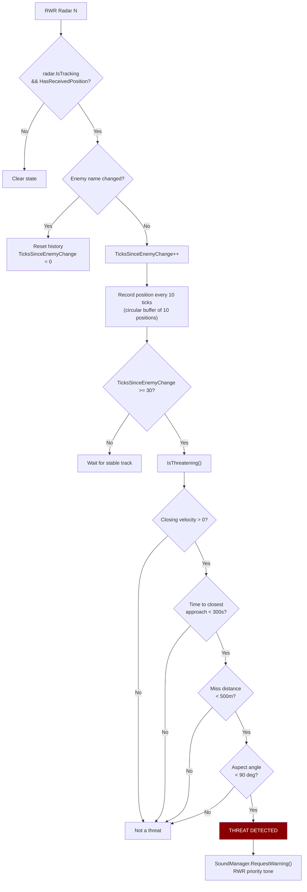
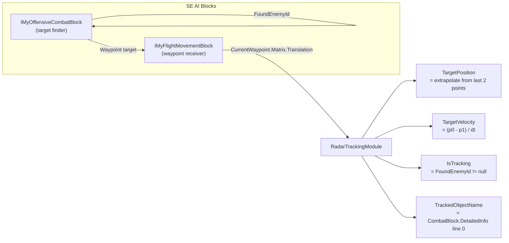
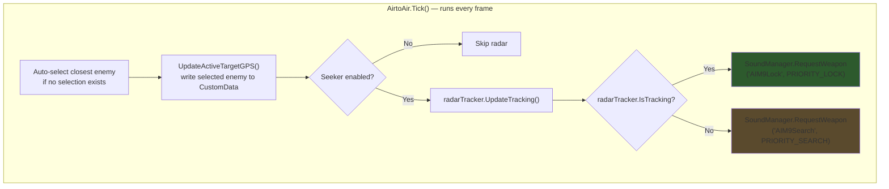
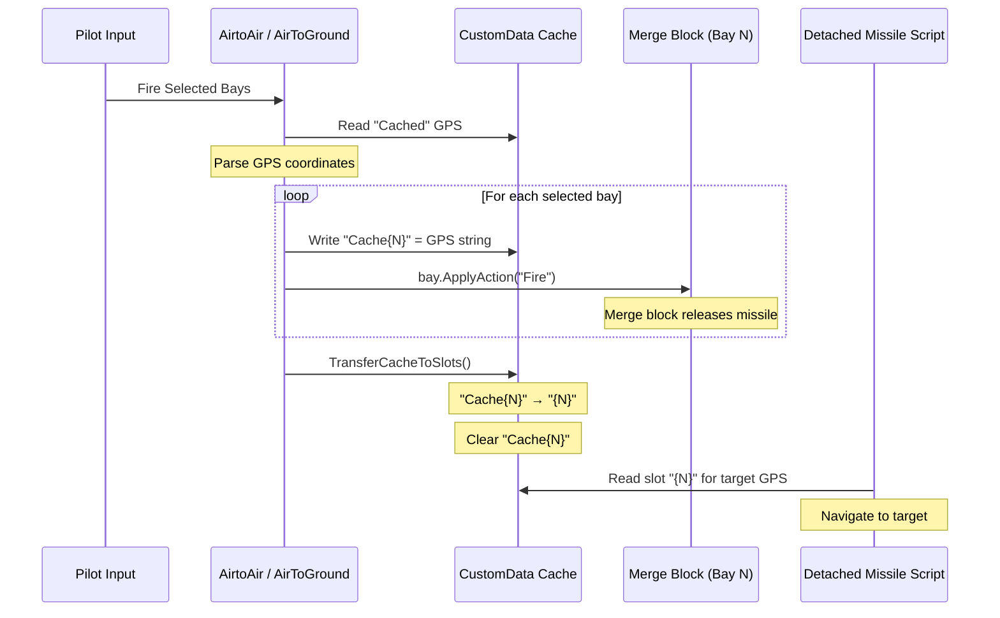
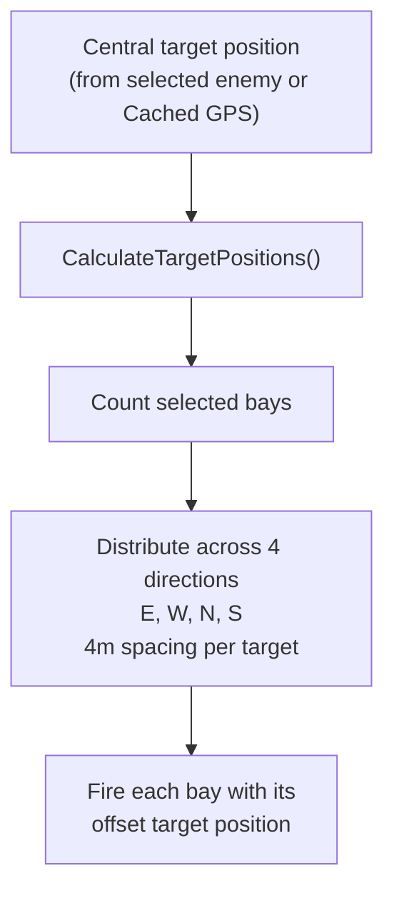
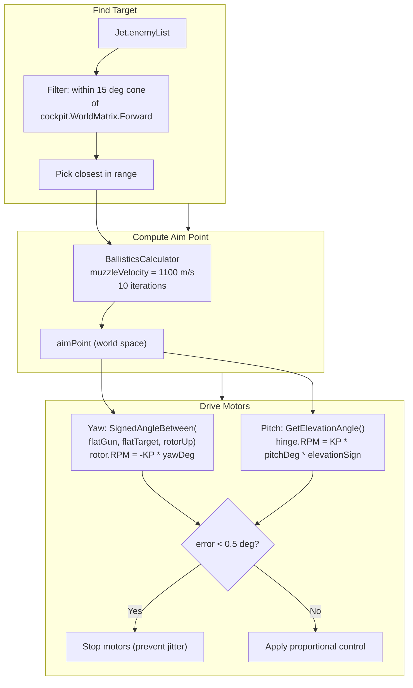
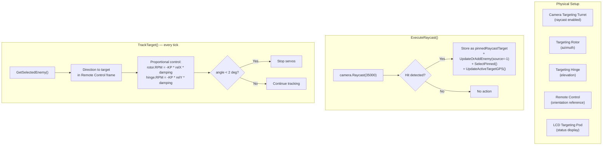

# Weapons & Radar Systems

## Radar Architecture

The radar system uses Space Engineers AI Flight + AI Combat block pairs. RadarControlModule manages multiple pairs with different roles.

```mermaid
flowchart TD
    subgraph Pairs ["AI Block Pairs (auto-detected)"]
        P0["AI Flight + AI Combat\n(Index 0 = Scan Radar)"]
        P1["AI Flight 2 + AI Combat 2\n(Index 1 = Track Radar)"]
        P2["AI Flight 3 + AI Combat 3\n(Index 2 = RWR 1)"]
        P3["AI Flight N + AI Combat N\n(Index N = RWR N-2)"]
    end

    subgraph RCM ["RadarControlModule.Tick()"]
        SCAN["Scan (Index 0)\nDetect new contacts"]
        TRACK["Track (Index 1)\nFine tracking of selected enemy"]
        RWR["RWR (Index 2+)\nPassive threat detection"]
    end

    P0 --> SCAN
    P1 --> TRACK
    P2 --> RWR
    P3 --> RWR

    SCAN --> |"UpdateOrAddEnemy(source=0)"| EL["Jet.enemyList"]
    TRACK --> |"UpdateOrAddEnemy(source=1)"| EL
    TRACK --> LOCK{"Tracked entity matches\nselected enemy?"}
    LOCK -- "Yes" --> LOCKED["IsTrackLocked = true"]

    RWR --> THREAT["ProcessRWR()\nThreat assessment"]
    THREAT --> WARNINGS["activeThreats list\n+ sound warnings"]

    style SCAN fill:#2d5a2d
    style TRACK fill:#2d4a5a
    style RWR fill:#5a2d2d
```



**Source:** `Modules/RadarControlModule.cs` — constructor (pair detection), `Tick()` (scan/track/RWR loop)

---

## RWR Threat Assessment

Each RWR radar independently tracks an enemy and evaluates whether it's a threat:



**Threat criteria summary:** Enemy must be closing, within 300s of closest approach, miss distance < 500m, and oriented within 90 deg of heading toward player.

**Source:** `Modules/RadarControlModule.cs` — `ProcessRWR()`, `IsThreatening()`

---

## RadarTrackingModule (AI Block Wrapper)

Each AI block pair is wrapped in a `RadarTrackingModule` that extracts position/velocity from the AI's internal waypoint system:



**Source:** `Utilities/RadarTrackingModule.cs` — `UpdateTracking()`, `TargetPosition`, `TargetVelocity`

---

## Air-to-Air Missiles

### AirtoAir Module Flow



### Seeker Toggle

Toggling the seeker enables/disables the primary AI Combat block:

| Action | AI Combat Block | AI Flight Block |
|--------|----------------|-----------------|
| Seeker ON | Enabled, Behavior=On, Pattern=Intercept(3), Priority=Closest | Enabled |
| Seeker OFF | Disabled, Behavior=Off | Disabled |

**Source:** `Modules/AirtoAir.cs` — `Tick()`, `ToggleSensor()`

---

## Missile Fire Sequence

Both AirtoAir and AirToGround share a similar fire pattern:



**Source:** `Modules/AirtoAir.cs` — `FireMissileFromBayWithGps()`, `TransferCacheToSlots()`; `Modules/AirToGround.cs` — same pattern

---

## Bombardment Pattern (Air-to-Ground)

When bombardment mode fires, targets are spread across 4 cardinal directions:



**Example:** 5 selected bays → 2 East (4m, 8m), 2 West (4m, 8m), 1 North (4m)

**Topdown mode:** Toggle via menu, persisted in CustomData as `Topdown:true/false`. Tells missile scripts to approach from above.

**Source:** `Modules/AirToGround.cs` — `ExecuteBombardment()`, `CalculateTargetPositions()`

---

## Gun Turret Auto-Tracking

GunControlModule drives rotor+hinge assemblies to aim gatling guns at the closest enemy.

### Turret Assembly

```
     Rotor (yaw)
       │
       └── Hinge (pitch)
             │
             └── Gatling Gun (barrel)
```

Left and right turrets use mirrored mounting. The `ElevationSign` auto-detects orientation.

### Aiming Pipeline



### Motor Sign Conventions

| Motor | Convention | Code |
|-------|-----------|------|
| Yaw (rotor) | SE positive RPM = counterclockwise from above. Cross-product sign must be **negated**: `RPM = -KP * yawDeg` | `SignedAngleBetween()` + negate |
| Pitch (hinge) | `ElevationSign = Sign(Dot(Cross(rotorUp, gunFwd), hinge.Up))`. Handles left vs right mounting automatically | `DetermineMotorSigns()` every 60 ticks |

### Configuration (via ConfigurationModule)

| Parameter | Default | Range | Key |
|-----------|---------|-------|-----|
| KP Gain | 5.0 | 0.5-20 | `gun_kp` |
| Max RPM | 30 | 5-60 | `gun_max_rpm` |
| Lock Threshold | 2.0 deg | 0.5-10 | `gun_lock_threshold` |
| Max Range | 6000m | 1000-15000 | `gun_max_range` |
| Muzzle Velocity | 1100 m/s | 200-2000 | `gun_muzzle_velocity` |

**Source:** `Modules/GunControlModule.cs` — `Tick()`, `TrackTarget()`, `DriveTowardDirection()`, `DetermineMotorSigns()`

---

## Targeting Pod (RaycastCameraControl)

Camera-based target acquisition with servo-controlled turret:



**Servo parameters:** KP = 0.05, Max RPM = 5.0, Lock threshold = 2 deg

**Source:** `Modules/RaycastCameraControl.cs` — `ExecuteRaycast()`, `TrackTarget()`
