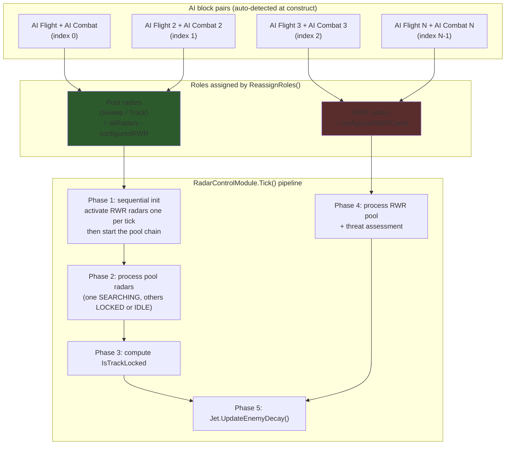
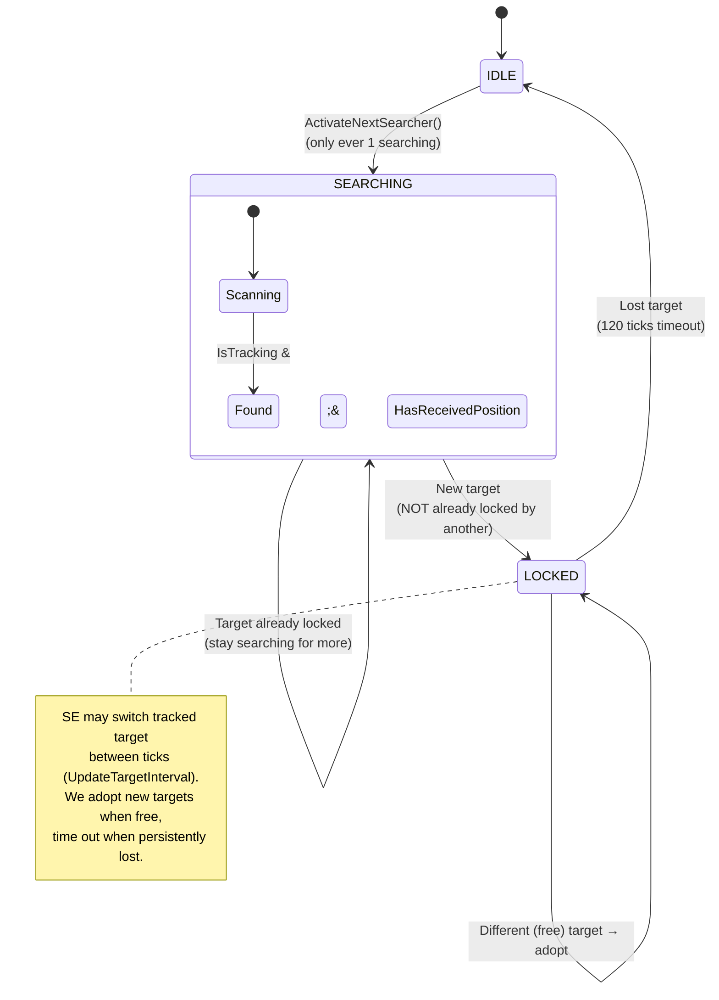
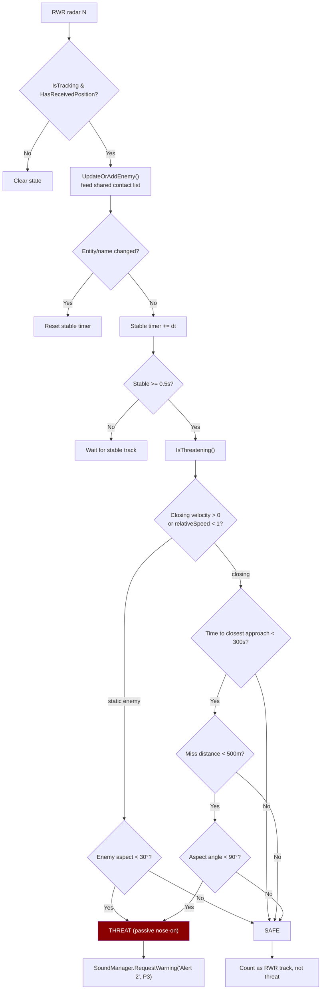
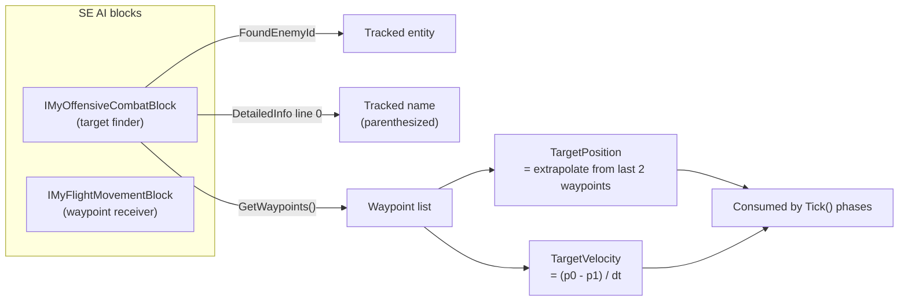
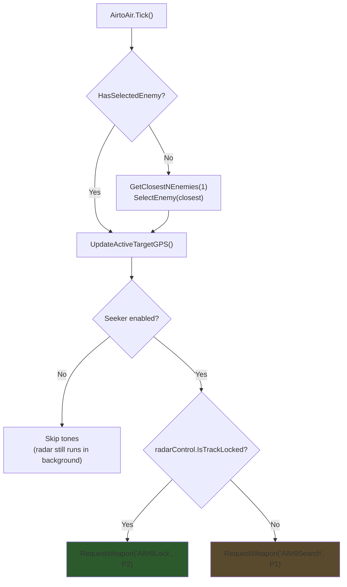
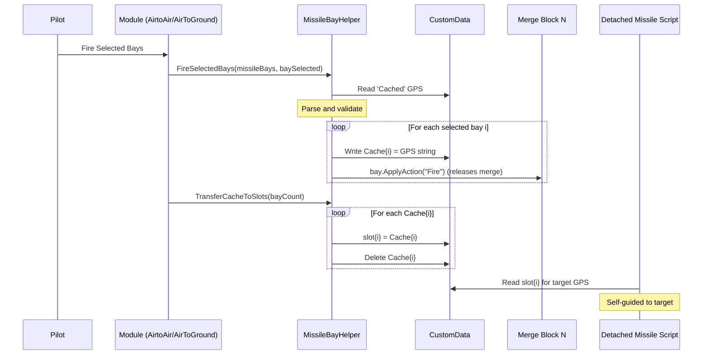
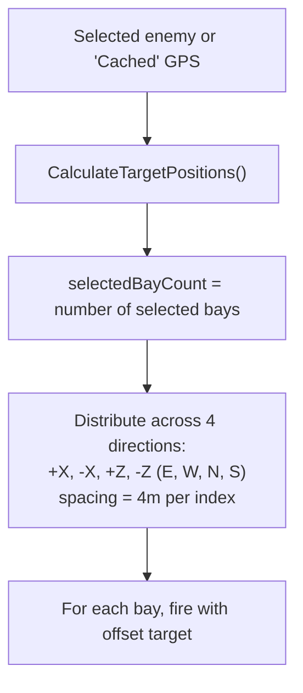

# Weapons &amp; Radar Systems

> **Source:** `Modules/RadarControlModule.cs` (sole sensor + RWR), `Utilities/RadarTrackingModule.cs` (AI block wrapper), `Modules/AirtoAir.cs`, `Modules/AirToGround.cs`, `Utilities/MissileBayHelper.cs`, `Modules/GunControlModule.cs`, `Utilities/BallisticsCalculator.cs`
>
> **Live demos:** [interactive/radar-demo.html](interactive/radar-demo.html) (radar minimap), [interactive/throttle-demo.html](interactive/throttle-demo.html) (related — engine balancing).

## Radar Architecture

JetOS uses Space Engineers AI Flight + AI Combat block pairs as radar emitters. `RadarControlModule` auto-detects pairs named `AI Flight` / `AI Combat` (and `AI Flight 2..99` / `AI Combat 2..99`) on script start.


```mermaid
flowchart TD
    subgraph Pairs ["AI block pairs (auto-detected at construct)"]
        P1["AI Flight + AI Combat<br/>(index 0)"]
        P2["AI Flight 2 + AI Combat 2<br/>(index 1)"]
        P3["AI Flight 3 + AI Combat 3<br/>(index 2)"]
        PN["AI Flight N + AI Combat N<br/>(index N-1)"]
    end

    subgraph Roles ["Roles assigned by ReassignRoles()"]
        POOL["Pool radars<br/>(Sweep / Track)<br/>= allRadars - configuredRWR"]
        RWR["RWR radars<br/>= configuredRWRCount"]
    end

    subgraph SM ["RadarControlModule.Tick() pipeline"]
        PHASE1["Phase 1: sequential init<br/>activate RWR radars one per tick<br/>then start the pool chain"]
        PHASE2["Phase 2: process pool radars<br/>(one SEARCHING, others LOCKED or IDLE)"]
        PHASE3["Phase 3: compute IsTrackLocked"]
        PHASE4["Phase 4: process RWR pool<br/>+ threat assessment"]
        PHASE5["Phase 5: Jet.UpdateEnemyDecay()"]
    end

    P1 --> POOL
    P2 --> POOL
    P3 --> RWR
    PN --> RWR

    POOL --> PHASE1 --> PHASE2 --> PHASE3
    RWR --> PHASE4
    PHASE3 --> PHASE5
    PHASE4 --> PHASE5

    style POOL fill:#2d5a2d
    style RWR fill:#5a2d2d
```

> **Pool vs RWR is configurable** — the pilot adjusts `RWRCount` from the Radar Control menu. Default: 1 RWR if 2+ radars exist, else all are RWR. The pool gets `allRadars - RWRCount` radars, RWR gets the remainder. Configuration is persisted in CustomData.

**Source:** `Modules/RadarControlModule.cs:118-160` (constructor), `:663-690` (ReassignRoles), `:692-709` (RWR helpers)

---

## Pool Radar State Machine

Pool radars activate in a sequential chain. **Only 1 pool radar is `SEARCHING` at a time.** When it finds a new target, it transitions to `LOCKED` and the next IDLE radar becomes `SEARCHING`.


```mermaid
stateDiagram-v2
    [*] --> IDLE
    IDLE --> SEARCHING : ActivateNextSearcher()<br/>(only ever 1 searching)

    state SEARCHING {
        [*] --> Scanning
        Scanning --> Found : IsTracking &amp;&amp; HasReceivedPosition
    }
    SEARCHING --> LOCKED : New target<br/>(NOT already locked by another)
    SEARCHING --> SEARCHING : Target already locked<br/>(stay searching for more)

    LOCKED --> LOCKED : Same target → feed
    LOCKED --> LOCKED : Different (free) target → adopt
    LOCKED --> IDLE : Lost target<br/>(120 ticks timeout)

    note right of LOCKED
        SE may switch tracked target
        between ticks (UpdateTargetInterval).
        We adopt new targets when free,
        time out when persistently lost.
    end note
```

### Key Constants

| Constant | Value | Purpose |
|----------|-------|---------|
| `LOST_TARGET_TIMEOUT` | 120 ticks (~2s) | LOCKED → IDLE if target stays untracked |
| `ACTIVATION_COOLDOWN` | 10 ticks | Wait after `ActivateBehavior_On` before reading data |
| `UpdateTargetInterval` | 5 (clamped, SE engine) | How often the AI block re-evaluates targets |
| Sequential init | 1 RWR per tick | Avoids overloading SE engine on script (re)compile |

### IsTrackLocked Computation

Each tick, after pool processing, the module sets `IsTrackLocked = true` if any LOCKED pool radar's `TrackedEntityId` or `TrackedName` matches the pilot's currently selected enemy:

```csharp
var selected = myJet.GetSelectedEnemy();
if (selected.HasValue) {
    for (int i = 0; i < poolSize; i++) {
        if (radarStates[i].Role != RadarRole.LOCKED) continue;
        if ((selected.Value.EntityId != 0 && selected.Value.EntityId == state.TrackedEntityId)
            || (selected.Value.Name == state.TrackedName))
        {
            IsTrackLocked = true;
            break;
        }
    }
}
```

`AirtoAir` reads `IsTrackLocked` to drive its lock/search audio tones.

**Source:** `Modules/RadarControlModule.cs:373-391` (lock check), `:426-462` (ProcessSearchingRadar), `:467-532` (ProcessLockedRadar)

---

## Activation Sequence (Critical)

The flight + combat block pair must be configured in **one specific sequence**, in a single tick. Splitting properties and behavior activation across ticks causes SE to silently disable the behavior.

```
Order (DO NOT REORDER):
  1. Set flight properties (waypoint mode, etc.)
  2. flight.ApplyAction("ActivateBehavior_On")
  3. Set combat properties (search radius, update interval)
  4. combat.ApplyAction("ActivateBehavior_On")
  5. combat.ApplyAction("SetTargetingGroup_Weapons")
  6. combat.ApplyAction("SetTargetPriority_Closest"/"Largest"/"Smallest")
```

> **`ActivateBehavior_On` is NOT a toggle.** It's the `_On` variant of an OnOff switch — always sets `IsActivated = true`. The toggle action is just `ActivateBehavior` (no suffix). `ActivateBehavior_Off` always sets false. See `memory/se-ai-block-internals.md` in the project for the full decompilation notes.

> **Radar-only mode:** JetOS only activates the **combat** block's behavior — the flight block's behavior stays off. This is critical and counterintuitive. Activating the flight block would make the AI try to physically fly the jet to the target. We just want the radar data, not the autopilot. Without flight block activation, waypoint updates run on a 5-second interval instead of the normal cadence — but for our purposes this is fine because we read raw position from the combat block.

**Source:** `Modules/RadarControlModule.cs:546-595` (ActivateRadar)

---

## RWR Threat Assessment

Each RWR radar independently watches an enemy, publishes that observation into the same `enemyList` used by sweep/track radars, and evaluates whether the contact is a threat. RWR does not use the pool radar lock choreography; it only feeds contacts after its own AI block already reports a valid target position.

The state machine waits 0.5 seconds of stable identity before classifying:


```mermaid
flowchart TD
    RWR["RWR radar N"] --> TR{IsTracking &amp; HasReceivedPosition?}
    TR -- "No" --> CL["Clear state"]
    TR -- "Yes" --> PUB["UpdateOrAddEnemy()<br/>feed shared contact list"]
    PUB --> EN{Entity/name changed?}
    EN -- "Yes" --> RST["Reset stable timer"]
    EN -- "No" --> INC["Stable timer += dt"]
    INC --> ST{Stable &gt;= 0.5s?}
    ST -- "No" --> WAIT["Wait for stable track"]
    ST -- "Yes" --> AS["IsThreatening()"]

    AS --> CV{Closing velocity &gt; 0<br/>or relativeSpeed &lt; 1?}
    CV -- "static enemy" --> AA{Enemy aspect &lt; 30°?}
    AA -- "Yes" --> THR["THREAT (passive nose-on)"]
    AA -- "No" --> SAFE
    CV -- "closing" --> TCA{Time to closest approach &lt; 300s?}
    TCA -- "No" --> SAFE
    TCA -- "Yes" --> MISS{Miss distance &lt; 500m?}
    MISS -- "No" --> SAFE
    MISS -- "Yes" --> ASP{Aspect angle &lt; 90°?}
    ASP -- "No" --> SAFE
    ASP -- "Yes" --> THR

    THR --> SND["SoundManager.RequestWarning('Alert 2', P3)"]
    SAFE --> CNT["Count as RWR track, not threat"]

    style THR fill:#8b0000,color:#fff
```

**Threat criteria summary:** the enemy must be on a closing trajectory, within 300s of closest approach, missing the player by less than 500m, and oriented within 90° of heading toward the player. Static enemies trigger if their aspect angle (relative to the relative-position vector) is < 30° — meaning they're pointed at us.

**Source:** `Modules/RadarControlModule.cs` (`ProcessRWR`, `IsThreatening`, and `ManageWarningSounds`)

---

## RadarTrackingModule (AI Block Wrapper)

`RadarTrackingModule` wraps each AI block pair and extracts position/velocity from the AI's internal waypoint system:


```mermaid
flowchart LR
    subgraph AI ["SE AI blocks"]
        CB["IMyOffensiveCombatBlock<br/>(target finder)"]
        FB["IMyFlightMovementBlock<br/>(waypoint receiver)"]
    end

    CB --> |"FoundEnemyId"| ID["Tracked entity"]
    CB --> |"DetailedInfo line 0"| NM["Tracked name<br/>(parenthesized)"]
    CB --> |"GetWaypoints()"| WPL["Waypoint list"]

    WPL --> P0["TargetPosition<br/>= extrapolate from last 2 waypoints"]
    WPL --> V["TargetVelocity<br/>= (p0 - p1) / dt"]

    P0 --> CONS["Consumed by Tick() phases"]
    V --> CONS
```

> **Why GetWaypoints() instead of CurrentWaypoint?** Without flight block activation, `CurrentWaypoint` returns stale data. The waypoint *list* is still populated by the combat block even when the flight block is inactive. Reading from the list gives us continuous fresh data.

> **First-tick velocity spike fix:** when a brand-new contact has only one position recorded (p1.Timestamp == 0), `TargetVelocity` returns `Vector3D.Zero` instead of dividing by an unset timestamp. Extrapolation in `TargetPosition` is also capped at 1 second to avoid lag spikes producing teleports.

**Source:** `Utilities/RadarTrackingModule.cs`

---

## Air-to-Air Module

`AirtoAir` is a **read-only consumer** — it never feeds `enemyList` and doesn't control radar blocks. Its job:

1. Auto-select the closest enemy if no selection exists
2. Sync the selected enemy's GPS to CustomData every tick
3. Drive lock/search audio tones based on `RadarControlModule.IsTrackLocked`
4. Manage missile bay selection and firing via `MissileBayHelper`


```mermaid
flowchart TD
    AT["AirtoAir.Tick()"] --> SEL{HasSelectedEnemy?}
    SEL -- "No" --> AUTO["GetClosestNEnemies(1)<br/>SelectEnemy(closest)"]
    SEL -- "Yes" --> GPS["UpdateActiveTargetGPS()"]
    AUTO --> GPS
    GPS --> SK{Seeker enabled?}
    SK -- "No" --> DONE["Skip tones<br/>(radar still runs in background)"]
    SK -- "Yes" --> LCK{radarControl.IsTrackLocked?}
    LCK -- "Yes" --> LT["RequestWeapon('AIM9Lock', P2)"]
    LCK -- "No" --> ST["RequestWeapon('AIM9Search', P1)"]

    style LT fill:#2d5a2d
    style ST fill:#5a4a2d
```

| Seeker | Behavior |
|--------|----------|
| ON | Plays AIM9 lock or search tones based on lock status |
| OFF | Silent — radar still runs and feeds enemyList |

**Source:** `Modules/AirtoAir.cs`

---

## Missile Fire Sequence

Both AirtoAir and AirToGround fire through `MissileBayHelper.FireSelectedBays()`, which uses a **cache → fire → transfer** pattern:


```mermaid
sequenceDiagram
    participant Pilot
    participant Mod as Module (AirtoAir/AirToGround)
    participant Helper as MissileBayHelper
    participant CD as CustomData
    participant Bay as Merge Block N
    participant Msl as Detached Missile Script

    Pilot->>Mod: Fire Selected Bays
    Mod->>Helper: FireSelectedBays(missileBays, baySelected)
    Helper->>CD: Read 'Cached' GPS
    Note over Helper: Parse and validate

    loop For each selected bay i
        Helper->>CD: Write Cache{i} = GPS string
        Helper->>Bay: bay.ApplyAction("Fire") (releases merge)
    end

    Mod->>Helper: TransferCacheToSlots(bayCount)
    loop For each Cache{i}
        Helper->>CD: slot{i} = Cache{i}
        Helper->>CD: Delete Cache{i}
    end

    Msl->>CD: Read slot{i} for target GPS
    Note over Msl: Self-guided to target
```

The two-stage cache → slot transfer exists because **the missile script reads from numbered slots**, but the firing module needs to know which slots to populate. Caching first means you can issue multiple bay fires in a single tick before transferring everything to numbered slots together.

**Source:** `Utilities/MissileBayHelper.cs` — `FireSelectedBays`, `TransferCacheToSlots`, `FireMissileFromBay`

---

## Bombardment Mode (Air-to-Ground)

When the pilot selects **Bombardment**, AirToGround spreads multiple bays across 4 cardinal directions instead of all hitting the same point:


```mermaid
flowchart TD
    CT["Selected enemy or 'Cached' GPS"] --> CALC["CalculateTargetPositions()"]
    CALC --> CNT["selectedBayCount = number of selected bays"]
    CNT --> SPREAD["Distribute across 4 directions:<br/>+X, -X, +Z, -Z (E, W, N, S)<br/>spacing = 4m per index"]
    SPREAD --> FIRE["For each bay, fire with offset target"]
```

**Example:** 5 selected bays → 2 East (4m, 8m), 2 West (4m, 8m), 1 North (4m).

The **Topdown** mode toggles a CustomData flag (`Topdown=true/false`) that missile scripts read to alter their approach (steeper attack angle from above).

**Source:** `Modules/AirToGround.cs:105-174`

---

## Gun Turret Auto-Track

`GunControlModule` drives rotor + hinge assemblies to aim gatling guns at the closest enemy in a forward cone.

### Turret Geometry

```
       Rotor (yaw) — fixed to grid
         │
         └── Hinge (pitch) — mounted on rotor's top grid
               │
               └── Gatling Gun — mounted on hinge's top grid
```

Left and right turrets use **mirrored mounting**. `ElevationSign` is auto-detected per side every 60 ticks.

### Aim Pipeline

```mermaid
flowchart TD
    subgraph T ["Find target"]
        EN["Jet.enemyList"] --> CONE["Filter: within 15° cone of cockpit.WorldMatrix.Forward"]
        CONE --> R["Within MAX_ENGAGE_RANGE"]
        R --> CL["Pick closest"]
    end

    subgraph BC ["Compute aim point"]
        CL --> SOLVE["BallisticsCalculator<br/>muzzle 1100 m/s default<br/>6 iterations"]
        SOLVE --> AIM["aimPoint (world space)"]
    end

    subgraph M ["Drive motors"]
        AIM --> YAW["Yaw error =<br/>SignedAngleBetween(flatGun, flatTarget, rotorUp)<br/>rotor.RPM = -KP * yawDeg<br/>(negate because SE +RPM = CCW)"]
        AIM --> PIT["Pitch error =<br/>elevation angle to aim point<br/>hinge.RPM = KP * pitchDeg * elevationSign"]
        YAW --> DAMP{|err| &lt; 0.5°?}
        PIT --> DAMP
        DAMP -- "Yes" --> STOP["Set RPM = 0<br/>(stop jitter)"]
        DAMP -- "No" --> DRV["Apply proportional control,<br/>clamped to MAX_VELOCITY_RPM"]
    end

    T --> BC --> M
```

### Sign Conventions (Tricky Bits)

| Motor | Convention | Why |
|-------|-----------|-----|
| **Yaw** (rotor) | `RPM = -KP * yawDeg` | SE positive RPM = counterclockwise from above. The right-hand-rule cross product gives us clockwise-positive degrees, so we negate. |
| **Pitch** (hinge) | `RPM = KP * pitchDeg * elevationSign` | `ElevationSign = Sign(Dot(Cross(rotorUp, gunFwd), hinge.Up))`. Auto-detects left vs right hinge mounting orientation, so the same code drives both turrets correctly. |

### Configurable Parameters

| Parameter | Default | Range | Config Key |
|-----------|---------|-------|------------|
| KP Gain | 5.0 | 0.5–20 | `gun_kp` |
| Max RPM | 30 | 5–60 | `gun_max_rpm` |
| Lock Threshold | 2.0° | 0.5–10° | `gun_lock_threshold` |
| Max Range | 6000m | 1000–15000 | `gun_max_range` |
| Muzzle Velocity | 1100 m/s | 200–2000 | `gun_muzzle_velocity` |

All adjustable from the Configuration menu. See [configuration.md](configuration.md).

**Source:** `Modules/GunControlModule.cs`, `Utilities/BallisticsCalculator.cs`

---

## Target Cone Direction

The cone check uses the **ship's forward vector**, not the gun's forward — this is critical:

> Using `gun.WorldMatrix.Forward` would create a feedback loop. Once the turret rotated off-center to track a target, the cone would follow it and chase the target through the cone — even if the pilot is now pointing somewhere else.

The cockpit's forward keeps the cone fixed in jet-space. The pilot must point the nose at the threat for the gun to engage it.

**Source:** `Modules/GunControlModule.cs` — `TrackTarget()`
